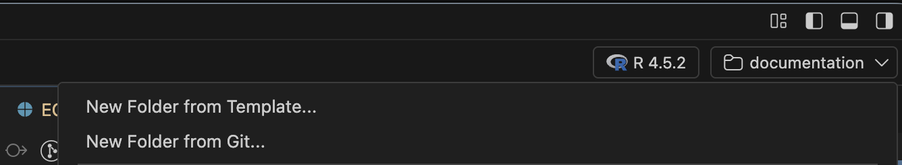

::: callout-note
# Take your time

You might not finish all the exercises during the scheduled hours. No, worries. Continue later! Please do the exercises yourself (on your computer). However, you are allowed to help each other!
:::

## Preparations

If you have not already done so, please install the following software on your computer:

1.  Install Positron: <https://positron.posit.co/download.html>

2.  Install Git: <https://git-scm.com/downloads>

-   Windows: Download and install binary version
-   MacOS: Git may already be installed. Type `$ git` and see what happens! Otherwise `$ xcode-select --install` but more recent version with `$ brew install git` (where `$` indicates that this is a command to be run from a terminal, but which itself is not part of the command).

3.  Create a GitHub account (if you do not already have one): [https://github.com]()

    -   Creating a GitHub account requires an e-mail address. GitHub is owned by Microsoft, and the University of Gothenburg also uses Microsoft as its e-mail provider. You may use your university e-mail address if you wish. Alternatively, you are free to register a separate e-mail account for GitHub.

4.  Open Positron

5.  Enter your credentials in the terminal (replace relevant parts with your own information and press enter after typing):

    -   Set your username: `git config --global user.name "FIRST_NAME LAST_NAME"`

    -   Set your email address: `git config --global user.email "MY_NAME@example.com"`

6.  In the upper right corner press the folder button and choose "New folder from Git ..." with the URL: `https://github.com/sta220/crap` and place the folder somewhere you can find it, tick the box "Open in a new window" and press OK. 

7.  In the cloned project, open the `TODO` file and follow the instructions there

You have now cloned an existing public repo from GitHub, made some changes which you have committed and viewed the history of that repo.

## New project

Let's make a new project from scratch!

You will now re-use your data and R-scripts from the first computer exercise in the course (with questionaire data led by AGE). This will be referred to as `CSQ` below.

1.  Press the folder button in the upper right corner of Positron and select "New folder from template" \> R project and specify a folder name as well as a parent folder. Check the box "Create a git repository". Choose which version of R you are using but don't use "renv" (it's a good tool but that can wait to some other time). Open the new project.
2.  Create a "data" sub-folder (use the "Explorer" pane from the left side bar to navigate through your files or use the terminal if you feel confident (`mkdir data`) ... or perhaps the [fs package](https://fs.r-lib.org) `fs::dir_create("data)`). This is a good place to store your data later.
3.  Create an "R" folder where you can later save your R scripts.
4.  Open the already existing `.gitignore` file. This is a file where you specify which files to NOT include for version control. It is already populated to avoid adding some unnecessary files (and hence to avoid unintentionally sharing those files with the rest of the world).
5.  You should never share any sensitive data (and healthcare data is sensitive) so let's add that we do not want to commit anything which is later found in the "data" sub-folder. Simply type `data/**` on a new line in the `.gitignore` file and save the file.
6.  Copy your old data files used in `CSQ` (SPSS-files, Excel, or whatever format they are in) to the data folder. (If you don't have access to this data, just type `write.csv(iris, "data/iris.csv")` or something to store at least some data in the folder).
7.  Check that the names of all data files in the Explorer pane are in gray. This means that those files will not be included in later git commits (because it is found in a folder which is ignored by git using the `.gitignore` file).
8.  Open the `README.md` file and make some changes to that file. Briefly describe what this repo is used for; the purpose of `CSQ` etc. Make some spelling mistakes on purpose :-)
9.  Commit your changes (as you did for the previous `crap` repo).
10. Press "Publish to GitHub" (you might need to log in) and select public repo. If everything works you should get a notification in the lower right corner of Positron that the repo has now been published and you can click a link to open it in your browser; do that!
11. Open the `README.md` file in the browser to have a look
12. Press "edit this file" (the pencil symbol to the upper right of the file).
13. Make some changes (correct your intentional spelling mistakes!) to the file in the online text editor and press "Commit changes ...". Write a message and click "Commit changes".
14. Go back to Positron and look at the source control pane. Press "Sync changes".
15. The changes you made online should now be visible locally as well.
16. Go back to the repo website. Click "Issues" \> "New issues" and give yourself a task to complete: "Include all R scripts from CSQ in the R folder".
17. In Positron: Perform the task you previously gave yourself through the issue tracker.
18. Commit your changes and in the commit message, write `Fix #N` where `N` is the number of the issue you were working on (probably no 1, hence `Fix #1`). Sync the local repo with GitHub.
19. Have a new look at the issue and check if it was updated/closed automatically by your commit.

To share your repo using GitHub (or Git alone or another provider such as GitLab or Bitbucket) makes it easy to collaborate with others and also to work with your projects from different computers. This is often done for software development, including for R packages. To collaborate within projects including sensitive health data, however, is often a bit more difficult. For this course we will only use synthetic data and can therefore be less careful for now. It is otherwise common to only share selected parts (such as the finalized R code) through GitHub and to use bare Git for collaboration on a secure server. To share R code for a research paper, it is also recommended to use a fixed version of the GitHub repo. This can be achieved by linking the GitHub repo to [Zenodo](https://zenodo.org) or other services.

## Source code for the STA220 website

The course web site is itself a GitHub repo! You can see a small link and icon "View source" in the right hand menu. Clone the repo locally, "fork it", play around! File an issue or make some edits if you find anything to improve! Make a "pull request" if you have concrete suggestions!

Note, it is technically easy to reuse code from GitHub. Some repositories might nevertheless have associated licenses, which you should of course respect. Take a look at the `LICENSE` file for the popular [dplyr package](https://github.com/tidyverse/dplyr/blob/main/LICENSE.md). R packages which are also distributed through CRAN have permissive licenses but their exact content may vary. There is no license file attached to the course web site yet, you might suggest one in a pull request or file an issue :-)

## (Try to) contribute to an R package

ROpenSci is an open community of R developers. Help them according to their instructions here: <https://contributing.ropensci.org/resources.html#issues>

1.  Read the instructions above.
2.  Look for an open issue (start with the "good first issue" or "documentation" issue lists)
3.  Read everything that is written/discussed in your issue of choice and try to understand the problem/task.
4.  When you have picked an issue, clone the relevant GitHub repo to your computer and try to identify which file(s) etc should be modified in order to fix/investigate the issue further.
5.  Try to fix the issue! Note that this can be (VERY!) difficult and you don't have to actually fix it if it seems impossible. But don't give up to easy!
6.  Submit your changes locally with an informative message and a reference to `#N` (where `N` is the issue number). Do this regardless if you fixed the issue or not.
7.  If you were able to fix the issue, submit your suggested changes back to GitHub (don't do this if you were not able to fix it).
8.  If you were not able to fix the issue, but if you gained some insights which might be relevant for the community, share those in the open issue! This might be as simple as reacting to an already stated comment (for example click on the smiley at the end of a comment you agree with and chose a relevant emoji).

## Additional practice

Please note the "Reading and practicing" section in the beginning of [EL4](EL4.qmd) (homework).