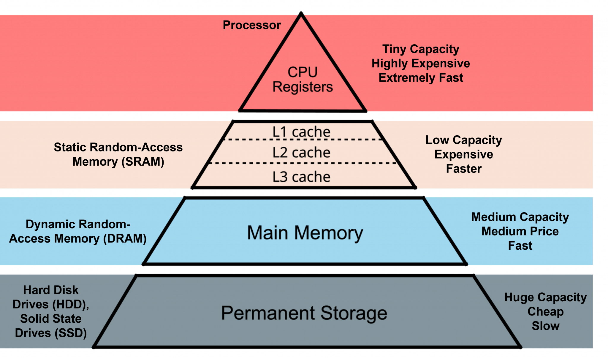

::: {.callout-important}
# Examination
This lecture will not be examined. You are encouraged to experiment with the concepts in your project work if you find them useful, but this is not required.
:::

## Big data


## Biggish data

Our focus:

-   Only tabular data
-   Original data might fit into physical RAM but ...
-   might be multiplied due to temporary necessity
-   physical RAM might be constrained due to other processes/settings
-   things might just take too much time ... and life is short ...

-----------



## Reading large datasets

When working with large datasets, where the data is stored matters.

### Network storage (e.g. shared drives)

- slower data transfer (limited bandwidth)
- higher latency (delay before data starts loading)
- multiple users may compete for resources
- repeated reads can be very inefficient

### Local storage

- much faster read/write speeds
- low latency
- more stable and predictable performance
- better suited for iterative data analysis

------------------------------------------------------------------------


## Secure environment

In secure environments, both types of storage may *look local*, but they behave differently.

- **“Local” disk (e.g. SSD on the server/VM)**
  - attached directly to the machine you are working on  
  - high bandwidth, low latency  
  - behaves like true local storage  
  - typically much faster for data analysis  

- **Mapped network folder**
  - accessed over the network (even if it looks like a normal folder)  
  - lower bandwidth and higher latency  
  - shared with other users  
  - slower, especially for repeated reads  

💡 **Key difference:**  
Not where the data is stored, but **how it is accessed** (direct disk vs network).


💡 **Practical advice:**  
Use “local” disk (SSD on the environment) for active analysis, and network storage for long-term storage.

------------------------------------------------------------------------


## Practical implication

For large datasets:

- avoid repeatedly reading data directly from network drives
- copy data locally when possible
    -   `fs::file_copy(path, new_path)`
    -   (*"libuv provides a wide variety of cross-platform sync and async file system operations."*)
    -   obviously only if "local drive" is also in the (same) secure environment!

💡 **Key message:**  
Data access can easily become the main bottleneck — not your code.


------------------------------------------------------------------------


## HDD (Hard Disk Drive)

- mechanical (spinning disks)
- slower, especially for random access
- typical speeds:
  - ~50–150 MB/s (sequential read)
- larger capacity at lower cost
- often used in older systems or for backups


## SSD (Solid State Drive)

- no moving parts
- much faster and more reliable
- typical speeds:
  - ~500 MB/s (SATA SSD)
  - ~2000–7000 MB/s (NVMe SSD)
- standard in most modern laptops


## Typical sizes

- laptops: **256 GB – 1 TB SSD**
- desktops / servers: **1–4 TB SSD + optional HDD storage**
- network drives: often very large but slower


## RAM and data analysis in R

When working in R, available **RAM (memory)** is often the main limiting factor.

- R can typically use **most of the available RAM** on your machine
- some memory is needed by:
    - the operating system
    - other applications
- a safe rule of thumb is to assume **~50–75% of total RAM** is available for R


## How large datasets can you work with?

- datasets must fit **in memory** (unless using special tools)
- but you also need memory for:
  - intermediate objects
  - copies created during transformations
  - model objects
- many R operations create **temporary copies of data**
- memory usage can **double or triple** during processing
- running out of RAM leads to:
  - slow performance
  - crashes


## Example

::: {.callout-tip}
Rule of thumb: you can usually work comfortably with data that is **at most ~1/3 to 1/2 of your available RAM**
:::

If you have:

- **16 GB RAM** → usable ≈ 8–12 GB  
→ practical dataset size ≈ 3–6 GB  
- Modern R is **64-bit** → can use large amounts of memory  
  - (32-bit R was limited to ~4 GB — mostly obsolete today)

## Practical advice

- check memory: `ps::ps_system_memory()`
- avoid unnecessary copies of large objects
    - Use `{data.table}` for reference semantics
    - or Parquet files to read only the necessary data
- consider pipelines (`targets`) or chunked processing

## Numeric vs integer in R

R’s default numeric type is **double precision (numeric)**.

```r
x <- 1
typeof(1) # "double"
typeof(1L) # weird syntax to get "integer"
```

### Why this matters

- integers use **less memory** (4 bytes vs 8 bytes)  
- can be important for large datasets  
- 100 million values:
  - numeric ≈ 800 MB  
  - integer ≈ 400 MB  

---

### In practice

- R often converts to numeric automatically  
- some tools (e.g. `data.table`) use integers efficiently
    - compare `as.IDate()` vs `as.Date()`
- useful when working with:
  - IDs  
  - categories  
  - counts  

💡 **Key message:**  
Choosing the right data type can significantly reduce memory usage.


## ALTREP (Alternative Representation)

R can represent some objects in a **compact or lazy way**.

- introduced in R 3.5.0  
- avoids allocating full memory immediately  

```{r}
#| echo: true
x <- 1:1e9
lobstr::obj_size(x) # actual memory used
format(object.size(x), units = "GB") # reserved memory
# as.numeric(x) # will use the reserved memory
```


## What happens?

- data is generated **on demand**  
- not all values are stored in memory  

💡 **Key message:**  
Not all objects in R are fully materialised — some are computed when needed.

## Other memory optimisations in R

R uses several mechanisms to reduce memory usage (not only ALTREP).

- **Shared strings (string interning)**  
  - identical strings may be stored only once  
  - reduces memory when many values are repeated  


## But memory still fills up...

Even with smart representations:

- many operations still create real objects  
- temporary objects accumulate  

👉 R still needs to **free memory**

## Garbage collection

When you work in R, memory is constantly used for **intermediate objects**.

- many operations create temporary results  
- these objects are no longer needed after a step is completed  
- but R does not always remove them immediately  


## What is the problem?

- memory can fill up with **objects that are no longer used**  
- there are no active references (“pointers”) to these objects  
- but they still occupy memory  


## Solution: garbage collection

- R periodically identifies objects that are no longer reachable  
- these are removed, and memory is freed  
- GC is triggered when R needs more memory  
- may cause short pauses during execution  


## Practical advice

  ```r
  rm(large_object) # Remove objects you no longer need (still takes up memory)
  gc() # manual garbage collection (free the memory)
  dt[, new := f(old)] # reference semantics by `{data.table}` avoids "hidden" objects
  ```


💡 **Key message:**  
You rarely need to manage memory explicitly — but inefficient code can still use too much of it.

## Unnecassary computations for large objects

- Sometimes R (or the computer hardware) is not the problem, but the IDE might be.
- Common for RStudio (RStudio and R both run in the same process)
    - Memory problems might make RSTudio crash
- Positron separates the R process from the IDE
    - Better, but still not perfect


[Still open?](https://github.com/posit-dev/positron/issues/12043)

-----------


## CPU

The **Central Processing Unit (CPU)** determines how fast computations are performed.

- CPUs work in **clock cycles** (e.g. 3 GHz ≈ 3 billion cycles per second)  
- CPU matters most when:
    - running models (e.g. regression, mixed models)  
    - performing simulations  
    - using loops or inefficient code  
- CPU matters less when:
    - reading data (disk/network bottleneck)  
    - working with very large objects (RAM bottleneck)  

::: {.callout-note}
Writing efficient code (vectorisation) often matters more than CPU speed.
Applies also to R packages on CRAN!
:::

## How R uses the CPU

- R is often **single-threaded**  
- many operations use only **one core**  
- some libraries can use multiple cores (parallel computing)

How many cores do you have?

```{r}
#| echo: true
benchmarkme::get_cpu()
```

## Vectorization in R

- R is designed to work efficiently with **vectors**, not loops.
- In R, what looks like a scalar is actually a vector of length 1
- vectorized operations apply to whole objects at once  
- loops process one element at a time (often slower)  

```r
# slow
result <- numeric(length(x))
for (i in seq_along(x)) {
  result[i] <- x[i] + y[i]
}

# fast
result <- x + y
```


## Why is vectorization faster?

Vectorized operations in R are usually implemented in **compiled C code**.

- R code (e.g. `for` loops) is **interpreted**
  → each step has overhead  

- vectorized operations (e.g. `x + y`) are:
  - implemented in C  
  - run as tight, optimized loops  


## Parallel computing

Parallel computing means using **multiple CPU cores at the same time**.

- most R code runs on a **single core**  
- your computer may have many cores (e.g. 4–16)
- a shared server such as TRE might have several hundreds!

### Why use parallel computing?

- to speed up **computationally intensive tasks**  
- especially when tasks can be done independently  


💡 **Key message:**  
Parallel computing allows you to do multiple computations at once — but only if the problem can be split.

------


## Paralellization

-   Some packages and functions may use multithreading by default
    - But this is unusual
-   Some functions might have arguments such as `nthreads`, `ncores` etc
    - You may want to use them
-   To handle multicore/thread computations in general can be (very) difficult (I've heard)

## Split-apply-combine

Parallel computing works best when:

- tasks are **independent**
- tasks are **computationally heavy**
- tasks can be repeated many times  

### Examples

- simulations  
- bootstrapping  
- cross-validation  
- applying a function many times  

💡 If tasks depend on each other, parallelisation will not help.

## When parallel computing does NOT help

Parallel computing is often not the solution.

- reading data → bottleneck is disk/network  
- large objects → bottleneck is RAM  
- inefficient code → vectorization is better  

## Example in R

```r
lapply(1:100, function(i) slow_function(i)) # Sequential
parallel::mclapply(1:100, slow_function, mc.cores = 4) # Parallel
```

### What happens?

- each core processes part of the work  
- results are combined at the end  

💡 More cores ≠ always faster

## Limitations of parallel computing

- overhead (starting processes takes time)  
- copying data between processes  
- limited by number of cores  
- not all functions are parallel-friendly  

## `{mirai}`

-   Suposed to be up to 1,000 times "faster" compared to earlier methods 
    - (according to some metric ...)
-   should not block the main process while executing (haven't tried)

> Designed for simplicity, a ‘mirai’ evaluates an R expression asynchronously in a parallel process, locally or distributed over the network, with the result automatically available upon completion.

```{r}
#| eval: false
#| echo: true

library(mirai)
library(data.table)
daemons(11)

# data.table with 1 billion rows:
dt <- data.table(x = seq_len(1e9), y = rnorm(1e9))
# row sums (row wise )
mirai_map(dt, sum)[.flat]
```

-----------


## `{purrr}`

-   Introduced `in_paralell()` in 2025
-   Based on mirai but without the specialised syntax
-   Needs to be explicit on which objects/functions to export to each worker/daemon

```{r}
#| echo: true
library(purrr)
library(mirai)

# Set up parallel processing (6 background processes)
daemons(6)

# Sequential version
mtcars |> map_dbl(\(x) mean(x))
#>    mpg    cyl   disp     hp   drat     wt   qsec     vs     am   gear   carb
#>  20.09   6.19 230.72 146.69   3.60   3.22  17.85   0.44   0.41   3.69   2.81

# Parallel version - just wrap your function with in_parallel()
mtcars |> map_dbl(in_parallel(\(x) mean(x)))
#>    mpg    cyl   disp     hp   drat     wt   qsec     vs     am   gear   carb
#>  20.09   6.19 230.72 146.69   3.60   3.22  17.85   0.44   0.41   3.69   2.81

# Don't forget to clean up when done
daemons(0)
```

## `{targets}`

- The targets package does implement parallel processing efficiently (based on `{mirai}` via `{crew}`)
- covered in the R medecine workshop (see [EL5](EL5.qmd))

## Note

-   Data must be copied for each paralell worker
-   If all data is needed for each worker, it will be multiplied in memory
    -   This might not be possible for big data
    -   It also takes time
-   Hence, there is no guarantee that the over all time will decrease
-   Often a tradeof between no of workers/threads/deamons/cores and efficiency etc
-   "Standard" computations in `{data.table}` is optimized for single core
-   Message handling and progress bar etc is complicated
    - So is random number generation

## GPU

A Graphics Processing Unit (GPU) is designed for **massively parallel computations**.

- many simple cores (thousands)  
- optimized for performing the same operation many times  
- originally developed for graphics  


## How is it different from a CPU?

- CPU: few powerful cores → general-purpose tasks  
- GPU: many simple cores → parallel tasks  

### When are GPUs useful?

- machine learning / deep learning  
- large matrix operations  
- simulations that can be parallelised  


## In R

- most R code does **not use the GPU**
- standard packages are **CPU-based**
- GPU requires specialized tools (e.g. `torch`, `tensorflow`, `gpuR`)


💡 **Key message:**  
GPUs can be extremely powerful — but only for specific types of problems.

In most R workflows, **CPU, RAM, and data access matter much more**.

## Profiling

-   First version of R script might be inneficient
-   Optimazation is difficult
-   Might be suboptimal if made ad hoc
-   `{profvis}` visualise time and memory usage for each step
-   improve the most important step first
    -   For example change `{base}` and `{tidyverse}` code to `{data.table}`
    -   set keys
    -   Efficient handling of dates and strings
-   itterate
-   Integrated in RStudio (works in Positron to)

------------------------------------------------------------------------


# Modify packages

## Modify packages

-   Functions from packages might be inefficient
-   Profile those as well
-   Clone package from GitHub if available or download source code from CRAN
-   Improve
-   Just load the modified function in global environment
    -   might need to modify internal calls to `:::`-accesed functions
-   Or rebuild/install the package if more convenient

::: callout-important
# Notify maintainer

If you find ways to improve a package, the maintainer might be eager to hear! Suggest pull request or open GitHub issue!
:::

## C-code changes

-   If the package use C-code it is probably already very fast
-   If not, and you can fix it, the package must be re-compiled
-   OS dependent
-   Might be tricky if using restricted environments (TRE)
-   Can still be done by rhub (might need to change maintainer-e-mail temporarily)

------------------------------------------------------------------------


------------------------------------------------------------------------

