## Big data

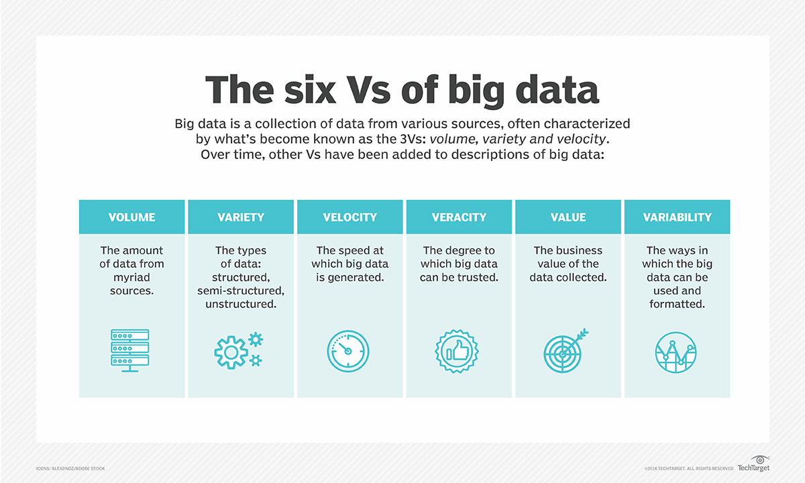

## Biggish data

My definition:

-   Only tabular data
-   Original data might fit into physical RAM but ...
-   might be multiplied due to temporary necessity
-   physical RAM might be constrained due to other processes/settings
-   things might just take too much time ... and life is short ...

## Software

-   SAS for big data files from register holders
-   R for everything else
-   Database?

# File format

## File storage

-   Avoid reading big files over ethernet connection
    -   data stored on network drive
-   Usually faster to first copy file to local SSD drive
    -   `fs::file_copy(path, new_path)`
    -   (*"libuv provides a wide variety of cross-platform sync and async file system operations."*)
    -   obviously only if "local drive" is also in the (same) secure environment
-   work with the project on disk
-   move back
-   Although not always possble with very large files it seems

------------------------------------------------------------

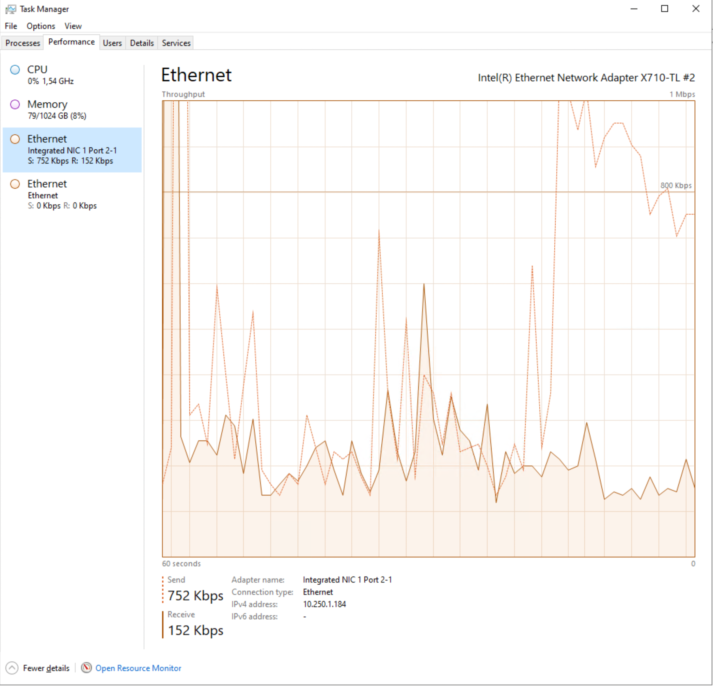

-------------------------------------------------------------

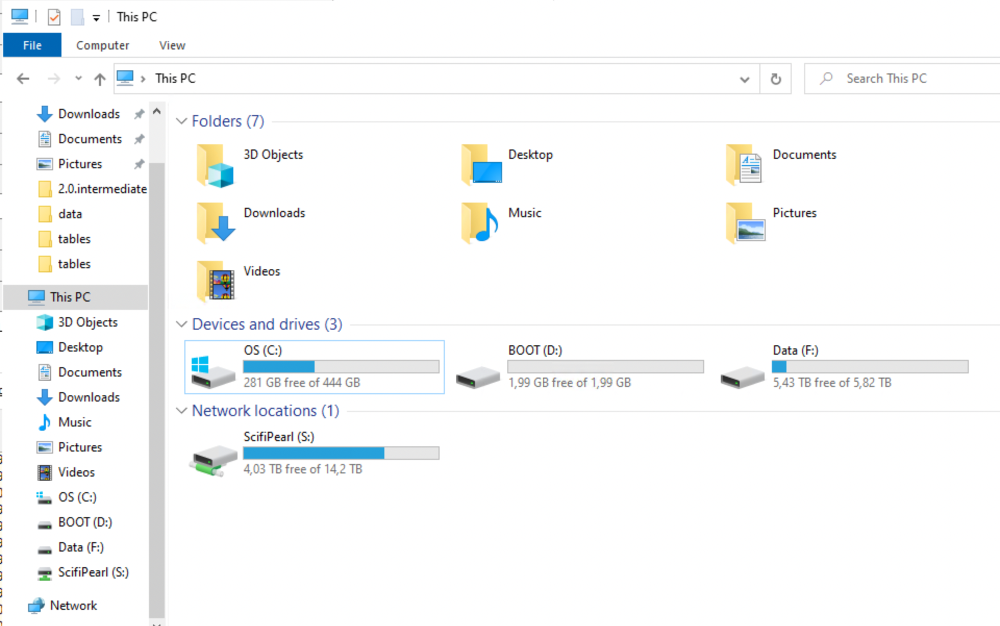

------------------------------------------------------------

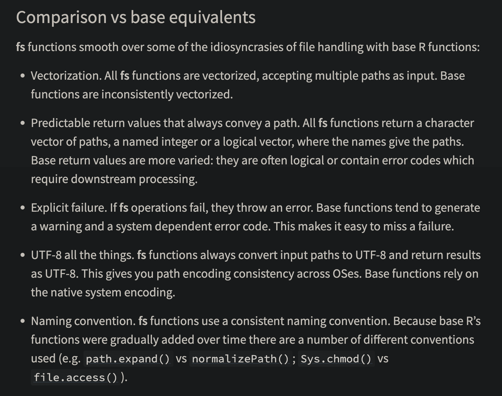

## `sync_project()`

-   I have a function `sync_project()` in my `.Rprofile`
    -   `usethis::edit_r_profile()`
-   However, I don't include all data files in each individual project
-   "Chek out" all files from network storage to disk
-   Work with it
-   Sync back to allow back-ups and common folder structure
-   Git-repo kept for the network storage

------------------------------------------------------------

```{r}
#| eval: false
#| echo: true
#| class-output: r
sync_project <- function (from, to) 
{
    loc_dirs <- c("S:/Projects/", "F:/xbuler/")
    loc_dirs_exp <- paste(loc_dirs, collapse = "|")
    proj <- gsub(loc_dirs_exp, "", getwd())
    locations <- paste0(loc_dirs, proj)
    locations_exp <- paste(paste0(locations, "/"), collapse = "|")
    stopifnot(getwd() %in% locations)
    from <- if (missing(from)) 
        getwd()
    to <- if (missing(to)) 
        setdiff(locations, from)
    ans <- askYesNo(paste("Sync from:\n ", from, "\n To: \n", 
        to))
    stopifnot(ans)
    if (!fs::dir_exists(to)) {
        fs::dir_create(to)
        message("Target folder did not exist but has been created!")
    }
    fr <- dplyr::mutate(dplyr::select(fs::dir_info(from, all = TRUE, 
        recurse = TRUE, regexp = ".git", invert = TRUE), path, 
        type, size, modification_time), file = gsub(locations_exp, 
        "", path), path_to = paste(to, file, sep = "/"))
    t <- dplyr::mutate(dplyr::select(fs::dir_info(to, all = TRUE, 
        recurse = TRUE), path, type, size, modification_time), 
        file = gsub(locations_exp, "", path))
    new <- dplyr::anti_join(fr, t, "file")
    new_dirs <- dplyr::filter(new, type == "directory")
    if (nrow(new_dirs)) {
        print(dplyr::select(new_dirs, file), n = Inf)
        ans <- askYesNo(paste(nrow(new_dirs), " dir(s) not in 'to'. Should I create these?"))
        if (ans) 
            fs::dir_create(new_dirs$path_to)
    }
    new_files <- dplyr::filter(new, type == "file")
    if (nrow(new_files)) {
        print(dplyr::select(new_files, file), n = Inf)
        ans <- askYesNo(paste(nrow(new_files), " file(s) not in 'to'. Should I copy them?"))
        if (ans) 
            purrr::walk2(new_files$path, new_files$path_to, fs::file_copy, 
                .progress = TRUE)
    }
    diff_mod <- dplyr::filter(dplyr::left_join(fr, t, "file", 
        suffix = c("_from", "_to")), type_from == "file", modification_time_to != 
        modification_time_from)
    if (nrow(diff_mod)) {
        print(dplyr::select(diff_mod, file, tidyselect::matches("modification_time|size")), 
            n = Inf)
        ans <- askYesNo(paste(nrow(diff_mod), " file(s) have been updated. Should I replace the older version?"))
        if (ans) {
            purrr::walk2(diff_mod$file, diff_mod$path_to, fs::file_copy, 
                overwrite = TRUE, .progress = TRUE)
        }
    }
    dlt <- dplyr::filter(dplyr::anti_join(t, fr, "file"), !startsWith(file, 
        ".git"))
    if (nrow(dlt)) {
        print(dlt, n = Inf)
        ans <- askYesNo(paste(nrow(dlt), " file(s) have been deleted in 'from'. Should I delete them in 'to'?"))
        if (ans) {
            purrr::walk(dlt$path, fs::file_delete, .progress = TRUE)
        }
    }
}
```

## 👎 Reading SAS files in R

-   Common to get large register files in SAS-format (SoS, SCB)
-   👍 SAS can handle that (files on disk) 😀
-   👎 I am a terrible SAS user 🙁
-   👎 Seems to be no easy way to read only parts of SAS-files into R directly
-   `haven::read_sas()`?

## `haven::read_sas()`

-   👍 May work if big enough RAM ...
-   👎 Whole file is first read into RAM (`readr::datasource(data_file)`)
-   👎 Most time spent on `df_parse_sas_file()`
-   (Same for .dta-files \[Stata\])

```{r}
#| class-output: r
haven::read_sas
```

## 👍 Export from SAS to csv

-   I use SAS code to export only nececary data to csv
-   I might use a prefiltering list exported from R to limit the data
-   SAS Viya more flexible (I've heard) but not SAS 9.4
-   Use `(set=1000)` etc for tests and then run over night
-   csv-files exported to local SSD drive (and then synced back to storage folder)

## ChatGPT

> Jag har exporterat en **csv-fil från R** som innehåller en lista med **löpnummer** på individer. Jag vill nu använda **SAS**. Först vill jag läsa in CSV-filen. Sedan vill jag **filtrera** ett dataset i SAS (vi kan kalla det pelle) som har en kolumn med samma löpnummer som i CSV-filen (jag vill bara ha med de fall där det finns en match). Därefter vill jag **exportera** resultatet till en **ny csv-fil**. Jag vill att detta ska ske på ett **effektivt och snabbt** sätt. Hjälp med med **SAS-syntax** för detta

------------------------------------------------------------

```{r}
#| classes: output-highlight
#| class-output: sas
#| echo: true
#| eval: false

/* Läs in CSV-filen i SAS */

/* Läs in filen med löpnummer till ett SAS-dataset (vi kallar det `individer`) */
proc import datafile="din_sökväg_till_csv_filen.csv"
    out=individer>
    dbms=csv
    replace;
    getnames=yes; /* Sätt till no om csv-filen saknar rubriker */
run;

/* Om CSV-filen saknar rubrik kan du lägga till följande steg för att namnge kolumnen manuellt */
data individer;
    set individer(rename=(var1=löpnummer)); /* Byt "var1" till korrekt variabelnamn */
run;

/* Filtrera datasetet `pelle` baserat på löpnummer */

/* Vi använder en hash-lookup för att göra filtreringen effektiv. Hash-lookup är snabbare än traditionella merge-metoder. */
data pelle_filtered;
    if _n_ = 1 then do;
        declare hash h(dataset: "individer");
        h.definekey("löpnummer");
        h.definedone();
    end;
    set pelle;
    if h.find() = 0; /* Endast matchande löpnummer */
run;

/* Exportera det filtrerade datasetet till en ny CSV-fil */

/* Använd proc export för att spara resultatet */
proc export data=pelle_filtered
    outfile="din_sökväg_till_ny_csv_fil.csv"
    dbms=csv
    replace;
run;

/* Effektivitetsoptimering:
Om både `individer` och `pelle` är mycket stora, 
kan du sortera båda och använda data step merge
istället för hash-lookup. Hash-metoden är dock 
generellt snabbare om det är många rader i båda 
tabellerna. */
```

## IDE

-   RStudio displays object info from the global environment
-   This is inefficient for big data
-   Whole session can hang and/or crash
-   I recommend [Positron](https://positron.posit.co/)
    -   Optimezed `View()` pane etc
    -   Active and enthusiastic development
-   Sometimes needed to ditch the IDE completely (even RGui)
    -   Run R from the terminal

------------------------------------------------------------------------

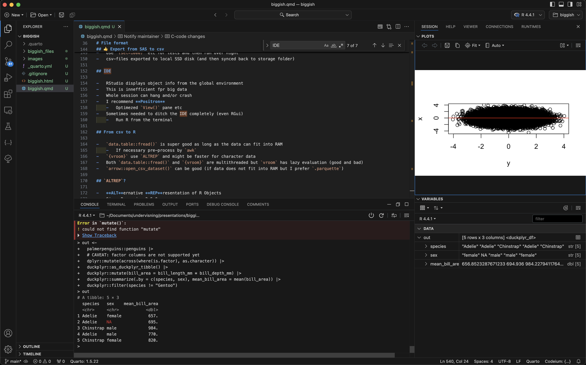

------------------------------------------------------------------------

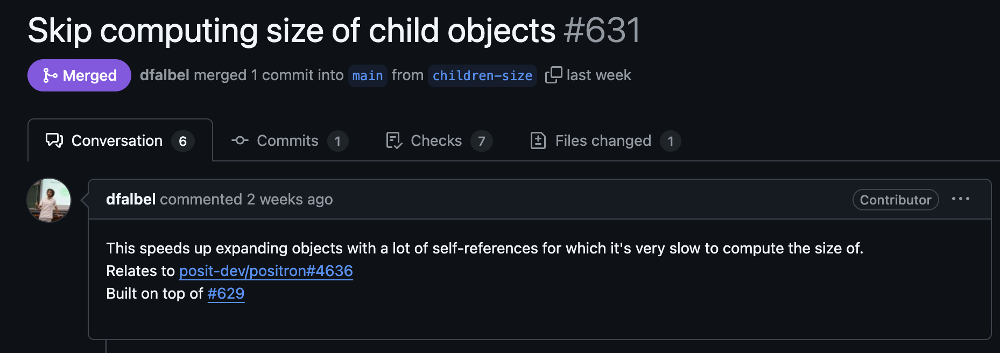

------------------------------------------------------------------------

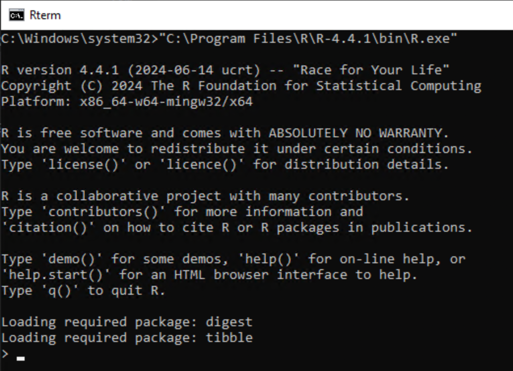

## From csv to R

-   `data.table::fread()` is super good as long as the data can fit into RAM
    -   If necessary pre-process by `awk`
-   `{vroom}` use `ALTREP` and might be faster for character data
-   Both `data.table::fread()` and `{vroom}` are multithreaded but `vroom` has lazy evaluation (good and bad)
-   `arrow::open_csv_dataset()` can be good (if data does not fit into RAM but I prefer `.parquette` if so)

------------------------------------------------------------------------

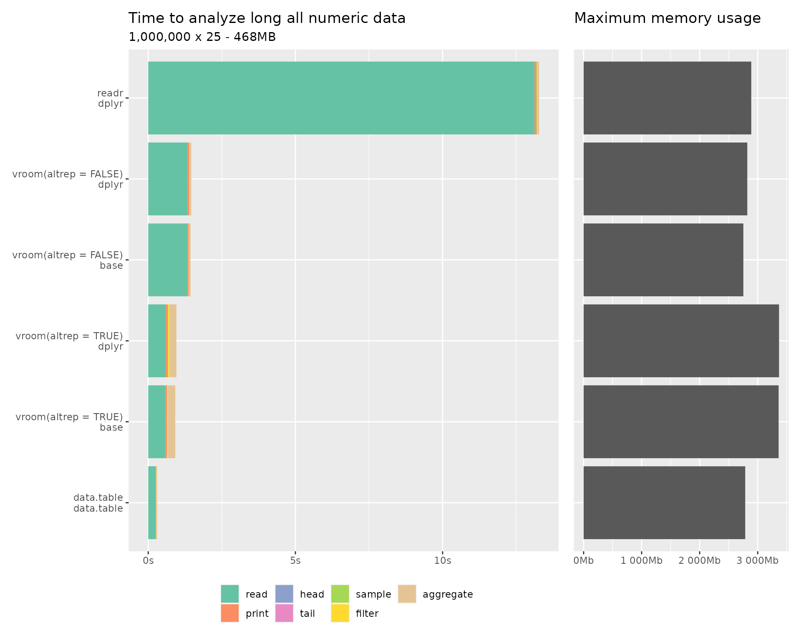

------------------------------------------------------------------------

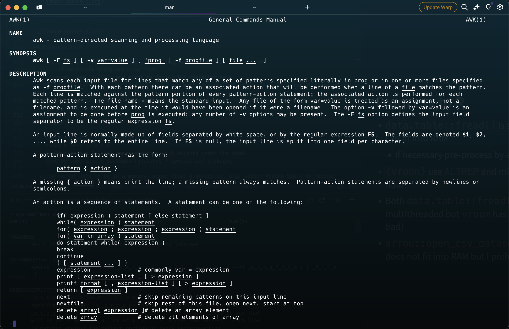

## `ALTREP`?

-   **ALT**ernative **REP**resentation of R Objects
-   Since R version 3.5.0
-   Applies to the C-level representation of R objects under the hood
-   Used by some base R packages/functions + specialized packages

> allow vector data to be in a memory-mapped file; distributed, e.g. within Apache Spark or Hadoop; shared with other applications, e.g. with Apache Arrow; allow compact representation of arithmetic sequences; allow adding meta-data to objects; allow computations/allocations to be deferred; support alternative representations of environments.

# Database?

## Database?

-   I don't want to administer Microsoft SQL Server myself!
    -   (They had R support for a couple of years but not any more)
-   SQLight is easy to use ...
-   but (as SQL server) it is row based 🙁
-   Some complicated ones are column based 😀 (Snowflake, Google Big Query)
    -   ... but I don't want to administer those either ...
-   DuckDB comes for rescue!

::: callout-important
# Indices

Never forget to set proper indices if needed!
:::

------------------------------------------------------------------------

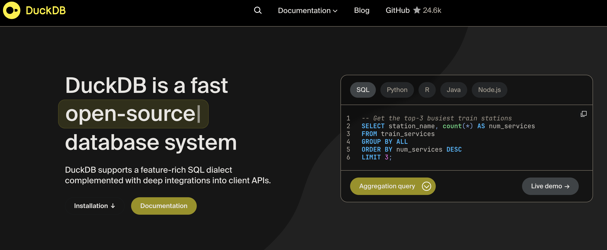

## DuckDB

-   Free and open source (backed by foundation)
-   Column based
-   Very easy to set up
-   Very efficient!
-   Integration with tidyverse in R
-   Can be used both with disk data and data in RAM
-   ... but I had some bad experience and now I am scared 😢

## From CSV to Parquet

-   CSV is not very nice 🙁
    -   No meta data
    -   Sensitive to errors (missing values, decimal point, numbers with leading 0 etc, although `fread` can take care of this)
    -   Encoding, BOM, whatever ...
-   Write to Parquet files
-   I don't think it is possible to convert csv to parquett on disk (first read csv, then write parquette)
    -   But it can be done in chunks (read portion of csv and write to individual parquet file which are later "combined")

------------------------------------------------------------------------

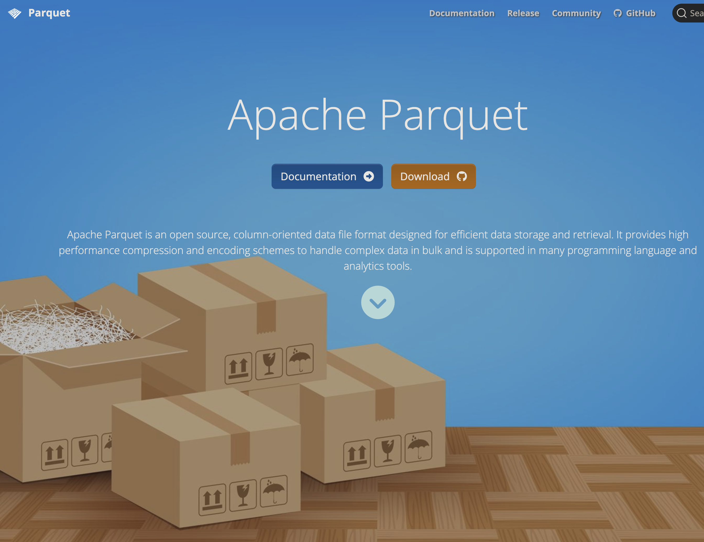

## Parquet

-   From Apache Arrow
-   Open format
-   flat files with possible hierarchical structure by transparent structure of folders and filenames
-   Integrates with DuckDB (which integrates with R/tidyverse)
-   See example later!

## R specific data files?

-   I use `.qd`-files (previously `.qs`) to cache non-tabular or intermediate data objects

> {qs2}: a framework for efficient serialization ... The qs2 format directly uses R serialization (via the R_Serialize/R_Unserialize C API) while improving underlying compression and disk IO patterns.

-   `.RData` is terribly slow!
-   `.rds` should now be much faster than before (serialized)
-   `.fst` might be better in some cases but `.qd/.qs` is more generic (I think)

------------------------------------------------------------------------

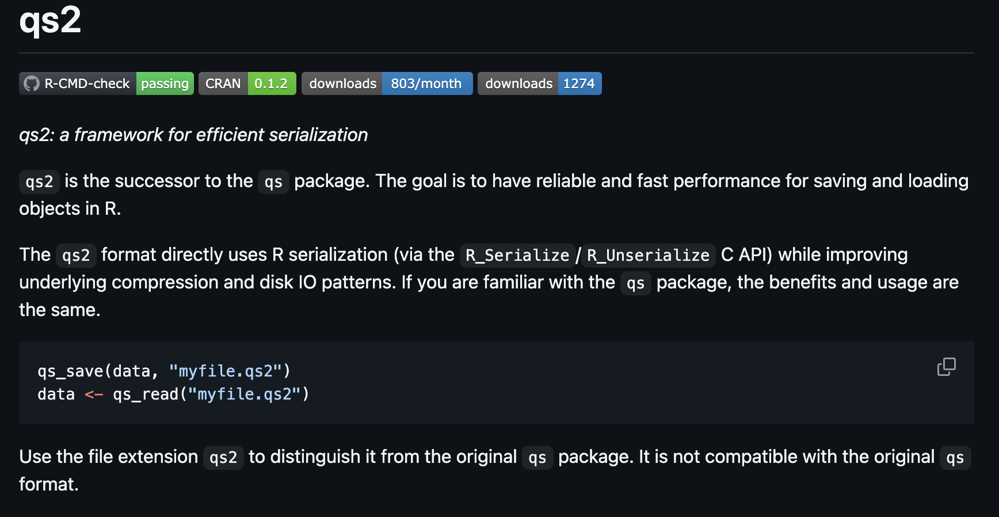

# Data management

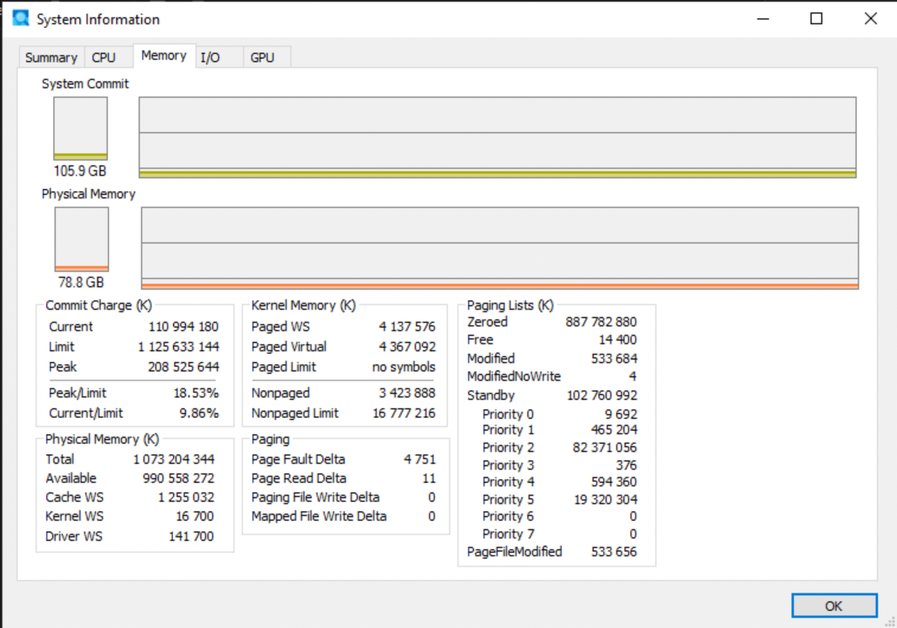

------------------------------------------------------------------------

-   Let's say data fits into RAM
-   base R and tidyverse works ... but might be terribly slow ...
-   `{data.table}`! 😀

------------------------------------------------------------------------

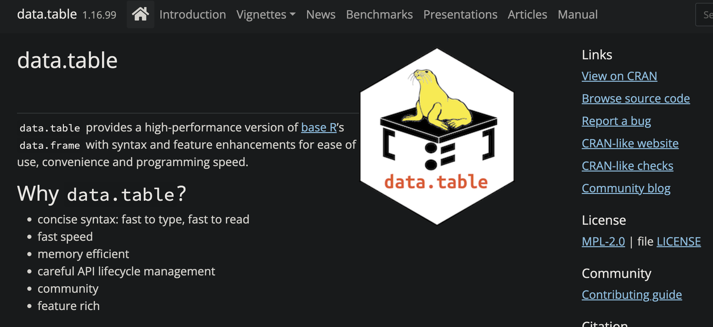

## {data.table}

-   Share basic properties with data frames (`dt[i, j]; merge()`)
-   Print method inspired by `{tibble}`
-   Some old friends from `{reshape2}: melt(), dcast()`
-   Has been around since 2006 (stable and well used, older than tidyverse)
-   faster alternatives to base: `fifelse(), fcase(), forder(), fread(), fcoalesce(), as.IDate(), %chin%`
-   C and GForce (some difficulties on Mac ...)
-   integer based keys and indices (compare data bases)
-   Reference semantics (no need to copy on modification)
-   Very flexible and compact (but perhaps unusual) syntax

## Example

```{r}
#| echo: true
library(data.table)
dt <- iris
setDT(dt)
setkey(iris)
iris
dt[, .N, Species]
dt[, date := as.IDate(Sys.Date()) + .GRP, Species][]
dt[, names(.SD) := lapply(.SD, as.character), .SDcols = is.factor][]
```

------------------------------------------------------------------------

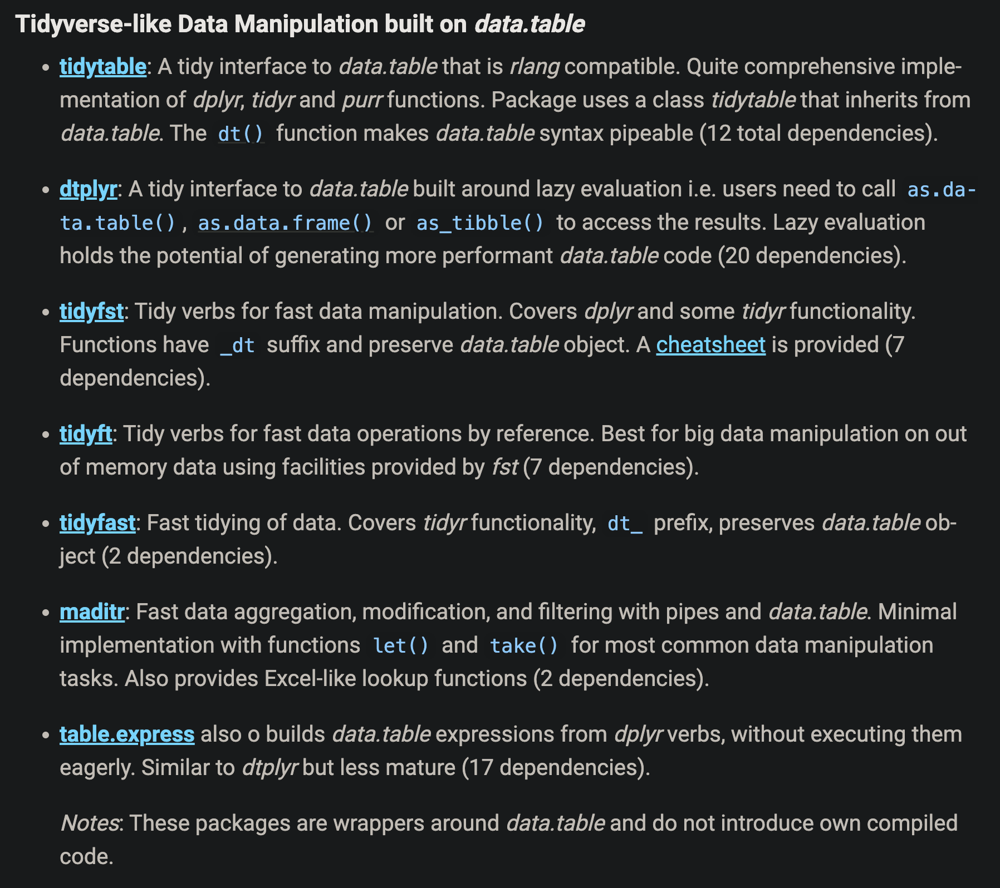

## If it doesn't fit?

-   Connect to parquet file.
-   Use DuckDB to process the data (while still on disk)
-   Use `{dplyr}` to translate its syntax into SQL code
-   Process data on disk
-   Only read the results into memory

## Example

```{r}
#| echo: true
#| eval: false
library(tidyverse)
db1 <-
  arrow::open_dataset("file1.parquet") |>
  arrow::to_duckdb() |>
  select(col1:col3) |>
  filter(...) |>
  pivot_wider(..) 

db2 <-
  arrow::open_dataset("file2.parquet") |>
  arrow::to_duckdb() |>
  count(x, y) |>
  filter(...)

df <- 
  db1 |>  
  left_join(db2) |>
  collect() # Only the resulting part should be collected!
  
```

------------------------------------------------------------------------

### Pros 👍

-   Lazy: nothing evaluated until it is actually needed (collected)
-   Many basic functions are translated from R to SQL
-   DuckDB is parallelized (`{data.table}` is mostly sequential)
-   Familiar syntax from tidyverse

### Cons 👎

-   tidyverse -\> SQL translation not perfect (non optimized)
-   might be relatively slow if intermediate steps are not cached and needs to be performed repeatedly

------------------------------------------------------------------------

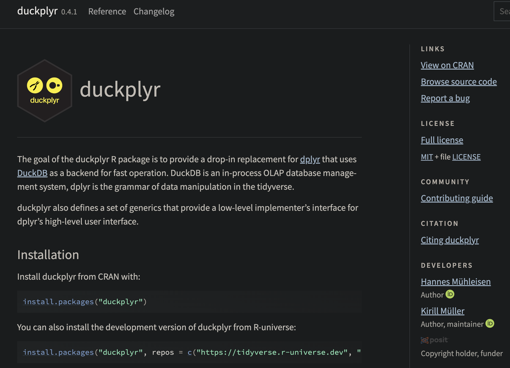

## DuckPlyr

-   New package with API-calls to DuckDB (no standard SQL code in between ... I think)
-   Drop-in-replacement of {dplyr}
-   Automatically fail-safe to collect and use standard {dplyr} if needed
-   Uptimized engine to not touch more data than necessary!
-   Although very limited functionality so far (but wait and see!)

------------------------------------------------------------------------

```{r}
#| eval: false
#| echo: true
out <-
  palmerpenguins::penguins %>%
  # CAVEAT: factor columns are not supported yet
  mutate(across(where(is.factor), as.character)) %>%
  duckplyr::as_duckplyr_tibble() %>%
  mutate(bill_area = bill_length_mm * bill_depth_mm) %>%
  summarize(.by = c(species, sex), mean_bill_area = mean(bill_area)) %>%
  filter(species != "Gentoo")

out %>%
  explain()
```

```{verbatim}
#> ┌---------------------------┐
#> │          ORDER_BY         │
#> │    --------------------   │
#> │      dataframe_42_42      │
#> │    42.___row_number ASC   │
#> └-------------┬-------------┘
#> ┌-------------┴-------------┐
#> │           FILTER          │
#> │    --------------------   │
#> │   "r_base::!="(species,   │
#> │         'Gentoo')         │
#> │                           │
#> │          ~34 Rows         │
#> └-------------┬-------------┘
#> ┌-------------┴-------------┐
#> │         PROJECTION        │
#> │    --------------------   │
#> │             #0            │
#> │             #1            │
#> │             #2            │
#> │             #3            │
#> │                           │
#> │         ~172 Rows         │
#> └-------------┬-------------┘
#> ┌-------------┴-------------┐
#> │      STREAMING_WINDOW     │
#> │    --------------------   │
#> │        Projections:       │
#> │    ROW_NUMBER() OVER ()   │
#> └-------------┬-------------┘
#> ┌-------------┴-------------┐
#> │          ORDER_BY         │
#> │    --------------------   │
#> │      dataframe_42_42      │
#> │    42.___row_number ASC   │
#> └-------------┬-------------┘
#> ┌-------------┴-------------┐
#> │       HASH_GROUP_BY       │
#> │    --------------------   │
#> │          Groups:          │
#> │             #0            │
#> │             #1            │
#> │                           │
#> │        Aggregates:        │
#> │          min(#2)          │
#> │          mean(#3)         │
#> │                           │
#> │         ~172 Rows         │
#> └-------------┬-------------┘
#> ┌-------------┴-------------┐
#> │         PROJECTION        │
#> │    --------------------   │
#> │          species          │
#> │            sex            │
#> │       ___row_number       │
#> │         bill_area         │
#> │                           │
#> │         ~344 Rows         │
#> └-------------┬-------------┘
#> ┌-------------┴-------------┐
#> │         PROJECTION        │
#> │    --------------------   │
#> │             #0            │
#> │             #1            │
#> │             #2            │
#> │             #3            │
#> │                           │
#> │         ~344 Rows         │
#> └-------------┬-------------┘
#> ┌-------------┴-------------┐
#> │      STREAMING_WINDOW     │
#> │    --------------------   │
#> │        Projections:       │
#> │    ROW_NUMBER() OVER ()   │
#> └-------------┬-------------┘
#> ┌-------------┴-------------┐
#> │         PROJECTION        │
#> │    --------------------   │
#> │          species          │
#> │            sex            │
#> │         bill_area         │
#> │                           │
#> │         ~344 Rows         │
#> └-------------┬-------------┘
#> ┌-------------┴-------------┐
#> │     R_DATAFRAME_SCAN      │
#> │    --------------------   │
#> │         data.frame        │
#> │                           │
#> │        Projections:       │
#> │          species          │
#> │       bill_length_mm      │
#> │       bill_depth_mm       │
#> │            sex            │
#> │                           │
#> │         ~344 Rows         │
#> └---------------------------┘
```

------------------------------------------------------------------------

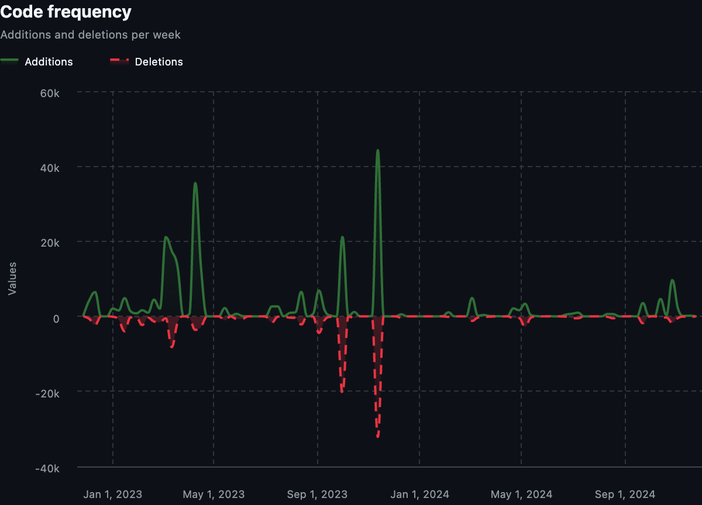

## Dates

-   Use `as.IDate()` instead of `as.Date()` if using `{data.table}`. Integer based.
-   Use `{anytime}` (or maybe `{fasttime}`) if conversion is needed (`ALTREP`)

## String manipulation

-   Character manipulation in base R can be quite slow (does not use `ALTREP` and only single core by default)
    -   For example regular expressions (`grep()`, `gsub()` etc)
-   `{stringfish}` use multithreads and ALTREP - much faster!

------------------------------------------------------------------------

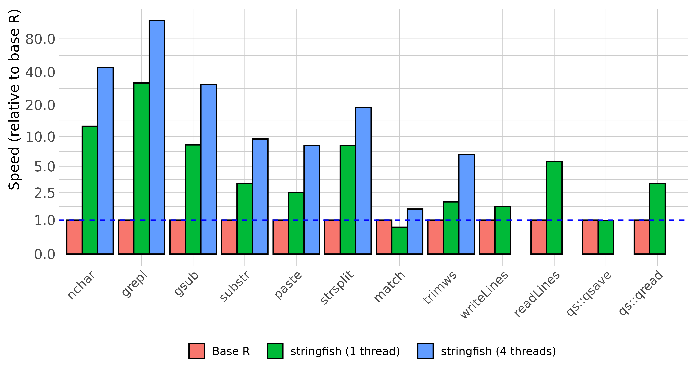

# Paralellization

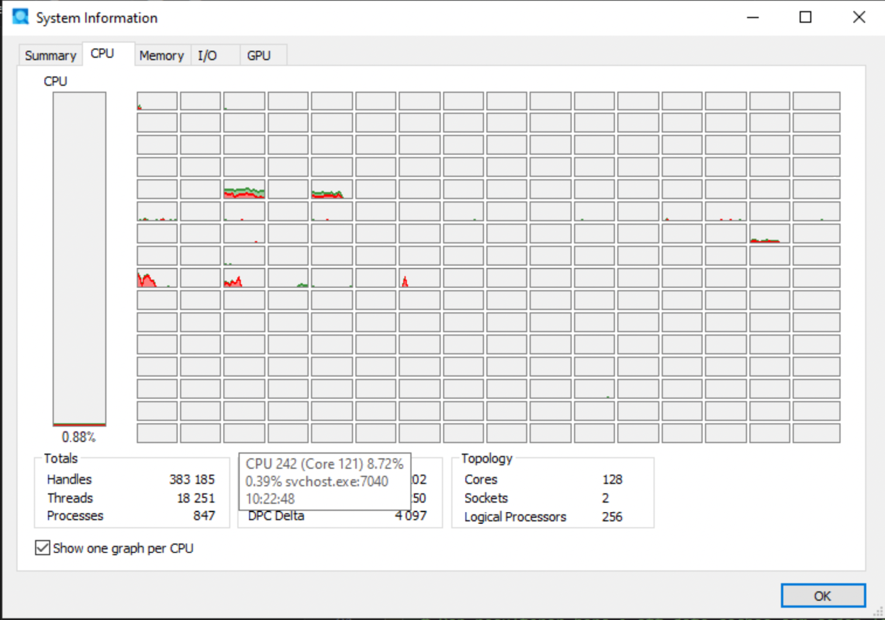

## Paralellization

-   R is single threaded by default
-   Some packages and functions may use multithreading by default
-   Some functions might have arguments such as `nthreads`, `ncores` etc
-   To handle multicore/thread computations can be (very) difficult (I've heard)
-   Easy if data can be divided and conquered (split-apply-combine)
-   `{futureverse}` is my favorite (Henrik Bengtsson)
    -   `{furrr}` is a a drop-in replacement for `{purrr}`

## `{furrr}`

```{r}
#| echo: true
# How many cores do we have?
parallel::detectCores()
library(furrr)
# Save at least one for OS etc
plan(multisession, workers = parallel::detectCores() - 1)

1:10 |> 
  future_map(rnorm, n = 10, .options = furrr_options(seed = 123)) |> 
  future_map_dbl(mean)
```

## {mirai}

-   Suposed to be up to 1,000 times "faster" compared to `{furrr}`(according to some metric ...)
-   should not block the main process while executing (haven't tried)

> Designed for simplicity, a ‘mirai’ evaluates an R expression asynchronously in a parallel process, locally or distributed over the network, with the result automatically available upon completion.

```{r}
#| eval: false
#| echo: true

library(mirai)
daemons(11, dispatcher = "thread") # "thread" still experimental

# data.table with 1 billion rows:
dt <- data.table(x = seq_len(1e9), y = rnorm(1e9))
# row sums (row wise )
mirai_map(dt, sum)[.flat]
```

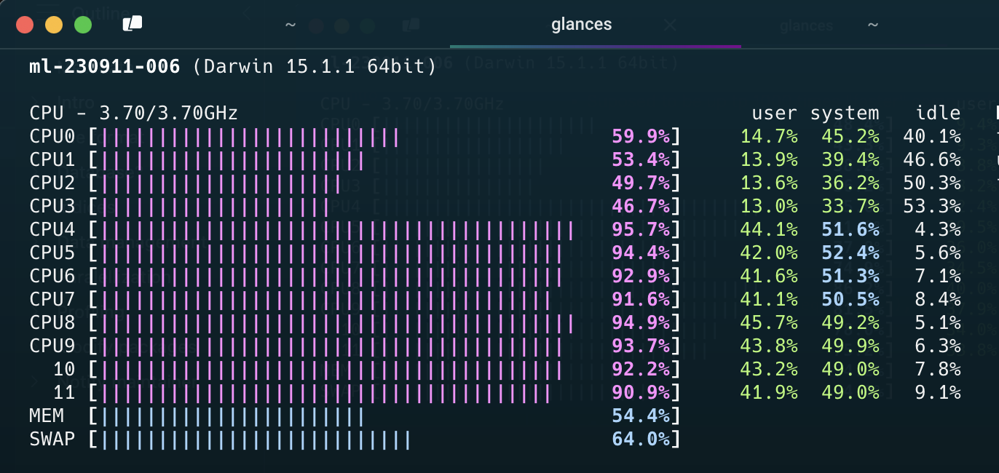

## Note

-   Data must be copied for each paralell worker
-   If all data is needed for each worker, it will be multiplied in memory
    -   This might not be possible for big data
    -   It also takes time
-   Hence, there is no guarantee that the over all time will decrease
-   Often a tradeof between no of workers/threads/deamons/cores and efficiency etc
-   "Standard" computations in `{data.table}` is optimized for single core
-   Message handling and progress bar etc is complicated

## Caching

-   I use `{ProjectTemplate}` to organize R projects into different steps

-   It has an inbuilt cache mechanism through `ProjectTemplate::cache()`

-   I have my own cache-functions in my `.Rprofile`

```{r}
#| echo: true
# OBS kollar inte att det verkligen finns cache-folder etc
cache_dt <- function(x, name = deparse(substitute(x)), nthreads = 5) {
  qs2::qd_save(x, glue::glue("cache/{name}.qd"), nthreads = nthreads)
  invisible(x)
}

decache_dt <- function(name, nthreads = 5) {
  x <- qs2::qd_read(glue::glue("cache/{name}.qd"), TRUE, nthreads = nthreads)
  if (data.table::is.data.table(x)) {
    data.table::setDT(x)
  }
  assign(name, x, envir = .GlobalEnv)
  invisible(x)
}

```

## Intermediate caching

-   For long running function calls (hours, days)

-   Divide task into smaller pieces and execute each part in paralell if feasable

-   Use wrapper function with some index/grouping variable to indicate which part is currently processed

-   Cache intermediate object as soon as possible (with name based on the grouping variable)

-   If process is disrupted and must be restarted, parts which are already executed are just retrieved from from cache

```{r}
#| echo: true
cache_wrapper <- function(dt_part, name, ...) {
  if (fs::file_exists(glue::glue("cache/{name}.qd"))) {
    decache_dt(name)
  } else {
    x <- do_what_should_be_done()
    cache_dt(x, name, ...)
    x
  }
}
```

## Profiling

-   First version of R script might be inneficient
-   Optimazation is difficult
-   Might be suboptimal if made ad hoc
-   `{profvis}` visualise time and memory usage for each step
-   improve the most important step first
    -   For example change `{base}` and `{tidyverse}` code to `{data.table}`
    -   set keys
    -   Efficient handling of dates and strings
-   itterate
-   Integrated in RStudio (but not yet Positron)

------------------------------------------------------------------------

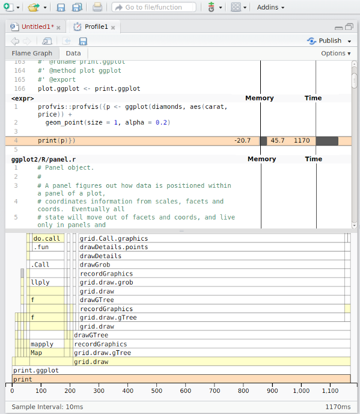

# Modify packages

## Modify packages

-   Functions from packages might be inefficient
-   Profile those as well
-   Clone package from GitHub if available or download source code from CRAN
-   Improve
-   Just load the modified function in global environment
    -   might need to modify internal calls to `:::`-accesed functions
-   Or rebuild/install the package if more convenient

::: callout-important
# Notify maintainer

If you find ways to improve a package, the maintainer might be eager to hear! Suggest pull request or open GitHub issue!
:::

## C-code changes

-   If the package use C-code it is probably already very fast
-   If not, and you can fix it, the package must be re-compiled
-   OS dependent
-   Might be tricky if using restricted environments (TRE?)
-   Can still be done by rhub (might need to change maintainer-e-mail temporarily)

------------------------------------------------------------------------

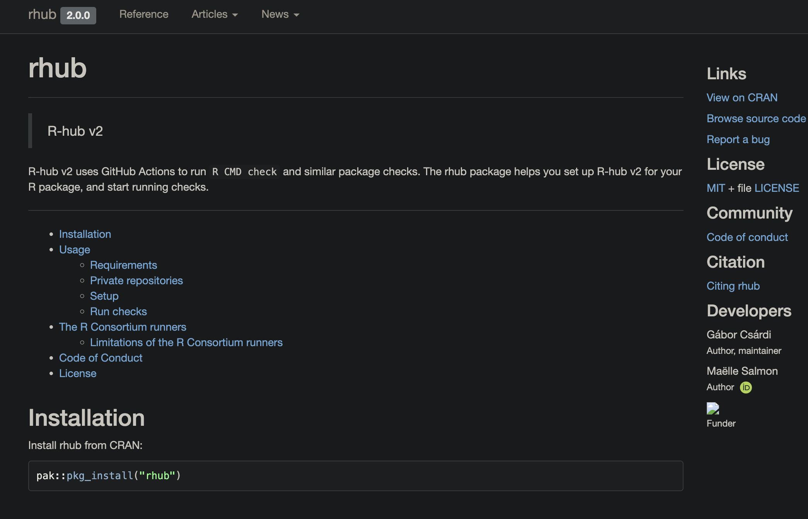

------------------------------------------------------------------------

------------------------------------------------------------------------

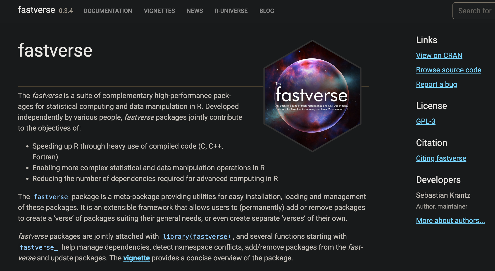