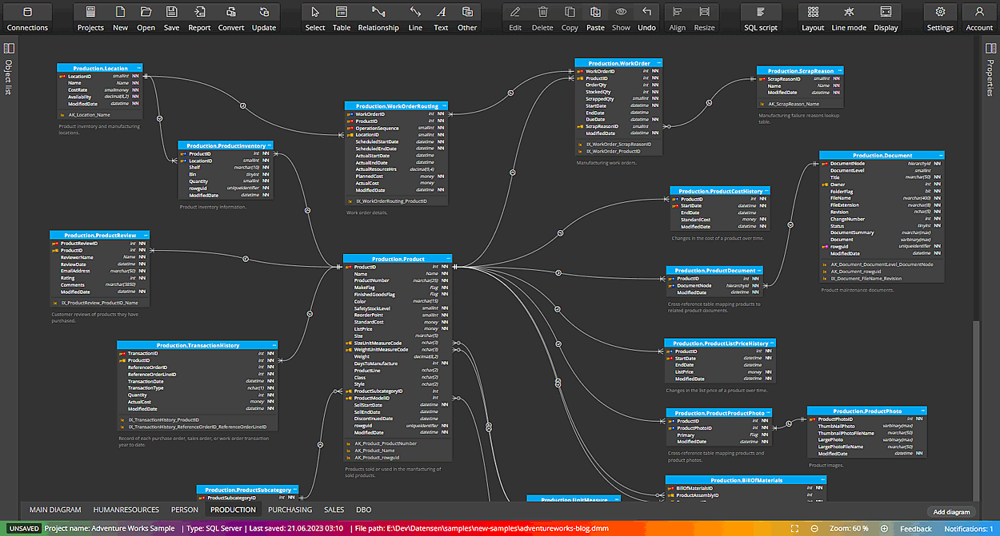
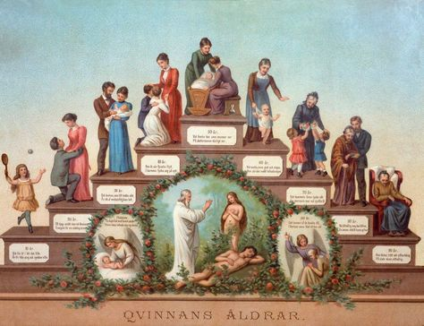

# EL1: Intro


## Important aspects

Data 
: where does is come from, what does it contain

Ethics and legal
: How to handle sensitive data, what laws and regulations apply

Project management
: how to plan and execute a data project, version control, reproducibility, R specific packages for efficient data handling

## Data -- what is it?

**EU Data Act \| Article 2, Definitions:**


data
: any digital representation of acts, facts or information and any compilation of such acts, facts or information, including in the form of sound, visual or audio-visual recording

metadata
:  a structured description of the contents or the use of data facilitating the discovery or use of that data;


## Inclusion/exclusion criteria

-   👍 Defines the target study/register population

-   👎 Define exceptions to the general rules

## Coverage and completeness

-   🏥 **Institutional coverage**: proportion of all eligible units/clinics that are connected to the registry
-   🤒 **Case coverage**: proportion of patients who should have been reported from connected units that are actually included
-   **Data completeness**: proportion of required data fields that are filled in for the registered patients


## Data linking

-   Unique personal identifier
    -   Not in every country!
    -   Social security number similar purpose but not as widely used


# EL4: Tooling


> It is widely acknowledged that the **most fundamental developments in statistics** in the past 60 years are **driven by information technology (IT)**. We should not underestimate the importance of pen and paper as a form of IT but it is since people start using **computers to do statistical analysis** that we really changed the role statistics plays in our research as well as normal life.

> Although: "Let’s not kid ourselves: the most widely used piece of software for statistics is Excel."" /Brian Ripley (2002)

[Short overview](https://vsni.co.uk/evolution-of-statistical-computing/?utm_source=chatgpt.com)

------------------------------------------------------------------------


## Panta rei!

-   We teach you the present
-   But your work is in the future
-   We might use history to predict the future?
-   At least we should learn that things changes constantly!

## Version control


------------------------------------------------------------------------

## Git

Design principles:

-   Distributed architecture
-   Fast local operations
-   Strong support for branching and merging

-----------------


## Version Control Beyond Code

Today, version control supports:

-   Reproducible research
-   Collaborative writing
-   Data science workflows
-   Teaching and learning


## WARNING!

-   Not everything should be shared!
-   Scripts and documentation yes!
-   But **Health data is sensitive!**
- `.gitignore`

## Statistics projects

-   Real projects are more complex than a single R script!
-   Multiple scripts
-   Multiple data files
-   Documentation
-   Reports
-   Version control
-   Reproducible workflows

## Project structure

Common file structures

-   Help you organize your thoughts
-   Help others to collaborate
-   simplifies paths used in your code


# EL5: Reproducibility

> An **article** about computational science in a scientific publication is not the scholarship itself, it is **merely advertising of the scholarship**. The **actual scholarship** is the **complete software development environment and the complete set of instructions** which generated the figures. / Buckheit & Donoho

> \[It is important to have\] a clear understanding of how data analysis was conducted when critical life and death decisions must be made. / Peng et al. 2021

## Reproducible analysis

> A published data analysis is reproducible if the analytic data sets and the computer code used to create the data analysis are made available to others for independent study and analysis

------------------------------------------------------------------------


## Pipeline

-   Define steps in your analysis as targets
-   Define dependencies between targets
-   Automatically track changes and rerun only necessary parts

------------------------------------------------------------------------


------------------------------------------------------------------------


## Different operating systems

-   R should behave similar on different operating systems.

-   Exceptions nevertheless exist!


## TRE

Different names, same concept: 

- Secure Research Envoronemnt (SRE), 
- Trusted Research Envoronment (TRE), 
- Secure Data Environment (SDE), 
- Data Clean Room, 
- Data Safe Havens, 
- ...

## In practice

-   Connect through VPN

-   2-factor authentication (BankID common in Sweden)

-   Remote Desktop 

-   Limited internet access from within the environment (maybe possible to install CRAN-packages tied to a certain historical snapshot but not the latest released/developed versions).

-   Data import and exports goes through administrator

------------

-   **Pros**: Secure, centralized backups, possibility to scale/share large computing resources (CPU, RAM, GPU etc), less dependent on individual computer (laptop), might aid collaboration

-   **Cons**: needs internet connection, restrictions on what software (packages) to use, difficult to export results and/or import script files etc, mentally exhausting to use for example a Mac Keyboard when working in Windows, can be expensive (pay per clock-cycle of CPU usage etc instead of simply purchasing a computer once).


# EL6: Data formats

## .sas7bdat

-   Many govermental agencies are using SAS
-   Their standard format when delivering big data sets
-   SAS is great for handling big data sets (no need to read everything into memory)
-   But you don't know how to use SAS 😩

## First try

-   It is often possible to read medium-sized SAS files to R by `haven::read_sas()`
-  But let's say this did not work for your data! 😩
-   Best practice for current SAS version (9.4) is to export only nessecary data to csv
-   The exported csv file can later be read into R


## Databases

-   a database is a collection of "tables" (tabular data frames)

-   Differences between data frames and database tables:

    -   Database tables are stored on disk and can be arbitrarily large.
    -   Data frames are stored in memory
    -   Database tables almost always have indexes; makes it possible to quickly find rows of interest
        -   Data frames and tibbles don’t have indexes, but `data.table`s do, which is one of the reasons that they’re so fast.
    -   No fixed row order in a table

------------------------------------------------------------------------



## Row vs column oriented

-   Most classical databases are optimized for rapidly **collecting** data, **not analyzing existing data**.

-   These databases are called row-oriented because the data is stored row-by-row, rather than column-by-column like R.

-   More recently, there’s been much development of column-oriented databases that make analyzing the existing data much faster.


## SQL

-   Different database systems may use different query languages.
-   The **Structured Query Language (SQL)** is the most widely used for relational databases.
-   Defined by international standards (ANSI/ISO).


## A Simple Example

``` sql
SELECT name, age
FROM students
WHERE age >= 18
ORDER BY age;
```

This query:

-   Selects two columns
-   Filters rows
-   Sorts the result


## DuckDB

-   Free and open source (backed by foundation)
-   R implementation by [duckplyr](https://duckplyr.tidyverse.org)
-   Can be used both with disk data and data in RAM


## DuckDB and Data Files

DuckDB can query files directly:

-   Parquet
-   CSV
-   JSON

No data import (to your computers Random Access Memory [RAM]) is required!


## Faster in memory?

-   DuckDB and `{duckplyr}` makes it possible to work with data which does not fit into memory
-   But what if data would fit (which is more common)?
    -   You can use tibbles and dplyr etc as usual ...
        -   ... but it might be slooooooooooooow ... for big enough data
-   `{data.table}` is much more efficient!

## data.table

- Comparable to working with `data.frame` in base R or `tibble` in the tidyverse
- Core components implemented in C for performance
- Uses concepts similar to databases:
  - Integer-based keys and indices  
  - Efficient joins and grouping
- Reference semantics  


## External API

- Some data can also be openly accessed by an Programming Application Interface (API)
- The PX-WEB API is used by a large number of statistical authorities (and others) world-widea to provide access to aggregated data
- The `{pxweb}` R package simplifies the process


# EL7: Medical coding

## Overview

-   Standardized vocabularies, controlled vocabularies, terminologies and ontologies ...
-   This is a field of its own (health informatics)
-   Let's just call it "medical coding" for now.

## ICD – International Classification of Diseases

-   Maintained by the World Health Organization (WHO)
-   Global standard for coding diseases and causes of death
-   Used for:
    -   Clinical documentation
    -   Mortality statistics
    -   Epidemiological research
    -   Health system planning and monitoring

## Historical Background

-   First version: 1893 (International List of Causes of Death)
-   WHO assumed responsibility in 1948 (ICD-6)
-   Major revisions approximately every 10–20 years
-   Each revision reflects:
    -   Advances in medical knowledge
    -   Changes in disease concepts
    -   Administrative and reporting needs

ICD has evolved from a mortality list to a comprehensive disease classification.


## National Modifications

Several countries use national adaptations:

-   ICD-10-CM (USA; Clinical Modification)
-   ICD-10-CA (Canada)
-   ICD-10-SE (Sweden)

## What Does an ICD Code Represent?

An ICD code reflects:

-   Clinical documentation
-   Coding rules
-   Administrative structure
-   Local practice


## Crosswalks Between Versions

When analyzing long time series:

-   Mapping tables (“crosswalks”) are often used
-   Mapping may be:
    -   One-to-one
    -   One-to-many
    -   Many-to-one

Crosswalks are rarely exact. Information loss or ambiguity is common.

Aggregation to broader diagnostic groups is often necessary.


## ATC for drugs

-   Anatomical Therapeutic Chemical (ATC) classification
-   categorizing therapeutic drugs,
-   introduced in the 1960s
-   In 1980, the World Health Organization (WHO) recommended the ATC system as the “state of the art”


## Procedure codes

-   We use ICD for diagnoses and medical condition
-   But how are patients with such diagnosis treated?
-   What actions (in addition to the prescription of medicines) do we have?
-   USA has a special version of ICD for this: ICD-10-PCS
    -   PCS = Procedure Coding System

## NOMESCO

In Sweden, medical procedures are coded using the **NOMESCO Classification of Surgical Procedures (NCSP)**.

-   Developed by the Nordic Medico-Statistical Committee (NOMESCO)
-   Used in Sweden, Denmark, Finland, Norway, and Iceland
-   Primarily for on surgical procedures

## KVÅ

-   In Sweden implemented through **KVÅ** (Klassifikation av vårdåtgärder)
-   Maintained nationally by Socialstyrelsen
-   Includes the NOMESCO-NCSP codes for surgery
-   Also includes additional codes for non-surgical treatments and activities
    -   Administration of chemotherapy (cytostatic treatment)
    -   Radiotherapy sessions
    -   Dialysis treatment (hemodialysis, peritoneal dialysis)
    -   Blood transfusion
    -   Vaccination
    -   Advanced wound care (non-surgical)
    -   Multidisciplinary team conference (MDT conference)
    -   ...


## SNOMED CT – What Is It?

**SNOMED CT (Systematized Nomenclature of Medicine – Clinical Terms)** is a large clinical terminology system.

- Maintained by **SNOMED International**
- Contains **hundreds of thousands of clinical concepts**
- Designed for **structured documentation in electronic health records**

Unlike ICD or ATC, SNOMED CT is primarily a **terminology**, not a statistical classification.

## Terminology vs Classification

| System | Type | Purpose |
|------|------|---------|
| ICD | Classification | Epidemiology and health statistics |
| ATC | Classification | Drug classification |
| KVÅ / NOMESCO | Classification | Medical procedures |
| **SNOMED CT** | Terminology | Detailed clinical documentation |

Classification systems simplify reality for **statistics and reporting**, while terminologies allow **very detailed clinical descriptions**.


## Regular Expressions (Regex)

-   A way to describe **patterns in text**
-   Used to:
    -   Identify diagnosis codes (ICD-10)
    -   Identify drug codes (ATC)
    -   Clean register data
    -   Validate variables


# EL8: Health care registers

## Types of registers

### National health registers 

- mandated by law
-  Sometimes with regional data collection and yearly updates
-   Governed by state authority

### Quality registers

-   Volontary for health care providers but commonly adopted
- opt-out for individuals
-   more than 100 in Sweden
-   But similar data collections in other countries by other names


------------------------------------------------------------------------



## Swedish Medical Birth Register

-   Established in **1973**
-   Covers pregnancies resulting in delivery in Sweden
-   Includes **live births and stillbirths** from gestational week 22+0
-   Contains information reported by **maternal care, delivery care, and neonatal care**


## The Total population Register (TPR)

-   maintained by Statistics Sweden (SCB)
-   based on data from the Population registration
-   structured for statistical analysis and research
-   used as the sampling frame for surveys and register-based studies

## Childhood

During childhood and school years, health information is collected through:

-   Child health services (BVC)
-   School health services
-   Vaccination records
-   Examinations by school nurses or physicians
-   dentists etc

In contrast to many other stages of life in Sweden, these data are **not collected in a national register**.

## Vaccination Register

-   National register maintained by the Public Health Agency of Sweden (Folkhälsomyndigheten)
-   Established in **2013**
-   Primarily covers vaccinations given within **national vaccination programmes**


## Military conscription

The conscription register contains information from military conscription examination

-   physical measurements (e.g. height, weight), cognitive ability tests, psychological assessments, health status and diagnoses, physical fitness
-   covers most Swedish men born roughly **1951–1990**
- Inactive 2010-2016
- Both men and women since 2017 (but only approximately 25 %)
-   examinations typically performed at **age 18–19**
-   data collected by the **Swedish Armed Forces**

## Swedish Dental Health Register

-   National register maintained by the National Board of Health and Welfare (Socialstyrelsen)
-   Established in **2008**
-   Includes adults (≥20 years)
-   based on reports submitted within the national dental care subsidy system
-   includes both public and private dental care providers

## Screening registers

-   breast cancer (mammography)
-   cervical cancer
-   colorectal cancer

These programmes aim to **detect disease at an early stage** in otherwise healthy individuals.

Data from screening programmes are often stored in **regional systems** 

## National Patient Register (NPR)

-   National register maintained by the National Board of Health and Welfare (Socialstyrelsen)
-   Covers **specialised health care in Sweden**
-   Data are collected by **regions and healthcare providers** and then reported to the national register

### Coverage

-   inpatient care since the **1960s**
-   nationwide coverage since **1987**
-   specialised outpatient care since **2001**

## Main variables include:

-   diagnoses (**ICD codes**)
-   procedures (**KVÅ codes – Swedish classification of healthcare interventions**)
-   dates of admission and discharge
-   hospital or clinic
-   patient demographics

## Primary care data

Primary care accounts for a large share of health care contacts in Sweden, but **there is still no comprehensive national primary care register** comparable to NPR.

-   most primary care data are stored in **regional electronic health record systems**
-   reporting practices differ between regions
-   national coverage for research and statistics is therefore limited


## Prescribed Drug Register (PDR)

-   National register maintained by the National Board of Health and Welfare (Socialstyrelsen)
-   Covers dispensed prescription drugs from Swedish pharmacies
-   Established in 2005
-   Nationwide coverage

## PDR does not include

-   drugs administered in hospitals
-   over-the-counter drugs
    -   since 2009, many non-prescription drugs can also be sold outside pharmacies (e.g. supermarkets and petrol stations)
-   most herbal medicines or dietary supplements

Dispension does not guarantee that the patient **actually used the medication**

## Cancer Register

-   National register maintained by the National Board of Health and Welfare (Socialstyrelsen)
-   Established in **1958**
-   Covers **all newly diagnosed malignant (and some benign) tumors in Sweden**
-   Based on "primary tumour"


## Cause of Death Register

-   National register maintained by the National Board of Health and Welfare (Socialstyrelsen)
-   Established in **1952**
-   Covers **all deaths among persons registered in Sweden**
-   Information is based on **death certificates completed by physicians**.
-   Diagnoses are classified using **ICD codes**. Currently ICD-10 (WHO version, not ICD-10-SE)


## LISA

Not a health care register but often used for background data.

-   education level
-   income and taxation
-   employment status
-   occupation and workplace
-   social insurance benefits
-   family situation


## National Quality Registers

National quality registers collect detailed clinical information on specific diseases or treatments.

They are designed to:

-   monitor and improve quality of care
-   support clinical quality improvement

But they can also be used for research

Typical characteristics:

-   focus on specific diagnoses, treatments, or procedures
-   contain more detailed clinical data than national health data registers
-   participation is generally voluntary for healthcare providers

There are currently **around 100 national quality registers** in Sweden.


## The Swedish register ecosystem

Key characteristics:

-   **Nationwide coverage** for many registers
-   Longitudinal data spanning several decades
-   Possibility of individual-level linkage across registers by the individual personal number

Limitations:

-   some sectors lack national registers (e.g. **primary care, school health services**)
-   coverage and data quality may vary across registers, health care providers (private vs public, secondary vs "tertary" care and over time)

## Countries with similar register infrastructures

The Nordic countries have relatively similar systems based on:

-   nationwide administrative registers
-   universal healthcare systems
-   personal identification numbers

These countries are therefore often used in **comparative register-based research**.


## Examples from other countries

Health data systems in other countries are often organised differently:

-   United Kingdom: NHS administrative datasets
-   Netherlands: population registers linked with health insurance data
-   United States: insurance claims databases and cohort studies
-   Canada: provincial administrative health data

**These systems can provide valuable data, but often lack:**

-   nationwide coverage
-   consistent linkage across registers
-   very long follow-up periods


# EL9: Documentation


## Levels of documentation

-   **Code level**
    -   scripts (comments, e.g. `# clean data and merge cohorts`)
    -   functions ([Roxygen2](https://roxygen2.r-lib.org/index.html) documentation)
    -   notes and reminders (e.g. `# TODO:`)
-   **Project level**
    -   `README.md`
    -   (GitHub repos may also have a wiki or a polished website)
-   **Output level**
    -   figures and tables
    -   reports (PDF / HTML)
    -   presentations (slides)


## Reproducible Workflows

Modern biostatistics projects rarely involve only statistics.

-   data cleaning and preprocessing
-   statistical modelling
-   visualisation
-   interpretation of results
-   reporting and documentation

A good workflow should make it possible to **combine all of these steps in one place**.

## What?

**Quarto** is a publishing system for scientific and technical documents.

It allows you to combine:

-   text
-   R code
-   statistical results
-   tables and figures

in a **single workflow**.

This makes it easier to create **reproducible statistical reports**.


## Audience

Decision makers, stake holders, friends or the public
: might not care about R. Disable R code (echoing the code itself), warnings and messages

collaborators
: Might still care less about verbose R messages and warnings (they trust that you have already considered those). May still need the underlaying R code for deeper understaing
Use `code-fold`.


## Manuscripts

-   [Quarto Manuscript](https://quarto.org/docs/manuscripts/)
-   framework for writing and publishing scholarly articles
-   Something for your later thesis work?
-   Handles references
-   Export to Word documents (`.docx`) etc
    -   which is still the most common format for submission to medical/epidemiological journals
    -   Still used for collaborative work with non-statisticians etc


## Online portfolio

-   Looking for a job after you fininsh the master program?
-   An online portfolia might increase your visability!
-   Perhaps add your course project to such portfolio?
-   [Demo](https://deepshamenghani.quarto.pub/portfolio-with-quarto-workshop/#/title-slide)
