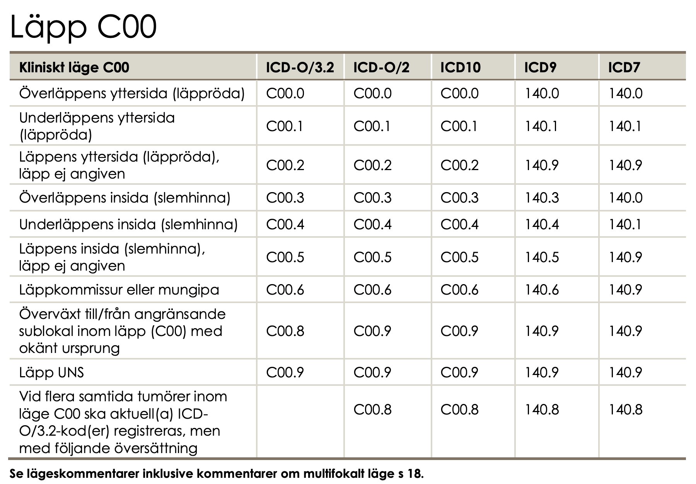
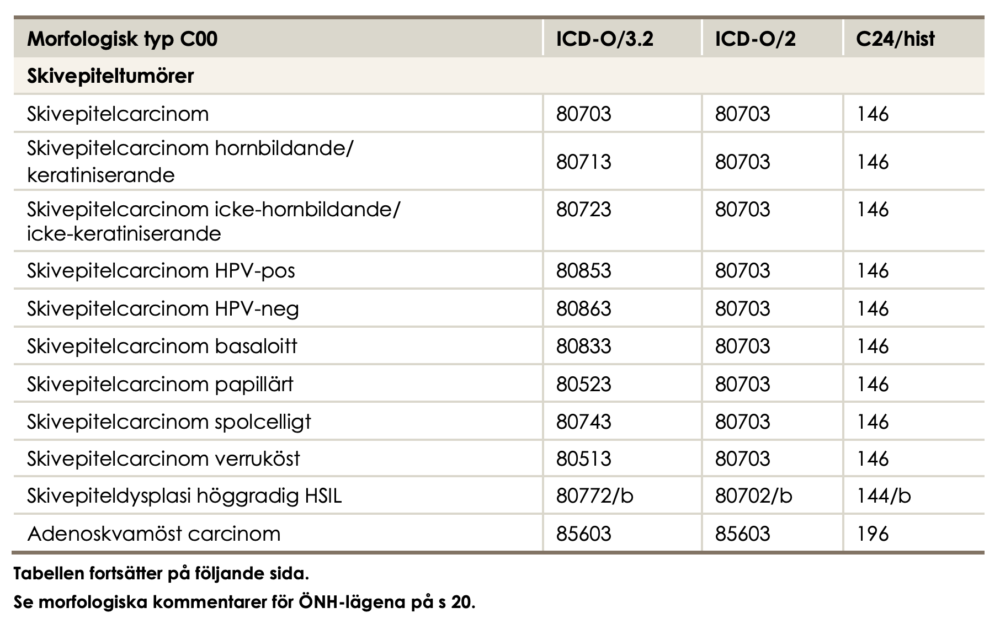
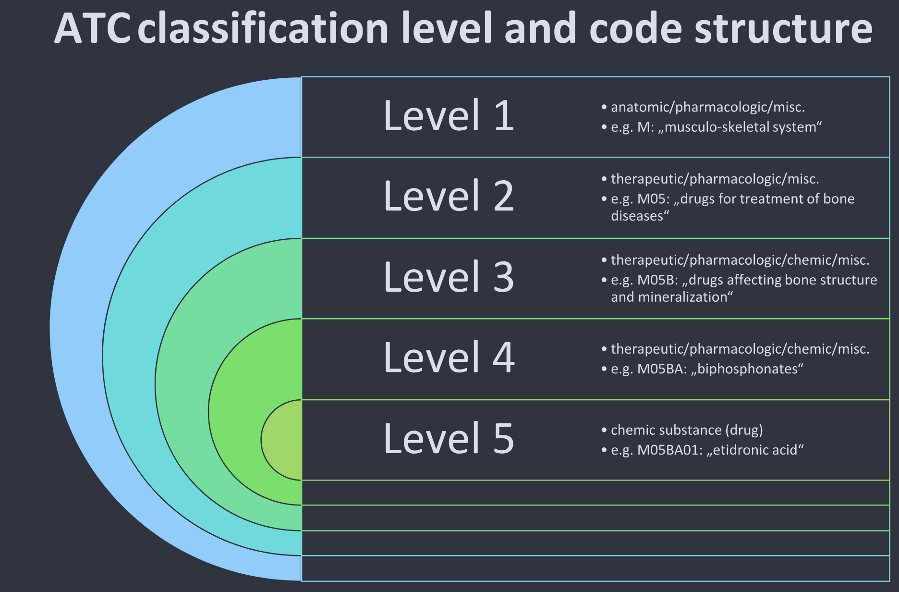

# EL1: Intro


## Important aspects

-   Data (where does it come from, what does it contain)
-   Ethics and legal (how to handle sensitive data, what laws and regulations apply)
-   Project management (how to plan and execute a data project, version control, reproducibility, R specific packages for efficient data handling)

## Data -- what is it?

**EU Data Act \| Article 2, Definitions:**

> For the purposes of *this Regulation*, the following definitions apply:

> (1) ‘data’ means any digital representation of acts, facts or information and any compilation of such acts, facts or information, including in the form of sound, visual or audio-visual recording;

> (2) ‘metadata’ means a structured description of the contents or the use of data facilitating the discovery or use of that data;

> (3) ‘personal data’ means personal data as defined in Article 4, point (1), of Regulation (EU) 2016/679;

> (4) ‘non-personal data’ means data other than personal data;

## Course structure

-   Lectures on different data sources/registers
-   🧑‍💻 Exercises on data management and analysis
    -   R with some additional tools (Git, GitHub, targets, data.table)
-   A data project with written report and presentation
-   Final exam 😱
-   Instruction web page [in addition to Canvas](https://sta220.github.io/documentation/)
-   Literature: accessible through [GU library](https://www.ub.gu.se) ([O'Reilly Learning for Higher Education](https://learning.oreilly.com/playlists/9f4347b3-6227-4ab8-9dce-bd31dee3ce8c)) or otherwise shared (no need to purchase books)

## Different types of data

-   🩻 Images
    -   Statistical image analysis
-   🧪 Lab samples
-   📝 Unstructured medical records
    -   Natural Language Processing
-   📺 Sensor data
    -   Time series ("big data")
-   💻 EHRs (electronic health records)
    -   Structured but hierarchical rather than tabular
-   💻 **Structured medical records**
    -   tabular data

## Usages

-   👩🏼‍🔬 Research
-   📒 Quality control/improvement
-   🔖 Administration/reporting
-   📰 News coverage
-   🧑‍💻 Building prediction models and tools

## Register data

Three types of health care registers:

-   Administrative registers
-   Health care registers
-   Quality registers

## 💶 Administrative data

(As found in all types of registers)

-   Billing codes
    -   Direct (what something actually cost)
    -   Estimated (DRG codes for different types of procedures)
-   Claims data
    -   Primary for reimbursement (insurance company or other payer)
    -   Secondarily for Health economy/epidemiology
-   How to contact patients, health care providers etc
-   Dates and times for visits, procedures etc

## 🏥 Hospital background data

-   hospital characteristics
-   staffing
-   resources
-   geographical area
-   level of specialization
-   private, public

## 🩺 Clinical data

-   health care registers
    -   Mandatory (by law)
    -   eg: National patient register, cancer register (diagnoses)
-   quality registers
    -   Optional for health care providers
    -   (Mandatory within organizations joining)
    -   conditions (diabetes, cancer, etc)
    -   procedures (total hip arthroplasty)
    -   Diagnoses, treatments, health status, questionnaires (PROM/PREM)

## 🤓 Individual background data

-   socioeconomic data
-   education
-   income
-   occupation
-   family relations
-   migration status
-   Mortality data
    -   date of death
    -   cause of death

## 🗺️ Aggregated data

"Micro" vs. "macro" data.

-   population data
-   neighborhood characteristics
-   pollution
-   crime rates

## Inclusion/exclusion criteria

-   👍 Defines the target study/register population

-   👎 Define exceptions to the general rules

## 🦿Simple example

> "Every Swedish resident who had total hip arthroplasty performed in Sweden"

-   **Include:** all ages, all hospitals, all reasons for the prosthesis, all types of prosthesis
-   **Exclude:** Swedish residents with surgery performed in other countries. Non-Swedish residents with the procedure performed in Sweden.

## 🥴 Complicated example

[The National Quality Register for Ovarian Cancer](https://cancercentrum.se/download/18.3de350c219545ea25bd2470a/1741112639724/inklusionskriterier-aggstockscancer-20140819.pdf)

-   **Inclusion**
    1.  **Epithelial borderline tumours of the ovary**
        -   Topography code according to ICD-O/2: C56.9.
        -   Morphology code according to ICD-O/2 ≥80103 and \<85900.
        -   Borderline tumours with 5th digit 3 in the morphology code according to ICD-O/2 and benign behaviour flag = 3.
    2.  **Epithelial ovarian cancer:**
        -   Topography code according to ICD-O/2: C56.9.
        -   Morphology code according to ICD-O/2 ≥80103 and \<85900.
        -   Malignant tumours with 5th digit 3 in the morphology code according to ICD-O/2 and benign behaviour flag blank.
    3.  **Non-epithelial ovarian cancer:**
        -   Topography code according to ICD-O/2: C56.9.
        -   Morphology code according to ICD-O/2 ≥85903 and \<95900, with the exception of mesotheliomas with ICD-O/2 codes in the interval ≥90500 and \<90600.
        -   Malignant tumours with digit 3 as the fifth digit in the morphology code according to ICD-O/2.
        -   Exception for granulosa cell tumours, where all cases with morphology codes according to ICD-O/2 in the interval ≥86200 and ≤86223 are included.
    4.  **Malignant tumours of the fallopian tube:**
        -   Topography code according to ICD-O/2: C57.0.
        -   Morphology code according to ICD-O/2 ≥80003 and \<95900, with the exception of mesotheliomas with ICD-O/2 codes in the interval ≥90500 and \<90600.
        -   Malignant tumours with digit 3 as the fifth digit in the morphology code according to ICD-O/2.
-   **Exclusion**
    -   **Epithelial ovarian cancer and borderline tumours of the ovary**\
        Cases with behavior **codes 0, 1, 2, 6, or 9 as the fifth digit** in the ICD-O/2 morphology code are excluded.\
        Morphology codes according to ICD-O/2 **\<80103 and ≥85900** are excluded.
    -   **Non-epithelial ovarian cancer**\
        Cases with **digits 0, 1, 2, 6, or 9 as the fifth digit** in the ICD-O/2 morphology code are excluded, **with the exception of granulosa cell tumours**, for which cases with ICD-O/2 morphology codes in the interval **≥86200 and ≤86223** are included even when the final digit is **0, 1, 2, or 3**.\
        Morphology codes according to ICD-O/2 **\<85903**, as well as codes in the intervals **≥90500 and \<90600** (mesotheliomas) and **≥95900**, are excluded.
    -   **Tumours of the fallopian tube**\
        Cases with **behaviour codes 0, 1, 2, 6, or 9 as the fifth digit** in the ICD-O/2 morphology code are excluded.\
        Morphology codes according to ICD-O/2 in the intervals **≥90500 and \<90600** (mesotheliomas) and **≥95900** are excluded.
    -   **For all diagnoses**, cases are excluded if the diagnosis is based solely on:
        -   clinical examination (**basis of diagnosis 1**),
        -   imaging procedures including radiography, scintigraphy, ultrasound, MRI, CT (or equivalent examinations) (**basis of diagnosis 2**),
        -   autopsy with or without histopathological examination (**basis of diagnosis 4 or 7**),
        -   surgery without histopathological examination (**basis of diagnosis 6**), or
        -   other laboratory investigations (**basis of diagnosis 8**).
        -   cases with **age \<18 years** are excluded.

## Coverage and completeness

-   🏥 **Institutional coverage**: proportion of all eligible units/clinics that are connected to the registry
    -   e.g., 90% of hospitals performing the procedure are connected
    -   Should be known by the "register holder"
-   🤒 **Case coverage**: proportion of patients who should have been reported from connected units that are actually included
    -   e.g., 85% of eligible patients registered
    -   The aim is to use 100 % but this is not always possible
-   **Data completeness**: proportion of required data fields that are filled in for the registered patients
    -   🚬 e.g., 95% of patients have smoking status recorded\
    -   🩸 e.g., 80% of patients have blood pressure data available

## What is recorded?

-   👩🏻‍⚖️ Some registers are mandated by law and regulations
-   Quality registers often have a steering committee and register holder
-   Reseasrh initiated databases according to specific protocols

## Data linking

-   Unique personal identifier
    -   Not in every country!
    -   Social security number similar purpose but not as widely used
-   study specific id number
-   HSA ("Hälso- och sjukvårdens adressregister" for staff and organizations)

## Unique personal identifier

(Swedish: personnummer, reading: [@ludvigsson2009])

> 121212-1212 [Tolvan Tolvansson](https://www.svd.se/a/164e04fe-7175-318e-b4d2-bc85530cee68/tolvansson-staller-till-problem)

-   10 (or 12) digits
-   date of birth-4 digits
-   assigned at birth or immigration
-   used in all health care contacts
-   used for all administrative data
-   sometimes reused after death
-   sometimes changed (uncommon)
-   sometimes inclusion criteria for register
-   similar in the Nordic countries
    -   Denmark: CPR number
    -   Norway: Fødselsnummer
    -   Finland: Henkilötunnus
    -   Iceland: Kennitala

## Combining data

-   Similar registries in different areas/regions/countries
    -   Different individuals but similar data
-   Same definitions and variables?
-   Same inclusion criteria?
-   Don't get fooled by similar names!
-   Differences and similarities within the Nordic countries [@laugesen2021]

## Working with health care data

A lot to do before the statistical analysis!

-   **Legalities**
    -   Do I have the right to access this data?
    -   What am I allowed to do?
    -   What am I not allowed to do?
-   **Data management**
    -   large datasets
    -   multiple datasets
    -   different formats
    -   missing data
    -   data cleaning
    -   data transformation
    -   data wrangling
    -   data munging
    -   data governance
    -   data engineering
-   **Planning**
    -   What is the purpose?
    -   How can I achieve my goals?
    -   What if I change my plans later?
    -   Can I redo my analysis?
    -   How do I present/communicate my results?

## R as a tool but ...

-   Large files often comes exported from SAS (initially "Statistical Analysis System")
-   Comma-Separated Values (csv) or text files
-   Application Programming Interface (API) calls
-   Structured Query Language (SQL) databases
-   Hierarchical data structures (eXtensible Markup Language, XML; JavaScript Object Notation, JSON, ...)

## Our use of R

-   `{data.table}` to handle large data sets efficiently
-   `{targets}` to streamline a reproducible pipeline
-   `Git` for version control
-   `GitHub` for collaboration
-   `Quarto` for reporting

------------------------------------------------------------------------

# EL4: Tooling


## Reading and practicing

-   [@theunix2026] introduces the Unix shell and the file system, which are essential parts for using git. Read and practice according to the instructions. (You may use the [Terminal tab in RStudio](https://support.posit.co/hc/en-us/articles/115010737148-Using-the-RStudio-Terminal-in-the-RStudio-IDE) or similarly in Posotron). Only the first sections are required:
    -   [Introducing the shell](https://swcarpentry.github.io/shell-novice/01-intro.html)
    -   [Navigating Files and Directories](https://swcarpentry.github.io/shell-novice/02-filedir.html)
    -   [Working With Files and Directories](https://swcarpentry.github.io/shell-novice/03-create.html)
-   [@rodrigues2023, ch. 4] introduces the basics of Git for R users and applies to all common operating systems. Read and practice by following the instructions.

**Recommended references:**

-   A bit old but still relevant: [Happy Git with R](https://happygitwithr.com/)
-   @staples2023 illustrates the constant evolution in technology. As a professional, you should not expect that what you learn in this course will stay relevant for ever. This article is a good illustration of how the linguistic use of R has changed in less than a decade. It is also a practical example of how you can use GitHub in a slightly different way and it touches briefly on `{data.table}`, which we will introduce later. It also illustrates that a lot of R code is not written for statistical analysis (the last and final step) but for data management. The article also mentions some statistical techniques which you will meet in later courses (ignore the details for now).

## Motivation

> It is widely acknowledged that the **most fundamental developments in statistics** in the past 60 years are **driven by information technology (IT)**. We should not underestimate the importance of pen and paper as a form of IT but it is since people start using **computers to do statistical analysis** that we really changed the role statistics plays in our research as well as normal life.

> Although: "Let’s not kid ourselves: the most widely used piece of software for statistics is Excel."" /Brian Ripley (2002)

[Short overview](https://vsni.co.uk/evolution-of-statistical-computing/?utm_source=chatgpt.com)

------------------------------------------------------------------------


## Panta rei!

-   We teach you the present
-   But your work is in the future
-   We might use history to predict the future?
-   At least we should learn that things changes constantly!

## Terminal

-   Don't rely too heavily on your computers graphical user interface (GUI)
-   You know how to use the R console!
-   To use a terminal/Unix shell/Bash... is similar
-   To navigate the file system is basic practice
-   A Unix Terminal is included if you are using Mac (and Linux)
-   Emulators are common for Windows (one is included in Git, use that one after installation)

## Early computer languages

-   **ALGOL / ALGOL 60**
    -   Algorithmic Language
    -   Influential in academic/scientific computing
    -   Introduced structured programming concepts that shaped later languages
-   **PL/I**
    -   Used in some government and industrial contexts
    -   Combined scientific and business computing features (Fortran + Cobol)

## General-Purpose Programming Languages

Early statistical computing relied heavily on:

-   **FORTRAN**
    -   Dominant language for numerical and statistical computation
    -   Statistical methods implemented as libraries and subroutines
    -   Still used as numerical back-end (e.g., BLAS/LAPACK) in modern statistical software
-   **C**
    -   Emerged in the 1970s as a systems programming language
    -   Widely used for implementing statistical software infrastructure
    -   Core language of many modern statistical environments (e.g., R, parts of SAS, Stata)
    -   Often used to interface with high-performance numerical libraries

📌 These languages required substantial programming expertise.

::: callout-note
## FORTAN and C

FORTAN is still used in R for subroutines such as [least squares](https://github.com/wch/r-source/blob/trunk/src/appl/dqrls.f). Even in modern packages!

Same for C, such as for [lm](https://github.com/wch/r-source/blob/trunk/src/library/stats/src/lm.c), which is popular for high performance computing (fast execution time).
:::

## Early Statistical Packages

Several dedicated statistical systems emerged:

-   **SPSS** (1968)
    -   Originally batch-oriented
    -   Widely used in social sciences
    -   Originaly "Statistical Package for the Social Sciences"
-   **BMDP** (1960s)
    -   Bio-Medical Data Package
    -   Developed at UCLA
    -   Common in medical statistics
-   **GENSTAT** (1968)
    -   Focused on agricultural statistics
-   **MINITAB** (1972)
    -   Designed for teaching and education
    -   Still popular in quality control

## SAS: A Transitional System

-   **SAS** (early 1970s)
-   Developed for agricultural and biostatistical analysis
-   Script-based, but largely batch-oriented
-   Became a standard in:
    -   Government agencies
    -   Large organizations
-   Known for strong data management capabilities
-   Still widely used in pharmaceutical industry

📌 SAS predates S and influenced later statistical workflows.

::: callout-note
## SAS data

-   Still common to receive data in SAS-format (`data_file.sas7bdat`) from register holders!
-   Sometimes necessary to use SAS to export the data (genAI might be a good aid in those cases)
:::

## Limitations of Pre-S Systems

Common limitations included:

-   Batch processing rather than interactivity
    -   But we still sometimes need batch processing for large scale projects!
    -   `Rscript script.R`
-   Separation of data management and analysis
-   Limited graphics capabilities
-   High barriers to exploratory data analysis

## S

-   S takes form at Bell Laboratories (interactive statistical computing).
-   John Chambers leads the effort.
-   **1976:** first working version of S runs on GCOS
-   **1979:** S2 is ported to UNIX; UNIX becomes the primary platform
-   **1980:** S is first distributed outside Bell Labs
-   **1981:** source versions are made available
-   **1984:** key S books published (often called the “Brown Book” era)

## The New S Language

-   **1988:** “New S” is released (major language redesign)
-   **1988:** **S-PLUS** is first released as a commercial implementation of S
    -   Last seen in Tibco Spotfire 2012
-   **1991:** *Statistical Models in S* (“White Book”) popularizes formula notation (the `~` operator), data frames, and modeling workflows

## R

-   **1993:** first versions of **R** is published (Auckland; Ross Ihaka & Robert Gentleman)
-   **1995:** R becomes open source (GPL)
-   **1997:** the R Core group forms; **CRAN** is founded (Kurt Hornik)
-   **2000:** **R 1.0.0** is released 2000-02-29

------------------------------------------------------------------------


## RStudio brings an IDE to the R community

-   **2009:** RStudio (the company) is founded
-   **2011:** RStudio IDE is introduced as an open-source IDE for R (desktop + server)

## Microsoft (Revolution Analytics)

-   **Jan 2015:** Microsoft announces it will acquire **Revolution Analytics**
-   Microsoft promotes enterprise R offerings (e.g., Microsoft R Open / R Server)
-   **2016:** SQL Server 2016 introduces **R Services** (in-database R)
-   **2017:** Microsoft expands the stack under “Machine Learning Server” branding
-   **June 2021:** Microsoft announces retirement of **Microsoft Machine Learning Server**
-   **2023:** Microsoft in still a relevant player
    -   platinum member of [The R consorsium](https://r-consortium.org)
    -   Owner of GitHub
    -   VS Code

## RStudio becomes Posit

-   **July 27, 2022:** RStudio rebrands as **Posit**
-   **July 28, 2022:** **Quarto** is announced as a next-generation scientific and technical publishing system (multi-language, multi-engine)
-   A public benefit company (not only relevant for its shareholders)
-   Also a platinum member of The R consortium \# Modern IDE

## Positron

-   New generation IDE for data science (and of course statistics!)
-   From Posit PBC
-   Free for individual use
-   Based on Code OSS (open source version of VS Code from Microsoft)
-   For both R and Python ([Julia?](https://github.com/posit-dev/positron/issues/3679))

------------------------------------------------------------------------


## Quick tour

<iframe width="560" height="315" src="https://www.youtube.com/embed/4Ir_HX4riHw?si=wu9-boO8Z4BKDSUZ" title="YouTube video player" frameborder="0" allow="accelerometer; autoplay; clipboard-write; encrypted-media; gyroscope; picture-in-picture; web-share" referrerpolicy="strict-origin-when-cross-origin" allowfullscreen>

</iframe>

::: callout-important
## Positron assistant (mentioned in the video)

This feature will most likely be disabled in any secure working environment. Such environments often have strict rules about data privacy and security, which may conflict with the assistant's functionality. Health data in SENSITIVE and SECURE environments must not be shared with external services, including AI assistants, to comply with data protection regulations and institutional policies.

It is recommended to not rely on such tools during the course (even if all our data is synthetic). If you start to rely on such tools, you might get difficulties the day you work with real data (might lead to prosecution for "brott mot tystnadsplikten" which is not only public, but actually civil law ("Brottsbalken") with prison sentence as a possibility). Society put an extreme emphasis on protecting health data, and rightfully so!

[Read more](https://posit.co/blog/trust-llm-tools/)
:::

## RStudio or Positron

-   We will use Positron in this course
-   This is for you to learn and see an alternative IDE ...
-   ... and to get used to the fact that you should never stop learning!
-   RStudio, however, is still a great tool and it is still developed and maintained.
-   You may use both in the future (maybe Positron on your computer but RStudio in a secure server, which tend to be more slowly updated)

## Some differences

-   No package installer (yet). You need to use `pak::pkg_install()` or `install.packages()` etc.

-   No inline rendering of results in Quarto documents (yet)

-   You can use multiple active R sessions at once

-   Great integrated tools from VS Code and extensions, such as GitHub integration

## Version control

------------------------------------------------------------------------


## Before Version Control Systems

1950s–1970s: Early software development relied on:

-   Manual file naming:
    -   `analysis_final.f`
    -   `analysis_final_v2.f`
-   Physical media:
    -   [Punch cards](https://storage.googleapis.com/dstlceqcawpgve/how-do-punch-card-computers-work.html)
    -   Magnetic tape
-   Centralised mainframes

📌 No automated tracking of changes.

## Floppy discs, Mail, and Shared Directories

1970s–1980s: Common practices included:

-   Copying files to:
    -   Floppy disks
    -   Magnetic tapes (actually still used for backups)
-   Sending media by **postal mail**
-   Sharing files via:
    -   Network drives
    -   FTP servers

📌 Version control was social, not technical.

## Early Version Control Systems

1980s: First-generation tools focused on single files:

-   **SCCS** (Source Code Control System, 1972)
-   **RCS** (Revision Control System, 1982)

Characteristics:

-   Versioning per file
-   Linear history
-   Central storage

## Centralised Version Control

1990s: Project-level systems emerge:

-   **CVS** (Concurrent Versions System)
-   **Subversion (SVN)**

Key features:

-   Central repository
-   Multiple users
-   Check-in / check-out model

📌 Still required constant access to the central server.

## Limitations of Centralised Systems

Common problems:

-   Single point of failure
-   Poor support for branching and merging
-   Difficult offline work
-   Slow operations on large repositories

These limitations became critical for large projects.

## Git

-   **Git** was created by Linus Torvalds in 2005
-   Original motivation:
    -   Support Linux kernel development
    -   Replace proprietary tools

Design principles:

-   Distributed architecture
-   Fast local operations
-   Strong support for branching and merging

## Terminal

-   Windows: the Git installer comes with a terminal
-   Linux/Unix (incl. Mac): use your terminal/Warp
-   Terminal pane in RStudio/Positron

------------------------------------------------------------------------


## GUI


------------------------------------------------------------------------


## The basics

[Four short videos to watch](https://git-scm.com/video/what-is-version-control.html)

[Cheat-sheet](https://git-scm.com/cheat-sheet.pdf)

Some interactive learning tools:

-   [Git practice](https://git-practice.com/)
-   [Git Master](https://my-git-playground.vercel.app)
-   [learn git branching](https://learngitbranching.js.org/)
-   [git simulator online](https://webutility.io/git-simulator-online)

## Some basics

-   You initiate a folder as a git project

-   Git will track all changes made in that folder

    -   New files

    -   Modified files (especially text, such as programming scripts/functions etc)

    -   Deleted files

## Branching


## Distributed Version Control with Git

Key ideas in Git:

-   Every clone is a full repository ("folder")
-   Local commits without network access
-   Cheap and fast branches
-   Cryptographic integrity (hash-based)

📌 Collaboration becomes more flexible and robust.

## Hosting Platforms

Platforms built around Git:

-   [GitHub](github.com) (2008)
-   [Bitbucket](bitbucket.org) (2008)
-   [GitLab](gitlab.com) (2011)
-   [Gitea](https://gitea.com/) - open source alternative to GitHub (get the same functionallity locally or on a server)

They add:

-   Pull requests / merge requests (collaboration tools)
-   Issue tracking (discussions and bug reports etc)
-   Code review
-   CI/CD integration (advanced)

## Issue tracking

-   Issue tracking is not part of Git but is implemented in most (if not all) hosting platforms.

-   Used for bug reports and discussions between developers and users

-   Issues can be closed when fixed/adressed but are still found in the history

-   Each issue gets a number (in order) and those can be referenced in commit messages etc (ex: `Fix #37`, which will automatically close the issue)

------------------------------------------------------------------------


------------------------------------------------------------------------


------------------------------------------------------------------------


## Version Control Today

Modern usage includes:

-   Code
-   Documentation
-   Data analysis (scripts, notebooks)
-   Configuration and infrastructure

Git is integrated into:

-   IDEs (RStudio, VS Code, Positron)
-   CI/CD pipelines
-   Cloud platforms

## Version Control Beyond Code

Today, version control supports:

-   Reproducible research
-   Collaborative writing
-   Data science workflows
-   Teaching and learning

📌 Version control is now a core professional skill.

## WARNING!

-   Not everything should be shared!
-   Scripts and documentation yes!
-   But **Health data is sensitive!**
    -   Do not share it!
    -   Avoid unintentional sharing!
    -   Private repositories are still shared with hosting provider!
-   Avoid explicit file paths and sensitive info in scripts!
    -   Can give information about data location and internal structure!
-   No hard-coded passwords or API keys!

## Git basics

(After installing the Git software)

-   Collect all files related to a project in a folder
-   Initialize a git repository in that folder
-   Make changes to files
-   Stage changes for commit
-   Commit changes with a message
-   Possibly push commits to remote repository

```         
cd path/to/your/project
git init
git status
## make changes to files
git add filename1 filename2
git commit -m "Descriptive message about changes"
git remote add origin
```

## Video tutorials

The video below is a good start to understand the basic concepts of Git and GitHub (and there are others to be found on YouTube).

<iframe width="560" height="315" src="https://www.youtube.com/embed/mJ-qvsxPHpY?si=vL8ERoEp0OnGzotn" title="YouTube video player" frameborder="0" allow="accelerometer; autoplay; clipboard-write; encrypted-media; gyroscope; picture-in-picture; web-share" referrerpolicy="strict-origin-when-cross-origin" allowfullscreen>

</iframe>

## Inspirational video

Watch this video even though some parts might be overwhelming. It gives a good overview of the current state (2025), even though many things will be too advanced for this course (it is not specifically aimed for statisticians or R users).

<iframe width="560" height="315" src="https://www.youtube.com/embed/vA5TTz6BXhY?si=ctFccFSel_GLwzuh" title="YouTube video player" frameborder="0" allow="accelerometer; autoplay; clipboard-write; encrypted-media; gyroscope; picture-in-picture; web-share" referrerpolicy="strict-origin-when-cross-origin" allowfullscreen>

</iframe>

::: callout-important
## .gitignore

The `.gitignore` file is very important in settings with health data! Pay close attention to [this section](https://www.youtube.com/watch?v=vA5TTz6BXhY&t=1545s) of the video!
:::

## Git in Positron

-   Remember that Positron is build on Code OSS (which shares a lot of features with VS Code).
-   Branching and merging is possible but we will not cover that here.

Short official introduction from Microsoft:

<iframe width="560" height="315" src="https://www.youtube.com/embed/i_23KUAEtUM?si=KNUO6Pr8UatA35kh" title="YouTube video player" frameborder="0" allow="accelerometer; autoplay; clipboard-write; encrypted-media; gyroscope; picture-in-picture; web-share" referrerpolicy="strict-origin-when-cross-origin" allowfullscreen>

</iframe>

More detailed introductions. Watch both! The first one is based on a Windows version of VS code and the second on Mac but the concepts are the same:

<iframe width="560" height="315" src="https://www.youtube.com/embed/z5jZ9lrSpqk?si=tajG6Mkm84wlJBYs" title="YouTube video player" frameborder="0" allow="accelerometer; autoplay; clipboard-write; encrypted-media; gyroscope; picture-in-picture; web-share" referrerpolicy="strict-origin-when-cross-origin" allowfullscreen>

</iframe>

<iframe width="560" height="315" src="https://www.youtube.com/embed/twsYxYaQikI?si=2QEK70Shtfvz5IA7" title="YouTube video player" frameborder="0" allow="accelerometer; autoplay; clipboard-write; encrypted-media; gyroscope; picture-in-picture; web-share" referrerpolicy="strict-origin-when-cross-origin" allowfullscreen>

</iframe>

::: callout-note
## Overwhelmed?

This video includes some parts which might be overwhelming if you are new to Git and GitHub. Don't worry! You don't need to understand everything right away. Just try to follow along with the basic concepts and steps. You will get more comfortable with practice.
:::

## Statistics projects

## Not a single R script

-   Real projects are more complex than a single R script!
-   Multiple scripts
-   Multiple data files
-   Documentation
-   Reports
-   Version control
-   Reproducible workflows

## Project structure

Common file structures

-   Help you organize your thoughts
-   Help others to collaborate
-   simplifies paths used in your code


## Example structure

```         
/.../my_project/
  ├── README.md        - project documentation
  ├── TODO             - what should be done next?
  ├── .git             - handled by git (hidden folder)
  ├── .gitignore       - used by git but your responsibility!
  ├── data/            - your data files (not under version control!)
      ├── cancer.csv 
      └── patients.qs 
  ├── R/               - your saved R functions
      ├── function1.R 
      └── function2.R
  ├── reports/
  └── _targets.R       - targets pipeline script
```

## `README.md`

-   Document the purpose of the project
-   What is it about?
-   What is the aim?
-   Who to contact for questions?
-   In what circumstances was it created?

[Markdown format](https://www.markdownguide.org/cheat-sheet/) (simple text with some possible formatting)

## `data` folder

-   Store your data files here as they are when you get them
-   Avoid any modifications to the raw files!
-   It is very easy to forget what you do if it can not be traced by code
-   Do NOT include this folder in version control!
-   Git is not good at handling large files
-   Sensitive data should not be shared!
-   Add `data/*` to your `.gitignore` file
-   In realistic projects, data might come in varying formats
    -   csv, txt, xlsx, sas7bdat, sav, dta, etc
    -   some files might be very big (gigabytes not uncommon)

## `R` folder

-   Store your R functions here
-   Document their purpose inline!
-   Helps you to reuse code
-   Easier to read main scripts
-   Easier to test and debug code
-   Easier to share code between projects

## `reports` folder

-   Store your reports here
-   Quarto documents
-   Documemnt your analysis
-   Include figures and tables
-   Share with external collaborators

## Computer practice

In [ECS1](ECS1.qmd) we will use Positron and git/GitHub in action!

Also see the "Reading and practicing" section above for a more in-depth introduction (homework).

## What you should know

-   Reflect on the use of different software and how the rapid development in this field interplay with other important aspects of our field

-   Be able to describe the principles of basic git commands (init, add, stage, commit, push, pull) and what they are used for (may be theoretical questions in the written exam)

-   Use Git and GitHub in practice (but you can choose to do it either by commands or the GUI), this will be assessed in computer exercises and a later project.

-   Similarily, you need to organize your projects according to best practice (but we will be the focus of [EL5](EL5.qmd)).

------------------------------------------------------------------------

# EL5: Reproducibility


## Reading

-   @baker2016 and @deoliveiraandrade2025 motivates why reproducible analysis is important!
-   @peng2021 introduce and elaborate more on the subject.
-   @nguyen2022a only read section "Basic Introduction to Docker and Containers" in chapter 2 (you do not need to install Docker for this course, just be aware of the concept)
-   @kavianpour2022 introduces Trusted Research Environment as well as some perceived challenges with those (we will not use such environments in the course but this is likely the reality you need to cope with later on in your career, so you should get familiar with the concept).

::: callout-tip
## Consider

-   After reading papers like @baker2016 and @deoliveiraandrade2025 , one might be tempted to conclude that nothing is trustworthy — not even our own analyses. If every result comes with assumptions, uncertainty, and potential bias, what does trust really mean? Statisticians live in a world of probabilities, but most people prefer certainty.

-   Reproducibility might sound like a good thing but how much does the technical details matter if we are not allowed to freely share the underlying health care data anyway?
:::

**For reference:**

-   [Targets overview](https://docs.ropensci.org/targets/articles/overview.html)

-   [Target manual](https://books.ropensci.org/targets/)

-   You read briefly about Docker in the mandatory reading. If this seems interesting, you might read: [An Introduction to Rocker: Docker Containers for R](https://journal.r-project.org/articles/RJ-2017-065/index.html) (not mandatory).

## Practice

A workshop with 7 parts was given at the R Medicine conference 2025. Practice according to part 1-3 (part 4-7 are slightly outside the scope of the course and only recommended if you have additional time and interest).

Clone [this GitHub repo](https://github.com/rsangole/2025-R-Medicine_targets-workshop). Exercies are found in the `code` folder.

Follow the recording from the workshop while you are practicing: [The power of {targets} package for reproducible data science](https://r-consortium.org/posts/the-power-of-targets-package-for-reproducible-data-science/)

::: callout-note
## Notes on the recording

-   The full video is close to three hours long, but this includes breaks as well as the more advanced topics that are not mandatory (only the first 92 minutes, which includes several 10 min breaks is mandatory). Nevertheless, it is recommended to watch the full video (just watching part 4-7 for inspirational purposes without doing the exercises and without any expectation to fully grasp all the details).
-   RStudio is used in the recording. Please try to use Positron; however, feel free to revert to RStudio this time if following the instructions in one application while working in another feels overwhelming.
-   You may recognize some of the material from Part 3, as presented during the lecture
:::

This practice is homework (no dedicated computer session is targeting targets but you should use at least some components of it in a later project, so you should practice the basics now)!

------------------------------------------------------------------------

## Motivational quotes

> An **article** about computational science in a scientific publication is not the scholarship itself, it is **merely advertising of the scholarship**. The **actual scholarship** is the **complete software development environment and the complete set of instructions** which generated the figures. / Buckheit & Donoho

> \[It is important to have\] a clear understanding of how data analysis was conducted when critical life and death decisions must be made. / Peng et al. 2021

## Reproducible analysis

**The definition** of reproducible research generally consists of the following elements.

> A published data analysis is reproducible if the analytic data sets and the computer code used to create the data analysis are made available to others for independent study and analysis

This is rather vague ...

## Why is this a problem?

-   Many, even simple, results depend on a precise record of procedures and processing and the order in which they occur.

-   Many statistical algorithms have many tuning parameters that can dramatically change the results if they are not inputted exactly the same way as was done by the original investigators.

-   If any of these myriad details are not properly recorded in the code, then there is a significant possibility that the results produced by others will differ from the original investigators’ results.

------------------------------------------------------------------------


------------------------------------------------------------------------


## Recap folder structure

```         
/.../my_project/
  ├── README.md        - project documentation
  ├── TODO             - what should be done next?
  ├── .git             - handled by git (hidden folder)
  ├── .gitignore       - used by git but your responsibility!
  ├── data/            - your data files (not under version control!)
      ├── cancer.csv 
      └── patients.qs 
  ├── R/               - your saved R functions
      ├── function1.R 
      └── function2.R
  ├── reports/
  └── _targets.R       - targets pipeline script
```

## Pipeline

-   A pipeline is a computational workflow that does statistics, analytics, or data science.

-   A pipeline contains tasks to prepare datasets, run models, and summarize results for a business deliverable or research paper.

-   Pipeline tools coordinate the pieces of computationally demanding analysis projects.

::: callout-note
## Pipe operator

The simplest example of pipelines might be when you combine R code by the pipe operator (`|>` or `%>%`), which in turn is inspired by the pipe operator in Unix (`|`).
:::

## Long running processes

-   Imaigine you have nice R-scripts to take care of every step in your project
-   You have either one very very ... very ... long file or a bunch of files which you execute in order
-   It takes two weeks to run all scripts (not unrealistic for a big project!)
-   You report the result to your collaborators
-   They ask you to update a tiny detail somewhere in the middle of your workflow
-   You need to rerun everything (while screaming in frustration)!
-   This will repeat again and again until you finally
    a)  Lose your mind and quit your job
    b)  Adapt a more reproducible workflow

## Steps-wise procedure

-   The default setting in R is to save the workspace to disk when you end the session
-   This is [usually not recommended](https://r4ds.hadley.nz/workflow-scripts.html#what-is-the-source-of-truth) and therefore often disabled in for example RStudio
    -   (If you re-start your session at a later point you might have no idea how the restored objects relates to each other.)
-   You may still want to execute things in a more step-wise fashion
    1.  Convert big data files (`.sas7bdat` from SAS etc) to something more R-friendly
    2.  Perform some data management (select relevant columns and rows), cleaning, add calculated variables etc
    3.  Perform some [exploratory data analysis (EDA)](https://en.wikipedia.org/wiki/Exploratory_data_analysis) to get a better understanding of the data
    4.  Perform some statistical analysis
    5.  Report and visualize the results

## Caching

-   If you perform each step in different script files, you might start each file with some input and end it with some output
-   The output from the previous script is used as input in the next script
-   `save()` and `load()` are standard but can be very slow for large objects
-   `saveRDS()` and `loadRDS()` use [serialization](https://www.geeksforgeeks.org/r-language/data-serialization-rds-using-r/) and are nowadays much more efficient
-   `qs2::qs_save()` and `qs2::qs_read()` (or `qs2::qd_save()` and `qs2::qd_read()`) from the [qs2 package](https://github.com/qsbase/qs2) are currently "state-of-the-art" (but things tend to change quickly)

## Benchmarking

#### Single-threaded

| Algorithm       | Compression | Save Time (s) | Read Time (s) |
|-----------------|-------------|---------------|---------------|
| qs2             | 7.96        | 13.4          | 50.4          |
| qdata           | 8.45        | **10.5**      | **34.8**      |
| base::serialize | 1.1         | **8.87**      | 51.4          |
| saveRDS         | **8.68**    | 107           | 63.7          |
| fst             | 2.59        | 5.09          | 46.3          |
| parquet         | 8.29        | 20.3          | 38.4          |
| qs (legacy)     | 7.97        | 9.13          | 48.1          |

#### Multi-threaded (8 threads)

| Algorithm   | Compression | Save Time (s) | Read Time (s) |
|-------------|-------------|---------------|---------------|
| qs2         | 7.96        | 3.79          | 48.1          |
| **qdata**   | **8.45**    | **1.98**      | **33.1**      |
| fst         | 2.59        | 5.05          | 46.6          |
| parquet     | 8.29        | 20.2          | 37.0          |
| qs (legacy) | 7.97        | 3.21          | 52.0          |

-   `qs2`, `qdata` and `qs` with `compress_level = 3`
-   `parquet` via the `arrow` package using zstd `compression_level = 3`
-   `base::serialize` with `ascii = FALSE` and `xdr = FALSE`

**Datasets used**

-   `1000 genomes non-coding VCF` 1000 genomes non-coding variants (2743 MB)
-   `B-cell data` B-cell mouse data, Greiff 2017 (1057 MB)
-   `IP location` IPV4 range data with location information (198 MB)
-   `Netflix movie ratings` Netflix ML prediction dataset (571 MB)

These datasets are openly licensed and represent a combination of numeric and text data across multiple domains. See `inst/analysis/datasets.R` on Github.

## Who cares?

-   Imagine you work with data for the whole Swedish population (\> 10 M people)
-   You have medical prescription data for everyone and lets say on average 20 prescriptions (since 2015) per person =\> 10 \* 20 = 200 M rows of data
-   You are working in a [secure environment](https://en.wikipedia.org/wiki/Secure_environment) were data is stored on a network server (no [SSD drive](https://en.wikipedia.org/wiki/Solid-state_drive))
-   The same environment is shared by 20 other researchers and you are all competing for the same [bandwidth](https://en.wikipedia.org/wiki/Bandwidth_(computing))
-   It will get increasingly frustrating just to load and save the big files
-   You might need to wait for half an hour before you can start working 😩

------------------------------------------------------------------------


## Automated process

-   Instead of relying on individual R scripts, use a reproducible pipeline.
-   This is common practice in software development
    -   For example GNU [Make](https://en.wikipedia.org/wiki/Make_(software)) is a build automation tool that automatically determines which parts of a program need to be rebuilt and executes the necessary commands based on rules defined in a Makefile.
-   **Iteration** during project development (which is equally relevant for a health data project), will be much **faster and reliable**.
-   **Caching** as described above is **automated** and you only need to read/write files to disk/network storage when actually needed.

## Alternative solutions

-   [GNU Make with R](https://www.evan-soil.io/blog/ode-to-gnu-make/)
-   `rmake` creates and maintains a build process for complex analytic tasks. [The package](https://beerda.github.io/rmake/) allows easy generation of a Makefile for the (GNU) ‘make’ tool
-   [drake](https://docs.ropensci.org/drake/) was the first more established R-oriented alternative
-   [targets](https://docs.ropensci.org/targets/) is the currently most developed and used alternative
-   [rixpress](https://docs.ropensci.org/rixpress/) might be a rising star (at least if you are combining R and Python; polyglot)?

We will use `targets` in this course!

## targets

-   The `{targets}` package is a Make-like pipeline tool for statistics and data science in R.

-   The package skips costly runtime for tasks that are already up to date, orchestrates the necessary computation with implicit parallel computing, and abstracts files as R objects.

-   If all the current output matches the current upstream code and data, then the whole pipeline is up to date, and the results are more trustworthy than otherwise.

-   The tasks themselves are called “targets”, and they run the functions and return R objects.

-   The `targets` package orchestrates the targets and stores the output objects to make your pipeline efficient, painless (well ... hopefully relatively so ...), and reproducible.

## Example

**Data:** survey data collected by the US National Center for Health Statistics (NCHS) which has conducted a series of **health and nutrition surveys** since the early 1960's. Since 1999 approximately **5,000 individuals of all ages** are **interviewed** in their homes every year and complete the h**ealth examination** component of the survey.

**Question:** Is there any association between `Gender` and `BMI`?

```{r}
## pak::pkg_install("NHANES")
str(NHANES::NHANES)
```

## R script

A normal R script might look like:

```{r}
## pak::pkg_install("NHANES")
library(tidyverse)

df <- as_tibble(NHANES::NHANES)
tbl <- count(df, Gender)
tst <- t.test(BMI ~ Gender, df)
gg <- ggplot(df, aes(BMI, color = Gender)) + geom_density()
```

-   You must run the script in order (but might not always do that during the initial "trial and error" process ... if so, confusion will later arise)!

-   objects `df`, `tbl` and `tst` only lives in the active session

    -   No problem in this example

    -   but working with big and complex data might introduce long-running processes =\> time consuming!

## Results

```{r}
#| echo: false
gg
tst
```

::: callout-note
## Figure and R output

You should see a figure and some R output on this slide. I just notice it doesn't show on my phone when viewing the slides, so if you don't see it, you might try another browser etc (it seems to render correct in the handouts however).
:::

## Pipeline

-   Define steps in your analysis as targets
-   Define dependencies between targets
-   Automatically track changes and rerun only necessary parts

------------------------------------------------------------------------

## Why?

-   You do not want to rerun everything all the time!
-   You want to keep track of what you have done
-   You want to be able to reproduce your results later
-   You want to share your workflow with others

## target

Reformulate from ordinary object assignment:

```{r}
df <- as_tibble(NHANES::NHANES)
```

to a target

```{r}
library(targets)
tar_target(df, as_tibble(NHANES::NHANES))
```

## Put all targets in a list

```{r}
#| results: "hide"
list(
  tar_target(df, as_tibble(NHANES::NHANES)),
  tar_target(tbl, count(df, Species)),
  tar_target(tst, t.test(BMI ~ Gender, df)),
  tar_target(gg, {
    ggplot(df, aes(BMI, color = Gender)) + geom_density()
  })
)
```

## `_targets.R` file

Put that list into a file `_targets.R` together with some additional code:

```{r}
#| results: "hide"
library(targets)
tar_source() # Source all scripts with functions stored in R folder
tar_option_set(
  # Specify all needed packages here
  # NOTE! They will not be available in the interactive R-session
  # so you might load them above as well to avoid confusion
  packages = c("tidyverse"),
  # Format used for caching (qs which is actually qs2 is best for big data)
  format = "qs",
  # Additional settings ...
  seed = 123
)

list(
  tar_target(df, as_tibble(NHANES::NHANES)),
  tar_target(tbl, count(df, Species)),
  tar_target(tst, t.test(BMI ~ Gender, df)),
  tar_target(gg, {
    ggplot(df, aes(BMI, color = Gender)) + geom_density()
  })
)
```

## Benefits

-   execute the whole project by `tar_make()`
-   intermediate steps are cached and cached objects retrieved by `tar_load()` or `tar_read()`
-   dependency among individual steps can be visualized: `tar_visnetwork()`

## Dependency graph


## Live show

```{bash}
#| eval: false
cd
git clone https://github.com/STA220/targets.git
cd targets
positron .
```

Or perform those steps from within Positron.

------------------------------------------------------------------------

## R-versions

-   Imagine you **finish** your research project and you submit a manuscript to a journal
-   The journal comes back **one year later** (they didn't have time until know) and one reviewer ask you to double check some steps of the analysis
-   You make some modifications and rerun your pipelines.
-   But it doesn't work!
-   **Half a year ago** you updated your R installation and a **week ago** all of your installed packages.
    -   One package was retired from CRAN (could happen even though there was nothing wrong with the package when you used it ... maybe the maintainer just didn't have time or energy to keep maintaining it)
    -   One package has deprecated one of the functions you previously used
    -   On package has redesigned the output format from a specific function you used
-   😱

------------------------------------------------------------------------


## Pros and cons

-   It is always a good idea to be able to reproduce exactly what you did!

-   But if you never update you might miss essential bug fixes!

-   If your results change, how can you know which version was the most accurate?

Best practice (I guess) is to rerun the analysis both with the frozen versions and with the most up-to-date versions of the packages ... because you have all the time in the world and nothing more important to do ... right ... 😂

## Different operating systems

-   R should behave similar on different operating systems.

-   Exceptions nevertheless exist!

    -   `parallel::mclapply()` behaves differently on Windows compared to Unix-like systems because Windows does not support forked processes.

    -   `sort(c("ä", "a", "z"))` might differ due to locale settings

    -   Earlier versions of R relied on system-specific native encoding (notably on Windows), whereas modern versions (R ≥ 4.2) use UTF-8 as the default across platforms.

------------------------------------------------------------------------


## Combining all?

-   you could very well use both targets + renv + git + GitHub etc

-   At some point you might start to wonder whether you are a medical statistician or a software developer ... and the more complex/esoteric tools you use, the more difficult it might be to collaborate with others

-   Try to find some middle ground ... but always be open to new ideas!

------------------------------------------------------------------------


## TRE

-   **Historically**: centralized data on [mainframe computer](https://en.wikipedia.org/wiki/Mainframe_computer)

-   **More recently:** working with data locally (desktop/laptop)

    -   Full volume encryption ([BitLocker](https://en.wikipedia.org/wiki/BitLocker) on Windows, [FileVault](https://en.wikipedia.org/wiki/FileVault) on Mac etc)

    -   Possible to work off-line (trains, flights etc)

    -   Backups! Backups!!! BACKUPS!!!

    -   Usually only password protected and no logging of of activities

    -   Sometimes admin user (sometimes not)

-   **Nowadays**: (Different names, same concept) Secure Research Envoronemnt (SRE), Trusted Research Envoronment (TRE), Secure Data Environment (SDE), Data Clean Room, Data Safe Havens, ...

## In practice

-   Connect through VPN

-   2-factor authentication (BankID common in Sweden)

-   Often by Remote Desktop (to access a Windows virtual desktop)

-   Sometimes a containerized Linux setup for R/RStudio etc accessed through a web browser (from within the virtual Windows machine)

-   Limited internet access from within the environment (maybe possible to install CRAN-packages tied to a certain historical snapshot but not the latest released/developed versions).

-   Data import and exports goes through administrator

-   **Pros**: Secure, centralized backups, possibility to scale/share large computing resources (CPU, RAM, GPU etc), less dependent on individual computer (laptop), might aid collaboration

-   **Cons**: needs internet connection, restrictions on what software (packages) to use, difficult to export results and/or import script files etc, mentally exhausting to use for example a Mac Keyboard when working in Windows, can be expensive (pay per clock-cycle of CPU usage etc instead of simply purchasing a computer once).

------------------------------------------------------------------------


------------------------------------------------------------------------


------------------------------------------------------------------------

# EL6: Data formats


## Reading

-   [@nguyen2022a, ch. 2] on Databases: it is important to understand some basic concepts. You might, however, ignore sections about "(Hyper)graph databases". Try to understand the SQL code even though you might not need to write such code on your own.

-   @wickham [chap 21](https://r4ds.hadley.nz/databases.html) describes how to connect to a database from R.

-   @fenk describe why the current common practice with register data delivery in SAS format should be replaced by parquet files. Until this has happened, we often need to use SAS for data extraction.

-   @dataana introduces the `data.table` syntax, its general form, how to *subset* rows, *select and compute* on columns, and perform aggregations *by group*.

**Recommended references:**

-   @arel-bundock2025 provides a good comparison between base R, dplyr and data.table.

## Optional practice

We won't focus on SQL in this course but it might still be good to know some of the basics. Two useful resources for your own practicing (if you like): 

- [SQLzoo](https://sqlzoo.net/wiki/SQL_Tutorial) 
- [The SQL Tutorial for Data Analysis](https://www.thoughtspot.com/sql-tutorial/introduction-to-sql)

## Imaginaed scenario

-   You have requested register data from Statistics Sweden (SCB) and The National Board of Health and Welfare (NBHW; SoS)
-   Aftar a couple of months (it previously took a year), you receive some huge files with file ending `.sas7bdat`
-   What do you do now?

## .sas7bdat

-   Many govermental agencies are using SAS
-   Their standard format when delivering big data sets
-   SAS is great for handling big data sets (no need to read everything into memory)
-   But you don't know how to use SAS 😩

## First try

-   It is often possible to read medium-sized SAS files to R by `haven::read_sas()`
-   Based on the [ReadStat C library](https://github.com/WizardMac/ReadStat)
-   Based on [reverse-engineering of binary files](https://github.com/FredHutch/sas7bdat-specification/blob/master/sas7bdat.rst)!
-   You need to put some trust that those wizards where good "hackers" (your analyzis and future patients lifes may depend on it) :-)
-   But similar trust always applies when you use open source software, which depend on other peoples software, which depends on ...
-   But, yes, it is legal according to EU legislation :-)

> [Directive 2009/24/EC art 6](https://eur-lex.europa.eu/eli/dir/2009/24/oj/eng) The authorisation of the rightholder shall not be required where reproduction of the code and translation of its form within the meaning of points (a) and (b) of Article 4(1) are indispensable to obtain the information necessary to achieve the interoperability of an independently created computer program with other programs \[...\]

But let's say this did not work for your data! 😩

## Large SAS files

-   Best practice for current SAS version (9.4) is to export only nessecary data to csv
    -   SAS Viya (another solution not likely replacing SAS 9.4) can export parquet files
-   You need a SAS license (expensive) as well as some SAS syntax for this
    -   But you might ask GenAI to generate such code for you
-   The exported csv file can later be read into R

::: callout-note
## SAS in the course?

We are not using SAS in the course (and it is [no longer available for students to download](https://studentportal.gu.se/en/digital-tools/other-digital-tools-and-software) ... it's to expensive even for a large university ...). Hence, this is just as a future advice if you will work in an organisation with a SAS license (it is still available for empoyers within GU for a monthly cost).
:::

------------------------------------------------------------------------


## Databases

-   a database is a collection of "tables" (tabular data frames)

-   Differences between data frames and database tables:

    -   Database tables are stored on disk and can be arbitrarily large.
    -   Data frames are stored in memory
    -   Database tables almost always have indexes; makes it possible to quickly find rows of interest
        -   Data frames and tibbles don’t have indexes, but `data.table`s do, which is one of the reasons that they’re so fast.
    -   No fixed row order in a table

------------------------------------------------------------------------


## Row vs column oriented

-   Most classical databases are optimized for rapidly **collecting** data, **not analyzing existing data**.

-   These databases are called row-oriented because the data is stored row-by-row, rather than column-by-column like R.

-   More recently, there’s been much development of column-oriented databases that make analyzing the existing data much faster.

## DBMS

Databases are run by database management systems (DBMS’s for short), which come in three basic forms

Client-server

:   run on a powerful central server, which you connect to from your computer (the client). For example PostgreSQL, MariaDB, SQL Server, and Oracle. 

Cloud

:   like Snowflake, Amazon’s RedShift, and Google’s BigQuery, are similar to client server DBMS’s, but they run in the **cloud**. This means that they can easily handle extremely large datasets and can automatically provide more compute resources as needed.

In-process

:   like SQLite or duckdb, run entirely on your computer.

## Relevance

Client-server

:  Those are sometimes used in our field but if so, you will hopefully get some initial help from the IT department who will provide acess details etc. Such access is then integrated into R and [Positron](https://positron.posit.co/connections-pane) (as well as [RStudio](https://support.posit.co/hc/en-us/articles/115010915687-Using-RStudio-Connections-in-the-RStudio-IDE)). If thi is relevant, you can most likely use tools such as [dbplyr](https://dbplyr.tidyverse.org) to query the data without to much use of SQL itself.

Cloud

:  Commercial cloud products are less likely to be used for sensitive health data within our field.

In-process

:   They’re great for working with large datasets locally where you (the statistician) is the primary user. SQLite was a good tool in the past (it might still be but ...) nowadays DuckDB is the most prominent implementation!

## SQL

-   Different database systems may use different query languages.
-   The **Structured Query Language (SQL)** is the most widely used for relational databases.
-   Defined by international standards (ANSI/ISO).

## What is SQL used for?

SQL is used to:

-   Retrieve data (`SELECT`)
-   Filter data (`WHERE`)
-   Aggregate data (`GROUP BY`)
-   Combine tables (`JOIN`)
-   Modify data (`INSERT`, `UPDATE`, `DELETE`)

## SQL Dialects

-   SQL is a standard, but implementations differ slightly.
-   These variations are called **dialects**.
    -   **T-SQL** (Microsoft SQL Server)
    -   **PL/SQL** (Oracle)
    -   PostgreSQL SQL dialect
    -   MySQL SQL dialect

Most core functionality is similar across systems.

## A Simple Example

``` sql
SELECT name, age
FROM students
WHERE age >= 18
ORDER BY age;
```

This query:

-   Selects two columns
-   Filters rows
-   Sorts the result

## Relevance?

- I don't think SQL is a necessary skill to master for most statisticians
- You should nevertheless be aware of its existence and understand simple code examples as above
- If an employer requires SQL skills, you can probably learn enough if/when needed
- Nevertheless, the more languages/tools etc you know, the more competitive you become (but don't sacrifice statistical knowledge for technical. 

------------------------------------------------------------------------


## DuckDB

-   Free and open source (backed by foundation)
-   Column based
-   Very easy to set up
-   Very efficient!
-   SQL is an option as API language but not a requirement
-   Integration by DBMS and "hidden" SQL under the hood: [dbplyr](https://dbplyr.tidyverse.org)
-   A more "native" implementation by [duckplyr](https://duckplyr.tidyverse.org)
    -   Better (but perhaps not as widely used yet and therefore a bit less mature/stable)
-   Can be used both with disk data and data in RAM

## Example

```{r}
## pak::pak("tidyverse/duckplyr")
library(duckplyr)
conflicted::conflicts_prefer(dplyr::filter)
## Extra tools to connect to internet data
db_exec("INSTALL httpfs")
db_exec("LOAD httpfs")

## Use some online data which is to big to keep in memory
year <- 2022:2024 # therefore, select just 3 years
base_url <- "https://blobs.duckdb.org/flight-data-partitioned/"
files <- paste0("Year=", year, "/data_0.parquet")
urls <- paste0(base_url, files)


## Connect to the data (without downloading)
flights <- read_parquet_duckdb(urls)
## nrow(flights) # It's not in memory!
count(flights, Year) # processing outside memory
```

------------------------------------------------------------------------

Complex queries can be executed on the remote data. Note how only the relevant columns are fetched and the 2024 data isn’t even touched, as it’s not needed for the result.

```{r}
#| cache: true
out <-
  flights |>
  mutate(InFlightDelay = ArrDelay - DepDelay) |>
  summarize(
    .by = c(Year, Month),
    MeanInFlightDelay = mean(InFlightDelay, na.rm = TRUE),
    MedianInFlightDelay = median(InFlightDelay, na.rm = TRUE),
  ) |>
  filter(Year < 2024)

out |>
  explain()
```

## DuckDB and Data Files

DuckDB can query files directly:

-   Parquet
-   CSV
-   JSON

No data import (to your computers Random Access Memory [RAM]) is required!

## Example

-   Let's say you used SAS to export your data to a csv file
-   DuckDB can query the relevant data from that file directly and collect only the data you actually need!
-   (If you knew you only needed i smaller data set you might have performed similar work already in SAS but you often query the data multiple times for different purposes so it still good to have a readable version of everything)

```{r}
## This is not writing from SAS but to illustrate the point :-)
csv_file <- tempfile(fileext = ".csv")
write.csv(NHANES::NHANES, csv_file)

read_csv_duckdb(csv_file) |>
  filter(Age >= 18) |>
  summarise(BMI_mean = mean(as.numeric(BMI), na.rm = TRUE), .by = Gender)
```

## Parquet

-   From Apache Arrow
-   Open format
-   flat files with possible hierarchical structure by transparent structure of folders and filenames
-   very fast to read and write

------------------------------------------------------------------------


## Example

-   So we might work with CSV + DuckDB but it is even more efficient if we could convert the CSV to a parquet file
-   The solution below reads the CSV data and then exports it to a new parquet file
-   This means that all data must still fit into memory
    -   If it doesn't, do it chunk-wise (piece by piece, 1 M rows at the time or similar)

```{r}
#| cache: true
## install.packages("arrow")
library(arrow)
parquet_file <- tempfile(fileext = ".parquet")
read_csv_arrow(csv_file) |>
  write_parquet(parquet_file)

## Now
read_parquet_duckdb(parquet_file)
```

## tidy data

-   `duckplyr` let's you use the familiar dplyr/tidyverse syntax
-   If certain steps in your pipeline are not compatible with DuckDB, data might be collected into memory and the pipeline contonous nevertheless
-   After filteringen/aggregation etc you can always choose to `collect()` the data and use your ordinary workflow from there

## Data files

`.qs2`  
: A fast, compressed R-specific binary format used for caching by the `{targets}` package.  
  Data must be fully read from disk into memory (RAM), typically via `targets::tar_read()`.

`.sas7bdat`  
: A proprietary binary format used by SAS and commonly encountered in register data deliveries.  
  It can be sometimes be imported into R (`haven::read_sas()`, which also allow selection of specific columns at import).  
  The dataset is read into memory.

`.csv` (Comma-Separated Values)  
: A plain-text format following a loosely defined standard.  
  It is human-readable but inefficient for large datasets.  
  Tools such as DuckDB (via `{duckplyr}`) can read only the required columns and rows and perform filtering and aggregation during import.

`.parquet` (Apache Parquet)  
: A columnar, compressed, and standardized binary format designed for efficient analytics.  
  It supports selective column access and integrates well with modern analytical engines such as DuckDB and Arrow.

## Archiving

- Swedish law say that we must archive the data (within the public sector).
- General practice is to store every "official document" forever ... which is a long time :-)
- Usualy conceptualized as 500 years.
- Retention (dokumenthanteringsplan/gallringsplan) usually limit the time needed to store source material for statistcal reporting/research etc
  - Varies between organisations but usually 10 years (25 for some research, which is also regulated by the EU)
- Can you read a 25 year old data file?
  - Yes, if storeed as an inefficient CSV-file ...
  - Maybe not if using another less human-readable format ...
- The work of a professional archivist might contain responsibilities for data conversion from time to time (CD-ROMS or floppy disks etc might otherwise not be accasible)
- It seems, however, less common that organizational standardd etc imply that statisticians are limited to certain formats (it is more often up to you and your collegues)

## Faster in memory?

-   DuckDB and `{duckplyr}` makes it possible to work with data which does not fit into memory
-   But what if data would fit (which is more common)?
    -   You can use tibbles and dplyr etc as usual ...
        -   ... but it might be slooooooooooooow ... for big enough data
        -   (Although dplyr also gets some [speed improvements](https://tidyverse.org/blog/2026/02/dplyr-performance/) from time to time)
-   `{data.table}` is much more efficient!

## data.table

- An R package (not a data storage format or a database system)
- Comparable to working with `data.frame` in base R or `tibble` in the tidyverse
- Sometimes described as a Domain Specific Language (DSL) within R
- Introduced in 2006 (mature, stable, and widely used — older than the tidyverse)
- Provides faster alternatives to several base R functions:
  `fifelse()`, `fcase()`, `forder()`, `fread()`, `fcoalesce()`,  
  `as.IDate()`, `%chin%`
- Core components implemented in C for performance
- Uses concepts similar to databases:
  - Integer-based keys and indices  
  - Efficient joins and grouping
- Reference semantics  
- Very flexible and compact syntax  
- Strongly appreciated by many statisticians —  
  unknown to some — and slightly intimidating to others 🙂

## Copy-on-modify

- Assume `df` is a large `data.frame`/`tibble` with many rows and columns, one of them called `old`.  
  Let `f()` be some function.
- What happens when you add a new column using  
  `df$new <- f(df$old)` or `df <- mutate(df, new = f(old))`?
- Even though you reuse the name `df`, R typically creates a modified copy of the object.
- In R, objects use *copy-on-modify* semantics:
  - When an object is changed, a new copy is created (if needed).
  - The name `df` is just a reference to an object in memory.
  - After reassignment, `df` refers to the new object.
- The previous object may remain in memory temporarily until garbage collection runs.
- For very large objects, this can result in substantial temporary memory use  

## Reference semantics

- In `data.table`, reference semantics are used instead.
- You can modify the existing object directly:
  `df[, new := f(old)]`
- Or delete columns in place:
  `df[, old := NULL]`
- No full copy is made
- There is still only one object in memory (and it is still called `df`).

## Example

```{r}
#| echo: true
library(data.table)
dt <- NHANES::NHANES
setDT(dt)
setkey(dt, ID) # Use the ID column as index
## How many adults by gender do we have
dt[Age >= 18, .N, Gender]
## Mean BMI by gender
dt[Age >= 18, mean(BMI, na.rm = TRUE), Gender]
## Convert all factors to characters
dt[, names(.SD) := lapply(.SD, as.character), .SDcols = is.factor]
```

## joins

```         
x[i, on, nomatch]
| |  |   |
| |  |   \__ If NULL only returns rows linked in x and i tables
| |  \____ a character vector or list defining match logic
| \_____ primary data.table, list or data.frame
\____ secondary data.table
```

| Join type | data.table | SQL | dplyr |
|---------------|----------------------|---------------|---------------------|
| Right join | `DT1[DT2]` | RIGHT JOIN | `right_join(DT2, DT1)` |
| Left join | `DT2[DT1]` | LEFT JOIN | `left_join(DT1, DT2)` |
| Inner join | `DT1[DT2, nomatch = 0]` | INNER JOIN | `inner_join(DT1, DT2)` |
| Full join | `merge(DT1, DT2, all = TRUE)` | FULL OUTER JOIN | `full_join(DT1, DT2)` |
| Anti join | `DT1[!DT2]` | NOT EXISTS | `anti_join(DT1, DT2)` |
| Semi join | `DT1[DT2, nomatch = 0][, unique(.SD)]` | EXISTS | `semi_join(DT1, DT2)` |
| Rolling join | `DT1[DT2, on = "date", roll = TRUE]` | — | `join_by()` + `rolling` |
| Non-equi join | `DT1[DT2, on = .(x >= lower, x <= upper)]` | — | `join_by(x >= lower, x <= upper)` |
| Update join | `DT1[DT2, value := i.value]` | UPDATE ... JOIN | `DT1 %>% left_join(DT2) %>% mutate(...)` |

## External API

- We previously assumed you get some data delivery from a register holder
- Or mayby you work within the organization where data is collected, and therefore have access to the original data base.
- Some data can also be openly accessed by an Programming Application Interface (API)
- The PX-WEB API is used by a large number of statistical authorities (and others) world-widea to provide access to aggregated data
- The `{pxweb}` R package simplifies the process

## Available resources

```{r}
#| echo: false
pxweb::pxweb_api_catalogue() |>
  purrr::map_chr("description") |>
  tibble::enframe() |>
  knitr::kable()
```

## Example

- The first time you need the data, use `pxweb_interactive()` from your console.
- It will guide you through all the necessary steps.
- It will then provide you the necessary R code to replicate the query

----------

```{r}
library(pxweb)
library(data.table)
library(ggplot2)

url <- "https://api.scb.se/OV0104/v1/doris/sv/ssd/BE/BE0101/BE0101A/BefolkningR1860N"

## PXWEB query
pxweb_query_list <-
  list(
    "Alder" = "*",
    "Kon" = c("1", "2"),
    "ContentsCode" = c("0000053A"),
    "Tid" = as.character(1864:2024)
  )

px_data <-
  pxweb_get(
    url = url,
    query = pxweb_query_list
  )

## A data.table with population numbers
bef <-
  px_data |>
  as.data.frame() |>
  setDT()

## Some data cleaning
setnames(
  bef,
  c("ålder", "kön", "år", "Antal"),
  c("age", "sex", "year", "N")
)
bef[, `:=`(
  age = as.numeric(gsub(" år", "", age)),
  sex = factor(sex, c("män", "kvinnor"), c("males", "females")),
  year = as.integer(year)
)]
bef <- bef[!is.na(age)] # Remove totals

## Aggregate for age groups
bef[,
  age_group := cut(
    age,
    c(-Inf, 17, 66, Inf),
    c("children", "adults", "elderly")
  )
]
bef_ag <- bef[, .(N = sum(N)), .(age_group, sex, year)]

## Visualize
gg <- bef_ag |>
  ggplot(aes(year, N, color = age_group, linetype = sex)) +
  geom_line() +
  theme(legend.position = "bottom") +
  scale_y_continuous(
    labels = scales::label_number(scale = 1e-6, suffix = "M")
  )
```

-------------------
```{r}
#| echo: false
gg
```

## Hierachical data

- We like tabular data!
- If we get wide data we can transform it to long data (and vice versa)
- But we might sometimes encounter more hierarchical data structures
- JSON (JavaScript Object Notation) most popular
- XML is another format (used for example by the IRS/Skatteverket sometimes)

```{json}
{
  "system": "ICD-10",
  "chapter": {
    "code": "Chapter I",
    "title": "Certain infectious and parasitic diseases",
    "range": "A00–B99",
    "blocks": [
      {
        "code": "A00–A09",
        "title": "Intestinal infectious diseases",
        "categories": [
          {
            "code": "A00",
            "title": "Cholera",
            "includes": ["Vibrio cholerae infection"],
            "excludes": ["Carrier state"],
            "subcategories": [
              {
                "code": "A00.0",
                "title": "Cholera due to Vibrio cholerae 01, biovar cholerae"
              },
              {
                "code": "A00.1",
                "title": "Cholera due to Vibrio cholerae 01, biovar eltor"
              }
            ]
          }
        ]
      }
    ]
  }
}
```

## Example

```{r}
#| cache: true
## db_exec("INSTALL json")
db_exec("LOAD json")
url <- "https://raw.githubusercontent.com/LuChang-CS/icd_hierarchical_structure/main/ICD-10-CM/diagnosis_codes.json"
(icd <- duckplyr::read_json_duckdb(url))
```

----------

## Flattening

So you now have a duckplyr data frame. One of its columns is nested and, with additional data frames as children)
If we unnest the children for chapter 1, we see that those children also have children ... and so it continous.
To get a simple translation between individual codes and their description, you might need to define some recursive function to unnest until you have found the last children in line. 

```{r}
#| cache: true
(chap1 <- icd |> slice(1) |> collect())
chap1 |>
  select(children) |>
  tidyr::unnest(children)
```

------------------------------------------------------------------------

# EL7: Medical coding


## Reading

-   [@nguyen2022a, ch. 3] on standardized vocabularies. You may skip the sections "CPT", "LOINC", "RxNorm" and "Using the Unified Medical Language System" (not examined within the course). Even if you skip those section, remember to read the conclusions in the end of the chapter!
-   @alharbi2021 provides an historical expose of the development of medical coding, with focus on the International Classificatin of Diseases (ICD).
-   @nelson2024 argue (based on a statistical analysis) that we should not put to much trust in the coded data (you may skip the methods section).
-   @bindel2025 introduces the Anatomical Therapeutic Chemical (ATC) and some associated problems. Focus on the introduction and conclusion sections (results and discussion may be skipped).
-   [@wickham, ch. 15]: Using `{stringr}` for regular expressions in R including exercises

**Recommended references:**

-   [History of the Statistical Classification of Diseases](file:///Users/xbuler/Downloads/cdc_5928_DS1.pdf)[and](https://stacks.cdc.gov/view/cdc/5928)[Causes of Death](file:///Users/xbuler/Downloads/cdc_5928_DS1.pdf)

**Recommended practice:**

-   [Regular expressins](https://www.regexone.com): But please not that this is general practice and deviations may exist between those exercises and R.

## Overview

-   Standardized vocabularies, controlled vocabularies, terminologies and ontologies ...
-   This is a field of its own (health informatics)
-   Let's just call it "medical coding" for now.

## Relevance

-   Imaganine you are diagnosed with "cancer" (hope not ...)
-   Your doctor writes that you have "kräfta" in your medical records
    -   **"kräfta"** (Swedish) = **cancer** (latin), although the astrological sign "cancer" is a "crab" (latin does not distinguish the two)
-   She might as well write:
    -   The patient was diagnosed with a **malignant neoplasm** of the colon.
    -   Histology confirms **invasive adenocarcinoma**.
    -   Evidence of **metastatic disease** to the liver.
-   Natural languages (English/Swedish/Latin etc) are not well suited for statistical analysis
    -   Natural language processing (NLP) is nice but outside the scope of the course
-   Statisticians need clear definitions of diagnoses, procedures, medications etc.
-   Therefore, such information is encoded in a standardized way

## Granularity/reliability

-   Cancer might be coded by an ICD-10 code (International Classificatin of Diseases v. 10) as "C" (or possibly "D")
-   Cancer, however, is a very general term. Is it lung cancer, brain cancer, skin cancer etc (those are very different)
-   The more we learn about a diseases, the more granularity we expect from the coding
-   The coding systems therefore tend to be quite complex, evolve over time and often have regional differences
-   Even though the intention of the coding system might be granular and precise, the data quality often relies on different coding practices in different hospitals etc.
-   The codes might also be misused for re-imbursment practices
    -   There was a regional scandal in Western Sweden not so many years ago ([you may read about int in Swedish](https://www.svt.se/nyheter/lokalt/vast/vardcentraler-fuskar-med-diagnoser-for-att-fa-hogre-ersattning))
-   In practice, the medical doctor might dictate a diagnosis, which then needs to be translated to a code by administrative staff

## Example

-   The Swedish Hip Arthroplasty Register identified that one hospital appeared to have an unusually high number of patients recorded with severe respiratory problems
-   At first glance, this raised a clinical question: could hip problems somehow lead to serious breathing problems?
-   However, hip surgery is often performed under general anesthesia. During general anesthesia, patients are intubated and mechanically ventilated, which involves procedures related to the respiratory system.
-   It was eventually discovered that a procedural code related to anesthesia and airway management had been incorrectly registered as a severe respiratory diagnosis.
-   The apparent “complication” was therefore not a real clinical problem, but a coding error.

**Lesson:** Register data reflect coding practices. Without understanding how variables are defined and recorded, one may draw incorrect conclusions.

## ICD – International Classification of Diseases

-   Maintained by the World Health Organization (WHO)
-   Global standard for coding diseases and causes of death
-   Used for:
    -   Clinical documentation
    -   Mortality statistics
    -   Epidemiological research
    -   Health system planning and monitoring

## Historical Background

-   First version: 1893 (International List of Causes of Death)
-   WHO assumed responsibility in 1948 (ICD-6)
-   Major revisions approximately every 10–20 years
-   Each revision reflects:
    -   Advances in medical knowledge
    -   Changes in disease concepts
    -   Administrative and reporting needs

ICD has evolved from a mortality list to a comprehensive disease classification.

## Major ICD Versions

-   ICD-7 (used in many countries in the 1950s–1970s)
    -   Still used in the Swedish cancer register for backward compability
-   ICD-8 (used in many countries in the 1960s–1980s)
-   ICD-9 (widely used until the early 2000s)
    -   Also still used in the Swedish cancer register
-   ICD-10 (introduced in the 1990s; still dominant in many countries)
    -   From 1997 in Sweden. What we currently most care about
-   ICD-11 (adopted in 2019; gradually being implemented)

Different countries adopted versions at different times, creating challenges for international comparisons.

## National Modifications

Several countries use national adaptations:

-   ICD-10-CM (USA; Clinical Modification)
-   ICD-10-CA (Canada)
-   ICD-10-SE (Sweden)
    -   A fifth position (ignoring the dot) sometimes used for more granularity
    -   ICD-10: S72.0 Fracture of neck of femur
    -   ICD-10-SE: S72.00 Fracture of neck of femur, closed; S72.01 Fracture of neck of femur, open; S72.10 Pertrochanteric fracture, closed; S72.11 Pertrochanteric fracture, open, ...

------------------------------------------------------------------------

| Feature | WHO ICD-10 | ICD-10-SE (Sweden) | ICD-10-CM (USA) |
|----------------|----------------|---------------------|-------------------|
| Maintained by | WHO | Swedish National Board of Health and Welfare (Socialstyrelsen) | U.S. National Center for Health Statistics (NCHS) |
| Primary purpose | Global disease classification | National clinical and statistical reporting | Clinical documentation and reimbursement |
| Level of detail | Moderate | More detailed than WHO ICD-10 | Much more detailed than WHO ICD-10 |
| Additional digits | Typically 3–4 characters | Often includes 5th character extensions | Up to 7 characters |
| Laterality (right/left) | Usually not specified | Limited | Frequently specified |
| Encounter type (initial, follow-up, sequela) | Not included | Not included | Explicitly coded |
| Administrative focus | Epidemiology and mortality statistics | Clinical and national register reporting | Strongly tied to billing and reimbursement |
| International comparability | High (reference standard) | High within Nordic context, requires mapping internationally | Requires crosswalk to WHO ICD-10 for comparison |

## Structure of ICD-10

Typical format:

-   One letter (chapter)
-   Two digits (category)
-   Optional dot
-   additional digit(s) (subcategory)

Example:

-   **I21** – Acute myocardial infarction (AMI)
-   **I21.0** – AMI of anterior wall
-   **I21.9** – AMI, unspecified

## Hierarchy

-   Chapter → Block → Category (3-digit) → Subcategory (4-digit+)

Researchers must decide:

-   Analyse at 3-digit level?
-   Or at more detailed subcategory level?

There is a trade-off between specificity and statistical power.

## What Does an ICD Code Represent?

An ICD code reflects:

-   Clinical documentation
-   Coding rules
-   Administrative structure
-   Local practice

It does not necessarily reflect:

-   Biological mechanism
-   Diagnostic certainty
-   Uniform clinical interpretation

Register data therefore reflect both medicine and administration.

## Changes Over Time

Between ICD versions:

-   Codes may be split (1-to-many) into more detailed categories (common)
-   Codes may be merged (many-to-one, although uncommon)
-   Codes may move between chapters (affects the aggregated chapter counts/incidence/prevalence)
-   Definitions may change

Example: A condition classified under one chapter in ICD-9 may appear elsewhere in ICD-10.

Implication: Observed changes in incidence may reflect coding changes rather than true epidemiology.

## Crosswalks Between Versions

When analyzing long time series:

-   Mapping tables (“crosswalks”) are often used
-   Mapping may be:
    -   One-to-one
    -   One-to-many
    -   Many-to-one

Crosswalks are rarely exact. Information loss or ambiguity is common.

Aggregation to broader diagnostic groups is often necessary.

## Crosswalk Patterns (WHO ICD-9 → WHO ICD-10)

When mapping between ICD versions, different structural relationships may occur.

| Mapping type | ICD-9 (WHO) | ICD-10 (WHO) | Interpretation |
|------------------|------------------|------------------|-------------------|
| One → Many (Split) | 250 – Diabetes mellitus | E10–E14 | One broad ICD-9 category split into multiple etiological types |
| Many → One (Merge) | 038 – Septicaemia; 790.7 – Bacteraemia | A41 – Other sepsis | Separate ICD-9 concepts consolidated into broader ICD-10 category |
| Many ↔ Many (Reorganisation) | 296 – Affective psychoses; 300 – Neurotic disorders | F30–F39 (Mood disorders); F40–F48 (Neurotic disorders) | Structural reorganisation and conceptual reclassification across chapters |
| Chapter relocation | 011 – Pulmonary tuberculosis | A15 – Respiratory tuberculosis | Infectious diseases reorganised under new chapter structure |

## Crosswalk before or after

-   The Swedish caner register has an internal "crosswalk" applied uniformly to the register itself
    -   Updated regularly, [2026 version with 360 pages (in Swedish)](https://www.socialstyrelsen.se/contentassets/73ddf4d21b7d41408b826caf96fa6dd7/2026-1-10005.pdf)
-   Other registers typically only records the current version in use
-   If so, you might perform the crosswalk yourself after receiving the data
    -   Applies if you want to look at longer time trends etc or combine data from different periods

## ICD-O

ICD-O (International Classification of Diseases for Oncology):

-   Used mainly in cancer registries
-   Combines:
    -   Topography (tumour site)
    -   Morphology (histology and behaviour)
-   Current commonly used version: - ICD-O-3
-   Earlier versions: ICD-O, ICD-O-2
-   ICD-O is more detailed than ICD-10 for cancer incidence studies.

## Relationship Between ICD-10 and ICD-O

-   ICD-10 commonly used for mortality and hospital discharge diagnoses
-   ICD-O primarily used for cancer registry incidence data

A cancer case may have:

-   An ICD-10 code in hospital data
-   An ICD-O morphology and topography code in a cancer registry

Researchers must understand which system underlies their dataset.

------------------------------------------------------------------------



------------------------------------------------------------------------



## Variation in Coding

Differences between hospitals or regions may arise due to:

-   Coding training
    -   A primary health care unit may encounter all possible diagnosis (wide but shallow knowledge) while a very specialized unit might have routines for a very narrow but detailed coding
-   Local guidelines
    -   Regions are independent in Sweden
-   Administrative incentives
-   Reimbursement systems
    -   public and private health care providers may have different incentives
-   Electronic health record design
    -   National registers often relies on combining multiple different sources
-   Somatic vs psychiatric care
    -   In psychiatric care, diagnoses may sometimes be recorded with less specificity, potentially due to concerns about stigma or the sensitive nature of certain conditions

Registers capture both clinical events and coding behaviour.

## Validity of ICD Codes

Important research question:

-   Does the code correspond to the true disease?

Validation studies compare ICD codes with a reference standard\
(e.g., chart review, clinical registry, laboratory confirmation).

## Key Measures of Validity

-   **Sensitivity**\
    Among patients who truly have the disease,\
    how many receive the correct ICD code?\
    → Measures undercoding (missed cases).

-   **Specificity**\
    Among patients who do not have the disease,\
    how many are correctly not assigned the code?\
    → Measures overcoding (false positives).

-   **Positive Predictive Value (PPV)**\
    Among patients assigned the ICD code,\
    how many truly have the disease?\
    → Measures how reliable the code is for identifying true cases.

## Conceptual 2×2 Table

|                  | True disease   | No disease     |
|------------------|----------------|----------------|
| ICD code present | True positive  | False positive |
| ICD code absent  | False negative | True negative  |

-   Sensitivity = True positives / (True positives + False negatives)
-   Specificity = True negatives / (True negatives + False positives)
-   PPV = True positives / (True positives + False positives)

## Why It Matters

Low sensitivity → underestimated incidence\
Low PPV → inflated case counts\
Variation in validity may depend on:

-   Diagnosis (e.g., myocardial infarction vs mild depression)
-   Care setting (inpatient vs primary care)
-   Time period (coding changes)
-   ICD version and national modification

Not all ICD codes are equally reliable for research.

## Practical Implications for Statisticians

Before analysis, always clarify:

-   Which ICD version?
-   Which national modification?
-   Which coding level (3-digit vs 4-digit)?
-   Has coding practice changed over time?
-   Are crosswalks required?
-   Is there validation evidence for the diagnosis?

ICD is a classification system. It is not identical to clinical truth. Transparent documentation of code selection is essential for reproducible research.

## ATC for drugs

-   Anatomical Therapeutic Chemical (ATC) classification
-   categorizing therapeutic drugs,
-   structured into 14 main groups and 5 levels, with a disease-oriented focus
-   introduced in the 1960s
-   In 1980, the World Health Organization (WHO) recommended the ATC system as the “state of the art”
-   follow a hierarchical structure: 1 letter, 2 digits, 2 letters, 2 digits
    -   Example: `C09AA05`
-   Several problems exist [@bindel2025] but it is nevertheless widely used

------------------------------------------------------------------------



## Sweden

-   We have ATC codes in the national prescription register
-   When a doctor prescribes a medication, the ATC code will follow automatically
-   Less room for interpretation when coding
-   New medications are introduced over time
-   The Swedish Medical Products Agency (MPA; Läkemedelsverket) make such decisions
-   Daily updates to the [National Substance Register](https://www.lakemedelsverket.se/en/e-services-and-forms/substance-register-and-product-register/national-substance-register-for-medicinal-products-nsl#hmainbody1)

## Procedure codes

-   We use ICD for diagnoses and medical condition
-   But how are patients with such diagnosis treated?
-   What actions (in addition to the prescription of medicines) do we have?
-   USA has a special version of ICD for this: ICD-10-PCS
    -   PCS = Procedure Coding System

## NOMESCO

In Sweden, medical procedures are coded using the **NOMESCO Classification of Surgical Procedures (NCSP)**.

-   Developed by the Nordic Medico-Statistical Committee (NOMESCO)
-   Used in Sweden, Denmark, Finland, Norway, and Iceland
-   Primarily for on surgical procedures

## KVÅ

-   In Sweden implemented through **KVÅ** (Klassifikation av vårdåtgärder)
-   Maintained nationally by Socialstyrelsen
-   Includes the NOMESCO-NCSP codes for surgery
-   Also includes additional codes for non-surgical treatments and activities
    -   Administration of chemotherapy (cytostatic treatment)
    -   Radiotherapy sessions
    -   Dialysis treatment (hemodialysis, peritoneal dialysis)
    -   Blood transfusion
    -   Vaccination
    -   Advanced wound care (non-surgical)
    -   Multidisciplinary team conference (MDT conference)
    -   Smoking cessation counselling
    -   Nutritional counselling
    -   Physiotherapy interventions
    -   Occupational therapy interventions
    -   Psychotherapeutic treatment sessions
    -   Structured patient education programmes
    -   Palliative care planning

## Structure

-   Alphanumeric codes (typically 5 characters)
-   First letter indicates anatomical or procedural group
-   Subsequent characters specify procedure type and detail

Example:

-   **NFB49** – Primary total hip replacement
-   **JKA20** – Appendectomy

## Purpose

-   Record surgical and certain non-surgical interventions
-   Used in:
    -   National Patient Register
    -   Quality registers
    -   Reimbursement and administrative reporting
    -   Health services research

## Important Distinction

-   **ICD-10-SE** → Diagnosis codes
-   **NOMESCO/KVÅ** → Procedure codes

A patient record may therefore contain:

-   An ICD diagnosis (e.g., hip fracture)
-   A NOMESCO procedure code (e.g., hip replacement surgery)

## Implications for Research

-   Diagnosis and procedure must not be confused
-   Trends in procedures may reflect:
    -   Clinical practice changes
    -   Technology changes
    -   Policy and reimbursement incentives
-   International comparisons require awareness that other countries (e.g., USA) use different coding systems

NOMESCO codes capture *what was done*, not *what disease the patient had*.

## DRG

**DRG (Diagnosis-Related Groups)** is a classification system used to group hospital cases into categories expected to require similar levels of resources.

In Sweden:

-   Based on the **NordDRG** system
-   Used for:
    -   Hospital reimbursement
    -   Resource allocation
    -   Health care management
    -   Productivity and efficiency analyses

## How Is a DRG Determined?

A DRG is assigned based on a combination of:

-   Primary diagnosis (ICD-10-SE)
-   Secondary diagnoses
-   Procedure codes (NOMESCO/KVÅ)
-   Age
-   Sex
-   Discharge status
-   Presence of complications or comorbidities

DRG codes are therefore derived classifications, not primary clinical codes.

## Implications for Research

-   DRG reflects resource use, not disease incidence.
-   Changes in reimbursement rules may influence coding behavior.
-   Regional comparisons must consider administrative incentives.
-   DRG is suitable for health services and economic analyses, but less appropriate for etiological research.

## SNOMED CT – What Is It?

**SNOMED CT (Systematized Nomenclature of Medicine – Clinical Terms)** is a large clinical terminology system.

- Maintained by **SNOMED International**
- Contains **hundreds of thousands of clinical concepts**
- Designed for **structured documentation in electronic health records**

Unlike ICD or ATC, SNOMED CT is primarily a **terminology**, not a statistical classification.

## Terminology vs Classification

| System | Type | Purpose |
|------|------|---------|
| ICD | Classification | Epidemiology and health statistics |
| ATC | Classification | Drug classification |
| KVÅ / NOMESCO | Classification | Medical procedures |
| **SNOMED CT** | Terminology | Detailed clinical documentation |

Classification systems simplify reality for **statistics and reporting**, while terminologies allow **very detailed clinical descriptions**.

## Why SNOMED CT Is Not Widely Used in Registers

Despite its strengths, SNOMED CT is rarely used directly in:

- national health registers
- epidemiological statistics

Main reasons:

- **Too detailed** for statistical aggregation
- Harder to ensure consistent coding
- Statistical reporting systems are built around **ICD**


## Regular expressions

## Regular Expressions (Regex)

-   A way to describe **patterns in text**
-   Used to:
    -   Identify diagnosis codes (ICD-10)
    -   Identify drug codes (ATC)
    -   Clean register data
    -   Validate variables
-   In R:
    -   Base R: `grepl()`, `sub()`, `gsub()`
    -   Tidyverse: `stringr::str_detect()`, `str_extract()`, `str_replace()`
    -   More efficient for big data: [stringfish](https://github.com/traversc/stringfish)

## Relevance

Typical use cases:

-   Select all ICD-10 codes starting with `"I21"` (acute myocardial infarction)
-   Identify all ATC codes beginning with `"C09"` (antihypertensives)
-   Check for malformed codes (quality control)
-   Extract codes embedded in free text (e.g., notes, text fields)

------------------------------------------------------------------------

## Basic Building Blocks

| Symbol  | Meaning                     |
|---------|-----------------------------|
| `^`     | Start of string             |
| `$`     | End of string               |
| `.`     | Any character               |
| `*`     | 0 or more repetitions       |
| `+`     | 1 or more repetitions       |
| `?`     | 0 or 1 repetition           |
| `{m,n}` | Between m and n repetitions |
| `[ABC]` | Any of A, B, or C           |
| `[0-9]` | Any digit                   |
| `\\d`   | Any digit (PCRE)            |

::: callout-important
## Different versions

There are different implementations of regular expressions! The implementation in base R is described by `?base::regex` in R. Perl-like Regular Expressions (PCRE) is a commonly used alternative requireing (`perl = TRUE` as argument) for the base functions.
:::

## Example: ICD-10 Structure

ICD-10 codes typically follow:

-   One letter
-   Two digits
-   Optional dot and additional digit

Regex pattern: `^[A-Z][0-9]{2}(\\.[0-9])?$`

where `\\` is ussed to remove the special meaning of `.` as described above. Hence, in this case `\\.` is interpreted as a literal `.` as to be found in the character string. In R:

``` r
grepl("^[A-Z][0-9]{2}(\\.[0-9])?$", icd) # base
stringr::str_detect(icd, "^[A-Z][0-9]{2}(\\.[0-9])?$")
## Faster and using 10 CPU cores in paralell (only relevant for "big enough data"):
stringfish::sf_grepl(icd, "^[A-Z][0-9]{2}(\\.[0-9])?$", nthreads = 10L)
```

## Example: Select a Diagnosis Group

-   All acute myocardial infarction codes: `^I21`
-   In R: `stringr::str_detect(icd, "^I21")`

This selects:

-   `I21`
-   `I21.0`
-   `I21.9`

But not:

-   `I20`
-   `I22`

## ATC Code Structure

-   Example: `C09AA05`

-   Regex pattern:`^[A-Z][0-9]{2}[A-Z]{2}[0-9]{2}$`

-   In R: `stringr::str_detect(atc, "^[A-Z][0-9]{2}[A-Z]{2}[0-9]{2}$")`

-   This will find any ATC code.

-   You might receive data with a variable supposed to contain only ATC codes

-   It might as well contain other information such as `??`, `don't know`, `XXXXXXX` etc

-   You might replace such character strings by `<NA>`

## Implementations

-   base R and `{stringr}` both use the same underlying regex engine (PCRE)
    -   but `{stringr}` is more "user friendly".
-   Stringfish seems technically sperior but is less maintained (more of a hobby project).

## Common Mistakes

-   Forgetting `^` when matching prefixes
    -   This is problematic even in the `stringfish::sf_starts()` implementation! [See bug report](https://github.com/traversc/stringfish/issues/25).
-   Forgetting to escape `.`
-   Not validating full string with `$`
-   Overmatching (e.g., `I2` instead of `^I21`)

## Standardised Groupings

To account for overall disease burden, researchers often use established grouping systems, such as:

-   **Charlson Comorbidity Index** (ICD)
-   **Elixhauser Comorbidity Index** (ICD)
-   Similar groupings of ATC-codes
-   Combinations of those

These indices:

-   Aggregate multiple ICD codes into clinically meaningful comorbidity categories
-   Are commonly used for:
    -   Risk adjustment
    -   Prognostic modelling
    -   Confounding control in observational studies

## `{decoder}`

-   The R package `{decoder}` provides descriptions for many commonly used coding systems.
-   In register data, you often only have the raw codes (e.g., ICD, ATC), without textual labels.
-   `{decoder}` allows you to translate codes into meaningful descriptions (in Swedish or English), making interpretation easier and more transparent.

::: callout-note
## Up-to-date?

I am the maintainer of `{decoder}` and `{coder}` but I have not had the time or energy to update them for a cuople of years. There are some reported issues.
:::

## `{coder}`

-   The R package `{coder}` can be used to aggregate individual diagnosis codes into broader clinical categories.
-   Common applications include:
    -   **Charlson Comorbidity Index**
    -   **Elixhauser Comorbidity Index**
    -   Other diagnosis-based groupings

This allows: 

- Standardised comorbidity adjustment 
- (Sort of/relatively ...) transparent and reproducible case definitions 
- Consistent grouping across studies (hopefully)

------------------------------------------------------------------------

# EL8: Health care registers


## Reading

-   @hiyoshi2026 gives a brief and recent introduction and to all registers covered in this lecture.

-   @ludvigsson2016 provides an excellent overview of the Swedish population registers and their use in medical research.

    -   The Personal Data Act (PUL) has been replaced by GDPR.

    -   The former Regional Ethical Review Boards were replaced in 2019 by a single national authority, the Swedish Ethical Review Authority (Etikprövningsmyndigheten)

    -   The legislation governing legal gender recognition has been revised, with a new law adopted in 2024 and entering into force in 2025.

---------

**Recommended references:**

-   @brooke2017 introduces the Swedish cause of death register
-   @ludvigsson2019 describes The longitudinal integrated database for health insurance and labour market studies (LISA) and its use in medical research
-   @everhov2025 have investigated the completeness of the national patient register (focus on the intoduction, discussion and conslussions)
-   @emilsson2015 gives an overview of the Swedish Quality Registers. Some things have changed since then, but most of it is still relevant.

## Types of registers

### National health registers 

- mandated by law
-  Sometimes with regional data collection and yearly updates
-   Governed by state authority

### Quality registers

-   Volontary for health care providers but commonly adopted
- opt-out for individuals
-   A typically Swedish concept
-   more than 100 in Sweden
-   But similar data collections in other countries by other names
-   Governed by regional authorities
-   Collaboration within The Swedish Association of Local Authorities and Regions (SALAR/SKR)

------------------------------------------------------------------------

| Authority | National registers / systems | Notes |
|------------------------|------------------------|------------------------|
| National Board of Health and Welfare (Socialstyrelsen) | National Patient Register, Medical Birth Register, Cause of Death Register, Cancer Register, Prescribed Drug Register, Dental Health Register | Main authority responsible for Swedish health data registers |
| Public Health Agency of Sweden (Folkhälsomyndigheten) | National Vaccination Register, SmiNet (notifiable communicable diseases) | Registers related to infectious disease surveillance |
| Swedish eHealth Agency (E-hälsomyndigheten) | National prescription database (dispensed prescription data) | Data on dispensed medicines from pharmacies |
| Statistics Sweden (SCB) | LISA database, Population Register, Education Register, Income and Tax Register | Socioeconomic and demographic registers often linked to health data |
| Swedish regions / national quality register organisations | National Quality Registers (e.g. SWEDEHEART, Swedish Hip Arthroplasty Register, National Diabetes Register) | Clinical quality registers maintained by healthcare organisations |


------------------------------------------------------------------------

## Swedish Medical Birth Register

-   Established in **1973**
-   Covers pregnancies resulting in delivery in Sweden
-   Includes **live births and stillbirths** from gestational week 22+0
-   Contains information reported by **maternal care, delivery care, and neonatal care**

Main variables include:

-   mother's **previous pregnancies**, smoking status, delivery clinic
-   **gestational age**, pain relief, and mode of delivery
-   **diagnoses and procedures** for mother and child
-   child's **sex, weight, length, head circumference, and condition at birth**


## National Register of Congenital Anomalies

-   Surveillance register for congenital malformations (ICD-10) and chromosomal abnormalities
-   For live births and stillbirths (≥22 weeks gestation)
-   Also includes anonymised data on terminated pregnancies due to fetal anomalies

### Background

-   monitoring of congenital anomalies started in 1964 following the Thalidomide (Neurosedyn) scandal
-   integrated with the Medical Birth Register in 1973
-   reporting expanded in 1999 to include terminated pregnancies due to fetal anomalies

## Population registration

-   Maintained by the Tax Agency
    -   administrative register used for **legal residence and taxation**
-   Personal identity number assigned at birth (at the hospital)
-   Legal sex registered as part of the personal identity number
-   Child's given name decided by parents and reported to the Tax Agency within 3 months
-   Registration of municipality of residence (and thereby county)
-   Registration district (earlier parish, now district)
-   Registered residential address
-   Migration events (immigration and emigration)
-   Changes of address within Sweden
-   Marital status and family relations
-   Date of death

## The Total population Register (RTP)

-   maintained by Statistics Sweden (SCB)
-   based on data from the Population registration
-   structured for statistical analysis and research
-   used as the sampling frame for surveys and register-based studies

## Childhood

During childhood and school years, health information is collected through:

-   Child health services (BVC)
-   School health services
-   Vaccination records
-   Examinations by school nurses or physicians
-   dentists etc

In contrast to many other stages of life in Sweden, these data are **not collected in a national register**.

## Vaccination Register

-   National register maintained by the Public Health Agency of Sweden (Folkhälsomyndigheten)
-   Established in **2013**
-   Primarily covers vaccinations given within **national vaccination programmes**

### Includes

-   vaccine administered
-   date of vaccination
-   dose number
-   healthcare provider

-------

### Purpose

-   monitor vaccination coverage
-   detect changes in uptake
-   support surveillance of vaccine-preventable diseases

### Limitations

-   vaccinations given outside national programmes (e.g. travel vaccines or by occupational health services) may not be fully captured
-   reporting comes from many providers (regions, schools, private clinics)
    -   therefore coverage may vary for some vaccines

## Military conscription

The conscription register contains information from military conscription examination

-   physical measurements (e.g. height, weight)
-   cognitive ability tests
-   psychological assessments
-   health status and diagnoses
-   physical fitness

--------

Important characteristics:

-   covers most Swedish men born roughly **1951–1990**
- Inactive 2010-2016
- Both men and women since 2017 (but only approximately 25 %)
-   examinations typically performed at **age 18–19**
-   data collected by the **Swedish Armed Forces**

Implications for research:

-   provides rich health and ability data in **late adolescence** for historic cohort
-   widely used in epidemiological and social science research
-   mainly includes **men**, which limits generalisability

## Swedish Dental Health Register

-   National register maintained by the National Board of Health and Welfare (Socialstyrelsen)
-   Established in **2008**
-   Includes adults (≥20 years)

Main variables include:

-   dental diagnoses
-   dental procedures (treatment codes)
-   dental status (e.g. number of remaining teeth)
-   treatment dates
-   treatment costs and reimbursement

Important characteristics:

-   based on reports submitted within the national dental care subsidy system
-   includes both public and private dental care providers

## Screening registers

-   breast cancer (mammography)
-   cervical cancer
-   colorectal cancer

These programmes aim to **detect disease at an early stage** in otherwise healthy individuals.

Data from screening programmes are often stored in **regional systems** and coordinated nationally through:

-   national screening programmes
-   national quality registers
-   regional cancer centres (RCC)

--------

Typical variables include:

-   invitation to screening
-   participation
-   screening results
-   follow-up examinations
-   detected diagnoses

Screening data are important for studies of:

-   participation in preventive care
-   early disease detection
-   effectiveness of screening programmes

## National Patient Register (NPR)

-   National register maintained by the National Board of Health and Welfare (Socialstyrelsen)
-   Covers **specialised health care in Sweden**
-   Data are collected by **regions and healthcare providers** and then reported to the national register

### Coverage

-   inpatient care since the **1960s**
-   nationwide coverage since **1987**
-   specialised outpatient care since **2001**

------------------------------------------------------------------------

Each record represents a **healthcare contact or episode of care**.

Examples of contacts included:

-   hospital admissions
-   outpatient specialist visits
-   psychiatric specialist care
-   day surgery or day care procedures

--------

### Main variables include:

-   diagnoses (**ICD codes**)
-   procedures (**KVÅ codes – Swedish classification of healthcare interventions**)
-   case-mix classification (**DRG codes**)
-   dates of admission and discharge
-   hospital or clinic
-   patient demographics

### Historical note:

-   earlier records used **ICD-8 and ICD-9**
-   today diagnoses are classified using **ICD-10-SE**

------------------------------------------------------------------------

### Important limitations:

-   **primary care is not included**
-   coverage before 1987 is incomplete
-   coding practices may vary between regions and over time

### Additional considerations:

-   reporting is **nationally standardized but based on regional data collection**
-   historically, some psychiatric care has been **less consistently reported**
-   many outpatient contacts require a **physician encounter**, but coding practices for contacts involving other professionals (e.g. nurses or psychologists) may vary

**Despite these limitations, the NPR is widely used for:**

-   epidemiological research
-   disease surveillance
-   health services research

## Primary care data

Primary care accounts for a large share of health care contacts in Sweden, but **there is still no comprehensive national primary care register** comparable to NPR.

-   most primary care data are stored in **regional electronic health record systems**
-   reporting practices differ between regions
-   national coverage for research and statistics is therefore limited

### Recent developments

-   there have been long-standing discussions about establishing a national primary care register
-   the National Board of Health and Welfare has begun collecting some aggregated primary care statistics
-   several pilot initiatives and data collections are ongoing

## Prescribed Drug Register (PDR)

-   National register maintained by the National Board of Health and Welfare (Socialstyrelsen)
-   Covers dispensed prescription drugs from Swedish pharmacies
-   Established in 2005
-   Nationwide coverage

| Profession   | Prescribing rights                                    |
|--------------|-------------------------------------------------------|
| Physicians   | Broad prescribing rights (most medications)           |
| Dentists     | Medications related to dental care                    |
| Midwives     | Selected medications (e.g., contraceptives)           |
| Nurses       | Limited list of medications after additional training |
| Optometrists | Certain diagnostic eye medications                    |

------------------------------------------------------------------------

### Main variables include:

-   drug classification (**ATC code**)
-   date of dispensing
-   amount dispensed
-   dosage information
-   prescribing clinic or prescriber category

The register contains **drugs dispensed at pharmacies**, not all prescriptions written by physicians.

------------------------------------------------------------------------

### PDR does not include

-   drugs administered in hospitals
-   over-the-counter drugs
    -   since 2009, many non-prescription drugs can also be sold outside pharmacies (e.g. supermarkets and petrol stations)
-   most herbal medicines or dietary supplements

Dispension does not guarantee that the patient **actually used the medication**

### used for

-   pharmacoepidemiology
-   studies of drug safety and effectiveness
-   studies of treatment patterns

## Cancer Register

-   National register maintained by the National Board of Health and Welfare (Socialstyrelsen)
-   Established in **1958**
-   Covers **all newly diagnosed malignant (and some benign) tumors in Sweden**
-   Based on "primary tumour"

Reporting is **mandatory** for clinicians ("A-form") and pathology laboratories ("B-form").

### Includes

-   date of diagnosis
-   tumor site and morphology
-   stage and diagnostic basis
-   reporting clinic and region

Diagnoses are classified using **ICD and ICD-O codes**.

------------------------------------------------------------------------

Cancer reporting in Sweden is organised through **six healthcare regions**:

-   Northern
-   Uppsala–Örebro
-   Stockholm–Gotland
-   South-East
-   **Western** *(VGR + \[Northern\] Halland)*
-   Southern

Within each region, a **Regional Cancer Centre (RCC)** coordinates:

-   cancer data reporting (combining A- and B-forms)
-   quality improvement
-   clinical guidelines
-   cancer care monitoring

------------------------------------------------------------------------

### Strengths:

-   one of the oldest nationwide cancer registers in the world
-   high completeness due to mandatory reporting
-   enables long-term studies of cancer incidence and survival

### Limitations:

-   limited information on **treatment and outcomes**
-   additional clinical details often require linkage to **quality registers or NPR**

## Other disease-specific registers

The Swedish Cancer Register is one of the few nationwide disease-specific health data registers.

Some other diagnoses are monitored through national systems, often related to infectious disease surveillance.

### Examples:

-   HIV (InfCare HIV register)
-   notifiable infectious diseases reported through **SmiNet**
-   tuberculosis surveillance systems
-   hepatitis registers

### Characteristics

-   often linked to **infectious disease control**
-   reporting may be **mandatory under the Communicable Diseases Act**
-   maintained by the **Public Health Agency of Sweden**


## Cause of Death Register

-   National register maintained by the National Board of Health and Welfare (Socialstyrelsen)
-   Established in **1952**
-   Covers **all deaths among persons registered in Sweden**
-   Information is based on **death certificates completed by physicians**.
-   Diagnoses are classified using **ICD codes**. Currently ICD-10 (WHO version, not ICD-10-SE)

------------------------------------------------------------------------

Each death certificate contains:

-   **underlying cause of death**\
    (the disease or injury that **initiated the chain of events** leading to death)

-   **contributing causes of death**\
    (other conditions that contributed to the death)

Example structure:

-   Disease → complication → death

-   Diabetes → kidney failure → death

This structure allows analyses of **both underlying and contributing causes of death**.

------------------------------------------------------------------------

### Strengths

-   nationwide coverage since the **1950s**
-   very long time series for mortality research
-   standardized (international) classification using **ICD**

### Limitations

-   cause of death depends on **clinical judgement and available information**
-   autopsy rates have decreased over time
-   misclassification can occur, especially at **older ages** (multimorbidity)

::: callout-note
The register is used when the cause of death is of importance. The date of eath is otherwise also found in TPR and can often be accesed directly from the Tax Agency.
:::

## LISA

Not a health care register but often used for background data.

-   Longitudinal Integration Database for Health Insurance and Labour Market Studies
-   Maintained by **Statistics Sweden (SCB)**
-   based on administrative registers from several authorities
-   Established in **1990**, with data available annually from that year

The database contains **socioeconomic information for all individuals aged 16 and older registered in Sweden**.

### Purpose

-   provide background variables for research and statistics
-   enable studies of **social determinants of health**

------------------------------------------------------------------------

### Main types of variables include

-   education level
-   income and taxation
-   employment status
-   occupation and workplace
-   social insurance benefits
-   family situation

### used for

-   adjustment for socioeconomic factors
-   studies of inequalities in health
-   labour market and health research

## Social services registers (SoL)

Maintained by the **National Board of Health and Welfare (Socialstyrelsen)**.

Data reported under the **Social Services Act (SoL)**.

### Examples

-   social assistance (economic support)
-   interventions for children and adolescents
-   substance abuse treatment
-   some elderly care services


## Social insurance registers

Registers on sickness absence and social insurance are maintained by the **Swedish Social Insurance Agency (Försäkringskassan)**.

### Examples

-   sickness benefit (sick leave compensation)
-   disability pension
-   parental leave benefits
-   work injury compensation

-----------

### Main variables

-   benefit type
-   start and end dates
-   degree of compensation (e.g. 25–100%)
-   diagnosis for sickness absence
-   demographic information

### Important characteristics

-   based on **administrative data used for benefit decisions**
-   widely used in research on **work ability, labour market participation, and health**

These registers complement health registers by providing information on **functional consequences of disease**, such as long-term sickness absence.


## National Quality Registers

National quality registers collect detailed clinical information on specific diseases or treatments.

They are designed to:

-   monitor and improve quality of care
-   support clinical quality improvement

But they can also be used for research

Typical characteristics:

-   focus on specific diagnoses, treatments, or procedures
-   contain more detailed clinical data than national health data registers
-   participation is generally voluntary for healthcare providers

There are currently **around 100 national quality registers** in Sweden.

------------------------------------------------------------------------

## Organisation

Quality registers are typically initiated by **clinical communities**.

**Key actors include:**

-   steering groups for each register
-   regional cancer centres and register centers
- The system is nationally coordinated by the **Swedish Association of Local Authorities and Regions (SALAR / SKR)**
- Registers are hosted by regions (who acts as data controllers)
- funded through national and regional support
- Quality registers therefore complement national health data registers by providing **more detailed clinical information**.

## PROM/PREM

In addition to clinical data, many registers also collect:

-   **PROM** – Patient Reported Outcome Measures
-   **PREM** – Patient Reported Experience Measures

These variables capture:

-   patients' own assessment of health status
-   quality of care from the patient perspective

If collected longitudinally, comparisons before/after treatment becomes possible.

## The Swedish register ecosystem

Sweden has a unique infrastructure of population-based registers that can be linked using the **personal identity number**.

| Register type | Examples | Maintained by |
|------------------------|------------------------|------------------------|
| Population registers | Population Register / RTB | Statistics Sweden (SCB) |
| Socioeconomic registers | LISA database | Statistics Sweden (SCB) |
| Health data registers | NPR, MBR, PDR, Cancer Register, Cause of Death Register, Dental Health Register | National Board of Health and Welfare |
| Infectious disease surveillance | National Vaccination Register, SmiNet | Public Health Agency of Sweden |
| Social insurance registers | Sickness absence, disability benefits | Swedish Social Insurance Agency |
| Social services registers | Social assistance, child welfare | National Board of Health and Welfare |
| Quality registers | \~100 disease- or treatment-specific registers | Regions (SALAR) |

-------------

Key characteristics:

-   **Nationwide coverage** for many registers
-   Longitudinal data spanning several decades
-   Possibility of individual-level linkage across registers by the individual personal number

Limitations:

-   some sectors lack national registers (e.g. **primary care, school health services**)
-   coverage and data quality may vary across registers, health care providers (private vs public, secondary vs "tertary" care and over time)

## International perspective

Many countries maintain health-related registers, but the **structure and coverage vary considerably**.

Common challenges internationally:

-   fragmented healthcare systems
-   lack of unique personal identifiers
-   multiple data holders (insurance systems, hospitals, regions)
-   limited possibilities for linking data across sectors

As a result, nationwide longitudinal register studies are often more difficult to conduct than in the Nordic countries.

------------------------------------------------------------------------

## Countries with similar register infrastructures

The Nordic countries have relatively similar systems based on:

-   nationwide administrative registers
-   universal healthcare systems
-   personal identification numbers

These countries are therefore often used in **comparative register-based research**.

------------------------------------------------------------------------

## Examples from other countries

Health data systems in other countries are often organised differently:

-   United Kingdom: NHS administrative datasets
-   Netherlands: population registers linked with health insurance data
-   United States: insurance claims databases and cohort studies
-   Canada: provincial administrative health data

### These systems can provide valuable data, but often lack:

-   nationwide coverage
-   consistent linkage across registers
-   very long follow-up periods

The Nordic register systems are therefore **widely used in international epidemiological research**.

## Swedish Twin Registry

- Maintained by **Karolinska Institutet**
- Established in **1961**
- One of the **largest twin registers in the world**

### Information on

- twins born in Sweden since the late 1800s
- zygosity (monozygotic / dizygotic)
- health outcomes
- lifestyle and environmental factors

The register currently includes **more than 190,000 twins**.

---

### research use

Main purpose to study the role of **genetic vs environmental factors** in health and disease

### Typical study designs:

- twin concordance studies
- co-twin control studies
- longitudinal follow-up

-------

# EL9: Documentation


## Reading

-   [@wickham, ch. 28-29] introduces Quarto with good examples

**For reference**

[quarto.org](https://quarto.org)


## Levels of documentation

Documentation can exist at several levels in a project.

-   **Code level**
    -   scripts (comments, e.g. `# clean data and merge cohorts`)
    -   functions ([Roxygen2](https://roxygen2.r-lib.org/index.html) documentation)
    -   notes and reminders (e.g. `# TODO:`)
-   **Project level**
    -   `README.md`
    -   (GitHub repos may also have a wiki or a polished website)
-   **Output level**
    -   figures and tables
    -   reports (PDF / HTML)
    -   presentations (slides)

## Code level

## Documenting R scripts

-   Use [Air](https://posit-dev.github.io/air/editor-vscode.html) for better formatting of the R code itself (will format the code according to best practice for readability and collaboration)
-   Section labels by `Shift + Ctrl/Cmd + R` in Positron (and RStudio)
-   Easiest way to aid navigation to R scripts

``` r
## My section heading -----------------------------------------------------
```


## Individual scripts

-   As soon as you distribute an individual R script from a bigger project (by e-mail or as a printed copy) some context would get lost.
-   The [commentr package](https://bitbucket.org/cancercentrum/commentr/src/master/) is designed to maintain such context
    -   `remotes::install_bitbucket("cancercentrum/commentr")`

```{r}
#| echo: true
commentr::header_comment(
  "My nice script",
  "Bla bla bla ...",
  "Erik Bülow",
  "xxx@yyy.zzz",
  "John Doe"
)
```

------------------------------------------------------------------------


```         
## TODO: Change this to something better:
1 + 2
```

## Documenting R functions

What does this function do?

```{r}
#| echo: true
hello <- function(who = "world") {
  sprintf("Hello %s!", who)
}
```

------------------------------------------------------------------------

```{r}
#| echo: true
#' Say hello
#'
#' Create a simple greeting. If no name is provided, the function
#' returns a greeting to the world.
#'
#' @param who A character vector giving the name(s) of the person or
#'   object to greet. If missing, the greeting defaults to `"world"`.
#'
#' @return A character vector of the same length as `who` containing
#'   greeting messages.
#'
#' @examples
#' hello()
#' hello("you")
#' hello(c("Alice", "Bob"))
hello <- function(who = "world") {
  sprintf("Hello %s!", who)
}
```

-   There is a standardized syntax to document R functions
-   You should be able to click a small light bulb (💡) to insert a sceleton when writing your function
-   The same syntax is used within modern R packages
    -   but it is useful even within your own projects
-   [roxygen2](https://roxygen2.r-lib.org/index.html) is a package used for package documentation but it also has a great [manual for documenteing functions in general](https://roxygen2.r-lib.org/articles/rd.html)

## Project level

## Documenting a project

-   You have a `README.md` file within your git repository
-   It can contain plain text without any formatting
-   It will be displayed up-front in GitHub
-   You can also include formatting!
-   It will be nicely rendered on GitHub or elsewhere


------------------------------------------------------------------------

## Basic formatting

| What you want | Markdown syntax               | Result                      |
|------------------|---------------------------|---------------------------|
| Heading       | `# Heading`                   | Heading                     |
| Italic        | `*text*`                      | *text*                      |
| Bold          | `**text**`                    | **text**                    |
| Inline code   | `` `code` ``                  | `code`                      |
| Link          | `[text](https://example.com)` | [text](https://example.com) |
| Bullet list   | `- item`                      | • item                      |
| Numbered list | `1. item`                     | 1\. item                    |

::: callout-note
## Comment or heading

`#` is used for comments in R files and within R blocks but for headings in `.md` and `.qmd` files!
:::

## Visual mode

Instead of editing the source code, you may also use the "visual editor" in Positron:


::: callout-warning

:::

## Use both?

Personally, I do most editing in source mode (better for the R chunks), but I find it much easier to include references/citations and to paste in external figures in using the visual mode.

## Reproducible Workflows

Modern biostatistics projects rarely involve only statistics.

-   data cleaning and preprocessing
-   statistical modelling
-   visualisation
-   interpretation of results
-   reporting and documentation

A good workflow should make it possible to **combine all of these steps in one place**.

## Output level

## What?

**Quarto** is a publishing system for scientific and technical documents.

It allows you to combine:

-   text
-   R code
-   statistical results
-   tables and figures

in a **single workflow**.

This makes it easier to create **reproducible statistical reports**.

## Why?

In many projects people work with:

-   R scripts for analysis 🥳
-   Word documents for reporting 😱
-   PowerPoint slides for presentations 😱

This separation often leads to:

-   copy–paste errors 🥴
-   outdated figures 👎
-   results that cannot easily be reproduced 🤯

**Quarto helps avoid these problems!**

## Reproducible analysis

In a Quarto document you can:

1.  write the explanation of your analysis
2.  include the R code used
3.  generate figures and tables automatically
4.  update everything by re-running the document

-   If the data or model changes, the **entire report can be regenerated automatically**.
-   It is widely used in **data science, epidemiology and biostatistics**.
-   Integrated in Positron and developed by Posit PBC

## Used in three ways

1.  For **communicating to decision-makers**, who want to *focus on the conclusions, not the code behind the analysis*.
2.  For **collaborating with collegues** (including future you!), who are interested in both your *conclusions, and how you reached them (i.e. the code).*
3.  As an **environment** in which to do data science and statistics, as a modern-day lab notebook where you can capture not only what you did, but also what you were thinking.

## A simple report

When you chose `New > New File ... > Quarto document,` the file will contain:

``` yaml
---
title: "Untitled"
format: html
---
```

-   This is a YAML header (Yet Another Markup Language)
-   Different output formats are available:
    -   **html:** can also be published online ([Quartopub](https://quartopub.com) or [GitHub pages](https://quarto.org/docs/publishing/github-pages.html))
    -   **docx:** Word document for collaborating with non-statisticians etc
    -   **typst:** PDF rendering (ever heard of $\LaTeX$? ... This is the modern alternative!)
    -   **revealjs:** slide decks (you are looking at one!)
-   Can render to multiple formats at once!

------------------------------------------------------------------------

This is the yaml header for this presentation:

``` yaml
---
title: "EL9: Documentation"
subtitle: "Quarto"
reading: "[@wickham, ch. 28-29]"
format:
  revealjs:
    theme: blood
    transition: fade
    slide-number: true
    css: styles.css
    smaller: true
    scrollable: true
    incremental: false
  typst:
    include-before-body:
      - text: |
          // Gör alla länkar tydliga i PDF: blå + understrukna
          #show link: set text(fill: rgb("1a5fb4"))
          #show link: underline
  docx: default
bibliography: references.bib
---
```

## YAML structure

YAML uses **indentation to represent structure**.

Think of it like a tree.

``` yaml
format:
  html:
    code-fold: true
```

This corresponds to the structure:

```         
format
└── html
    └── code-fold: true
```

### If indentation is wrong?

``` yaml
format:
html:
  code-fold: true
```

Now Quarto interprets this as:

```         
format
html
└── code-fold: true
```

This is **not the intended structure**, and the document may fail to render.

------------------------------------------------------------------------

💡 **Rule of thumb**

-   use **two spaces per level**
-   never use **tabs**
-   when something fails, **check indentation first**

## Three parts

Quarto documents have three parts:

1.  An (optional) YAML header surrounded by `---`s.
2.  Chunks of R code surrounded by ```` ```{r} ```` and ```` ``` ````.

``` verbatim
```{r}          ← chunk header
#| echo: false  ← options controlling the output
summary(x)      ← R code
```             ← end of chunk
```

Keybindings: `Cmd + option + I` (Mac) or `Ctrl + Alt + I` (Windows)

3.  Text with markdown format

::: callout-tip
## Order

Part 1 (YAML header) always comes first but 2 (code block) and 3 (Markdown text) are usually intermingled throughout the rest of the document.
:::

## Inline code

Sometimes we want to insert **small pieces of R output directly in the text**.

This is called **inline code**.

Inline code will always just show the result of the call (not the code itself in the rendered document):

```{verbatim}
Todays date is `r Sys.Date()` and it is `r format(Sys.time(), format = "%H")` 
```

> Todys date is `r Sys.Date()` and it is `r format(Sys.time(), format = "%I %p")`

To higlight with bold and italic:

```{verbatim}
Todays date is **`r Sys.Date()`** and it is *`r format(Sys.time(), format = "%I %p")`*
```

> Todays date is **`r Sys.Date()`** and it is *`r format(Sys.time(), format = "%I %p")`*


------------------------------------------------------------------------


------------------------------------------------------------------------


## To publish

Decision makers, stake holders, friends or the public might not care about R. Disable R code (echoing the code itself), warnings and messages:

``` yaml
---
title: "Untitled"
format: html
execute:
  echo: false
  warning: false
  message: false
---
```

## For collaborators

-   Might still care less about verbose R messages and warnings (they trust that you have already considered those)
-   May still need the underlaying R code for deeper understaing
-   Use `code-fold`

``` yaml
---
title: "Untitled"
format:
  html:
    code-fold: true
execute:
  warning: false
  message: false
---
```

------------------------------------------------------------------------


------------------------------------------------------------------------


------------------------------------------------------------------------

This can also be set individually for each code chunk:

````{verbatim}
```{r}
#| echo: false
#| warning: false
#| message: true
message("will be muted!")
warning("will be ignored")
plot(something_beautiful, realy = TRUE)
```
````

## Figures

Figures are usualy displayed without problem (and you can adjust their size, add captions etc):

````{verbatim}
```{r}
#| fig-cap: This is origo!
plot(0, 0)
```
````

```{r}
#| fig-cap: This is origo!
plot(0, 0)
```

## Tables

Just printing the R output might not look very nice:

```{r}
#| echo: true
head(iris)
```

------------------------------------------------------------------------

## Better with kable

The easiest way to make tibbles/data.frames/data.tables look nicer is with `df-print: kable` in the yaml header.

``` yaml
---
title: "Untitled"
format: html
df-print: kable
---
```

Or manually for individual outputs:

````{verbatim}
```{r}
#| tbl-cap: Some iris data
knitr::kable(head(iris))
```
````

```{r}
#| tbl-cap: Some iris data
knitr::kable(head(iris))
```

## Best with gt

-   Very flexible
-   Publication ready
-   [Package from Posit](https://gt.rstudio.com)
-   [flextable](https://ardata-fr.github.io/flextable-book/) may be preferred instead if rendering Office documents (Word, PowerPoint)

------------------------------------------------------------------------


------------------------------------------------------------------------


## gtsummary

[gtsummary package](https://www.danieldsjoberg.com/gtsummary/) build on top of `{gt}` to easily summarise datasets, regression models etc

````{verbatim}
```{r}
gtsummary::tbl_summary(iris, Species)
```
````

```{r}
gtsummary::tbl_summary(iris, Species)
```

## Presentations

-   Quarto can export to PowerPoint
-   And to the older Beamer format
-   But I recommend [revealjs](https://revealjs.com)
    -   `format: revealjs`
    -   can also be modified with speaker notes, laser pointer etc
-   [Info and examples](https://quarto.org/docs/presentations/revealjs/)

For example (as used for these slides):

``` yaml
format:
  revealjs:
    theme: blood
    transition: fade
    slide-number: true
    css: styles.css
    smaller: true
    scrollable: true
    incremental: false
```

## Integrate with `{targets}`

[`tarchetypes::tar_quarto()`](https://docs.ropensci.org/tarchetypes/reference/tar_quarto.html)

### in `_targets.R`

``` r
library(targets)
library(tarchetypes) # Let you integrate a quarto report/presentation
list(
  tar_target(data, data.frame(x = seq_len(26), y = letters))
  tar_quarto(report, "report.qmd") # Make presentation
)
```

### In `report.qmd`

````{verbatim}
---
title: My report
format: html
---

## Here is my beautiful data!

```{r}
gt::gt(tar_read(data))
```
````

## Try it

Copy this code to the terminal (not the console!) and try `targets::tar_make()` in the console!

```{bash}
#| eval: false
#| echo: true
cd
mkdir test_targets_quarto
cat > test_targets_quarto/_targets.R <<'EOF'
library(targets)
library(tarchetypes) # Lets you integrate a quarto report/presentation

list(
  tar_target(data, iris),
  tar_target(model, lm(Sepal.Length ~ ., data)),
  tar_quarto(report, "report.qmd") # Make presentation
)
EOF

cat > test_targets_quarto/report.qmd <<'EOF'
---
title: My project
author: My name
date: today
format:
  typst: default
  docx: default
  html: default
  revealjs:
    output-file: slides.html
---

## Here are some flowers!

gtsummary::tbl_summary(targets::tar_read(data))

## And here is a model

gtsummary::tbl_regression(targets::tar_read(model))
EOF

positron test_targets_quarto
## rm -r test_targets_quarto
```

## Manuscripts

-   [Quarto Manuscript](https://quarto.org/docs/manuscripts/)
-   framework for writing and publishing scholarly articles
-   Something for your later thesis work?
-   Handles references
-   Export to Word documents (`.docx`) etc
    -   which is still the most common format for submission to medical/epidemiological journals
    -   Still used for collaborative work with non-statisticians etc

## Use references

When writing scientific reports we need to:

-   acknowledge previous research
-   support claims with evidence
-   allow readers to find the original sources

This is done through **citations** and a **reference list**.

Example:

> Don't blame me, it was according to @wickham.

At the end of the document a **bibliography** is automatically generated.


## How Quarto handles references

Quarto uses a **bibliography file**, usually in `.bib` format.

Example in the document header:

``` yaml
bibliography: references.bib
```

Then citations can be written directly in the text:

```         
Several studies have examined this relationship @smith2020.
```

Quarto will render something like:

> Several studies have examined this relationship (Smith 2020).

The full reference will appear automatically in the bibliography.


## Online portfolio

-   Looking for a job after you fininsh the master program?
-   An online portfolia might increase your visability!
-   Perhaps add your course project to such portfolio?
-   [Demo](https://deepshamenghani.quarto.pub/portfolio-with-quarto-workshop/#/title-slide)

------------------------------------------------------------------------
