## Reading and practicing

-   [@theunix2026] introduces the Unix shell and the file system, which are essential parts for using git. Read and practice according to the instructions. (You may use the [Terminal tab in RStudio](https://support.posit.co/hc/en-us/articles/115010737148-Using-the-RStudio-Terminal-in-the-RStudio-IDE) or similarly in Posotron). Only the first sections are required:
    -   [Introducing the shell](https://swcarpentry.github.io/shell-novice/01-intro.html)
    -   [Navigating Files and Directories](https://swcarpentry.github.io/shell-novice/02-filedir.html)
    -   [Working With Files and Directories](https://swcarpentry.github.io/shell-novice/03-create.html)
-   [@rodrigues2023, ch. 4] introduces the basics of Git for R users and applies to all common operating systems. Read and practice by following the instructions.

**Recommended references:**

-   A bit old but still relevant: [Happy Git with R](https://happygitwithr.com/)
-   @staples2023 illustrates the constant evolution in technology. As a professional, you should not expect that what you learn in this course will stay relevant for ever. This article is a good illustration of how the linguistic use of R has changed in less than a decade. It is also a practical example of how you can use GitHub in a slightly different way and it touches briefly on `{data.table}`, which we will introduce later. It also illustrates that a lot of R code is not written for statistical analysis (the last and final step) but for data management. The article also mentions some statistical techniques which you will meet in later courses (ignore the details for now).

## Motivation

> It is widely acknowledged that the **most fundamental developments in statistics** in the past 60 years are **driven by information technology (IT)**. We should not underestimate the importance of pen and paper as a form of IT but it is since people start using **computers to do statistical analysis** that we really changed the role statistics plays in our research as well as normal life.

> Although: "Let’s not kid ourselves: the most widely used piece of software for statistics is Excel."" /Brian Ripley (2002)

[Short overview](https://vsni.co.uk/evolution-of-statistical-computing/?utm_source=chatgpt.com)

------------------------------------------------------------------------

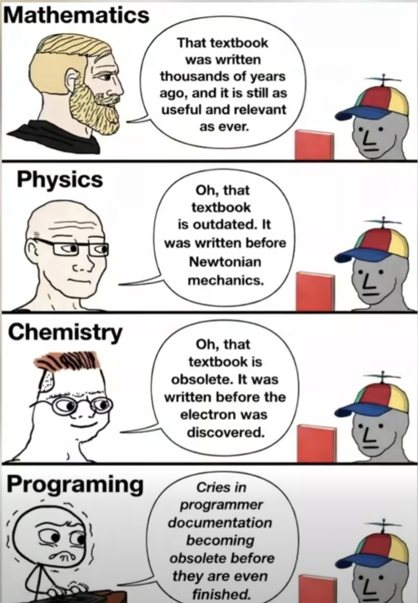

## Panta rei!

-   We teach you the present
-   But your work is in the future
-   We might use history to predict the future?
-   At least we should learn that things changes constantly!

## Terminal

-   Don't rely too heavily on your computers graphical user interface (GUI)
-   You know how to use the R console!
-   To use a terminal/Unix shell/Bash... is similair
-   To navigate the file system is basic practice
-   A Unix Terminal is included if you are using Mac (and Linux)
-   Emulators are common for Windows (one is included in Git, use that one after installation)

## Early computer languages

-   **ALGOL / ALGOL 60**
    -   Algorithmic Language
    -   Influential in academic/scientific computing
    -   Introduced structured programming concepts that shaped later languages
-   **PL/I**
    -   Used in some government and industrial contexts
    -   Combined scientific and business computing features (Fortran + Cobol)

## General-Purpose Programming Languages

Early statistical computing relied heavily on:

-   **FORTRAN**
    -   Dominant language for numerical and statistical computation
    -   Statistical methods implemented as libraries and subroutines
    -   Still used as numerical back-end (e.g., BLAS/LAPACK) in modern statistical software
-   **C**
    -   Emerged in the 1970s as a systems programming language
    -   Widely used for implementing statistical software infrastructure
    -   Core language of many modern statistical environments (e.g., R, parts of SAS, Stata)
    -   Often used to interface with high-performance numerical libraries

📌 These languages required substantial programming expertise.

::: callout-note
# FORTAN and C

FORTAN is still used in R for subroutines such as [least squares](https://github.com/wch/r-source/blob/trunk/src/appl/dqrls.f). Even in modern packages!

Same for C, such as for [lm](https://github.com/wch/r-source/blob/trunk/src/library/stats/src/lm.c), which is popular for high performance computing (fast execution time).
:::

## Early Statistical Packages

Several dedicated statistical systems emerged:

-   **SPSS** (1968)
    -   Originally batch-oriented
    -   Widely used in social sciences
    -   Originaly "Statistical Package for the Social Sciences"
-   **BMDP** (1960s)
    -   Bio-Medical Data Package
    -   Developed at UCLA
    -   Common in medical statistics
-   **GENSTAT** (1968)
    -   Focused on agricultural statistics
-   **MINITAB** (1972)
    -   Designed for teaching and education
    -   Still popular in quality control

## SAS: A Transitional System

-   **SAS** (early 1970s)
-   Developed for agricultural and biostatistical analysis
-   Script-based, but largely batch-oriented
-   Became a standard in:
    -   Government agencies
    -   Large organisations
-   Known for strong data management capabilities
-   Still widely used in pharmaceutical industry

📌 SAS predates S and influenced later statistical workflows.

::: callout-note
# SAS data

-   Still common to receive data in SAS-format (`data_file.sas7bdat`) from register holders!
-   Sometimes necessary to use SAS to export the data (genAI might be a good aid in those cases)
:::

## Limitations of Pre-S Systems

Common limitations included:

-   Batch processing rather than interactivity
    -   But we still sometimes need batch processing for large scale projects!
    -   `Rscript script.R`
-   Separation of data management and analysis
-   Limited graphics capabilities
-   High barriers to exploratory data analysis

## S

-   S takes form at Bell Laboratories (interactive statistical computing).
-   John Chambers leads the effort.
-   **1976:** first working version of S runs on GCOS
-   **1979:** S2 is ported to UNIX; UNIX becomes the primary platform
-   **1980:** S is first distributed outside Bell Labs
-   **1981:** source versions are made available
-   **1984:** key S books published (often called the “Brown Book” era)

## The New S Language

-   **1988:** “New S” is released (major language redesign)
-   **1988:** **S-PLUS** is first released as a commercial implementation of S
    -   Last seen in Tibco Spotfire 2012
-   **1991:** *Statistical Models in S* (“White Book”) popularizes formula notation (the `~` operator), data frames, and modeling workflows

## R

-   **1993:** first versions of **R** is published (Auckland; Ross Ihaka & Robert Gentleman)
-   **1995:** R becomes open source (GPL)
-   **1997:** the R Core group forms; **CRAN** is founded (Kurt Hornik)
-   **2000:** **R 1.0.0** is released 2000-02-29

------------------------------------------------------------------------

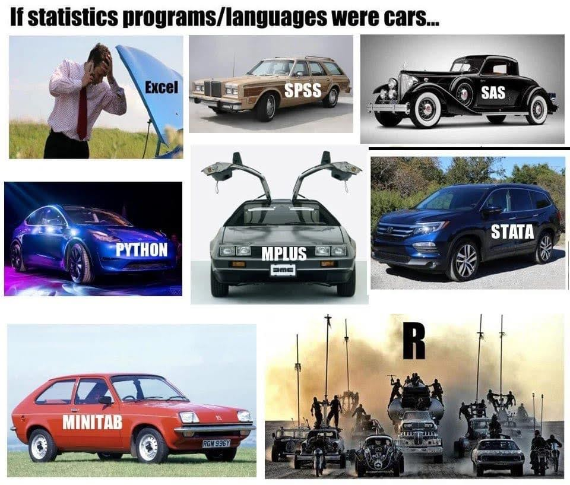

## RStudio brings an IDE to the R community

-   **2009:** RStudio (the company) is founded
-   **2011:** RStudio IDE is introduced as an open-source IDE for R (desktop + server)

## Microsoft (Revolution Analytics)

-   **Jan 2015:** Microsoft announces it will acquire **Revolution Analytics**
-   Microsoft promotes enterprise R offerings (e.g., Microsoft R Open / R Server)
-   **2016:** SQL Server 2016 introduces **R Services** (in-database R)
-   **2017:** Microsoft expands the stack under “Machine Learning Server” branding
-   **June 2021:** Microsoft announces retirement of **Microsoft Machine Learning Server**
-   **2023:** Microsoft in still a relevant player
    -   platinum member of [The R consorsium](https://r-consortium.org)
    -   Owner of GitHub
    -   VS Code

## RStudio becomes Posit

-   **July 27, 2022:** RStudio rebrands as **Posit**
-   **July 28, 2022:** **Quarto** is announced as a next-generation scientific and technical publishing system (multi-language, multi-engine)
-   A public benefit company (not only releant for its shareholders)
-   Also a platinum member of The R consortium \# Modern IDE

## Positron

-   New generation IDE for data science (and of course statistics!)
-   From Posit PBC
-   Free for individual use
-   Based on Code OSS (open source version of VS Code from Microsoft)
-   For both R and Python ([Julia?](https://github.com/posit-dev/positron/issues/3679))

------------------------------------------------------------------------

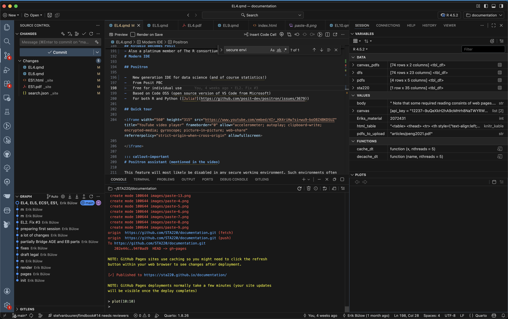

## Quick tour

<iframe width="560" height="315" src="https://www.youtube.com/embed/4Ir_HX4riHw?si=wu9-boO8Z4BKDSUZ" title="YouTube video player" frameborder="0" allow="accelerometer; autoplay; clipboard-write; encrypted-media; gyroscope; picture-in-picture; web-share" referrerpolicy="strict-origin-when-cross-origin" allowfullscreen>

</iframe>

::: callout-important
# Positron assistant (mentioned in the video)

This feature will most likely be disabled in any secure working environment. Such environments often have strict rules about data privacy and security, which may conflict with the assistant's functionality. Health data in SENSITIVE and SECURE environments must not be shared with external services, including AI assistants, to comply with data protection regulations and institutional policies.

It is recommended to not rely on such tools during the course (even if all our data is synthetic). If you start to rely on such tools, you might get difficulties the day you work with real data (might lead to prosecution for "brott mot tystnadsplikten" which is not only public, but actually civil law ("Brottsbalken") with prision sentence as a possibility). Society put an extreme emphasis on protecting health data, and rightfully so!

[Read more](https://posit.co/blog/trust-llm-tools/)
:::

## RStudio or Positron

-   We will use Positron in this course
-   This is for you to learn and see an alternative IDE ...
-   ... and to get used to the fact that you should never stop learning!
-   RStudio, however, is still a great tool and it is still developed and maintained.
-   You may use both in the future (maybe Positron on your computer but RStudio in a secure server, which tend to be more slowly updated)

## Some differences

-   No package installer (yet). You need to use `pak::pkg_install()` or `install.packages()` etc.

-   No inline rendering of results in Quarto documents (yet)

-   You can use multiple active R sessions at once

-   Great integrated tools from VS Code and extensions, such as GitHub integration

# Version control

------------------------------------------------------------------------

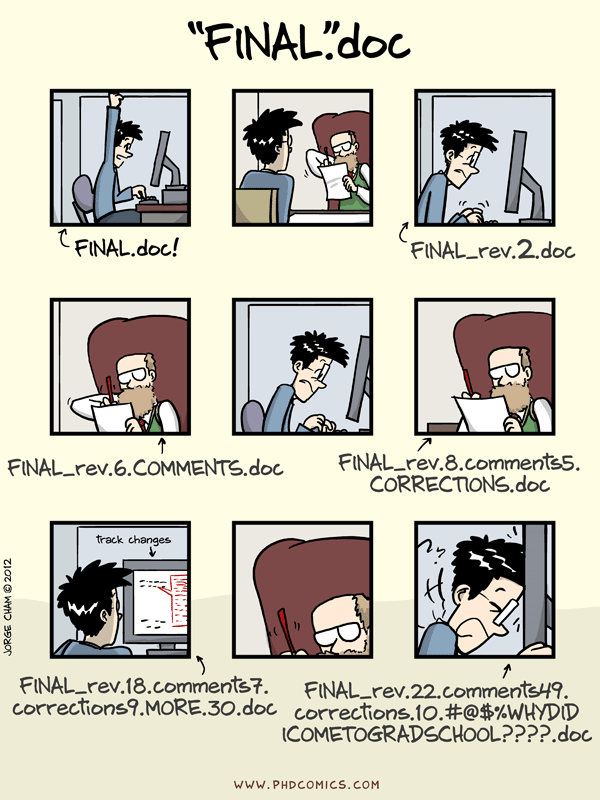

## Before Version Control Systems

1950s–1970s: Early software development relied on:

-   Manual file naming:
    -   `analysis_final.f`
    -   `analysis_final_v2.f`
-   Physical media:
    -   [Punch cards](https://storage.googleapis.com/dstlceqcawpgve/how-do-punch-card-computers-work.html)
    -   Magnetic tape
-   Centralised mainframes

📌 No automated tracking of changes.

## Floppy discs, Mail, and Shared Directories

1970s–1980s: Common practices included:

-   Copying files to:
    -   Floppy disks
    -   Magnetic tapes (actually still used for backups)
-   Sending media by **postal mail**
-   Sharing files via:
    -   Network drives
    -   FTP servers

📌 Version control was social, not technical.

## Early Version Control Systems

1980s: First-generation tools focused on single files:

-   **SCCS** (Source Code Control System, 1972)
-   **RCS** (Revision Control System, 1982)

Characteristics:

-   Versioning per file
-   Linear history
-   Central storage

## Centralised Version Control

1990s: Project-level systems emerge:

-   **CVS** (Concurrent Versions System)
-   **Subversion (SVN)**

Key features:

-   Central repository
-   Multiple users
-   Check-in / check-out model

📌 Still required constant access to the central server.

## Limitations of Centralised Systems

Common problems:

-   Single point of failure
-   Poor support for branching and merging
-   Difficult offline work
-   Slow operations on large repositories

These limitations became critical for large projects.

## Git

-   **Git** was created by Linus Torvalds in 2005
-   Original motivation:
    -   Support Linux kernel development
    -   Replace proprietary tools

Design principles:

-   Distributed architecture
-   Fast local operations
-   Strong support for branching and merging

## Terminal

-   Windows: the Git installer comes with a terminal
-   Linux/Unix (incl. Mac): use your terminal/Warp
-   Terminal pane in RStudio/Positron

------------------------------------------------------------------------

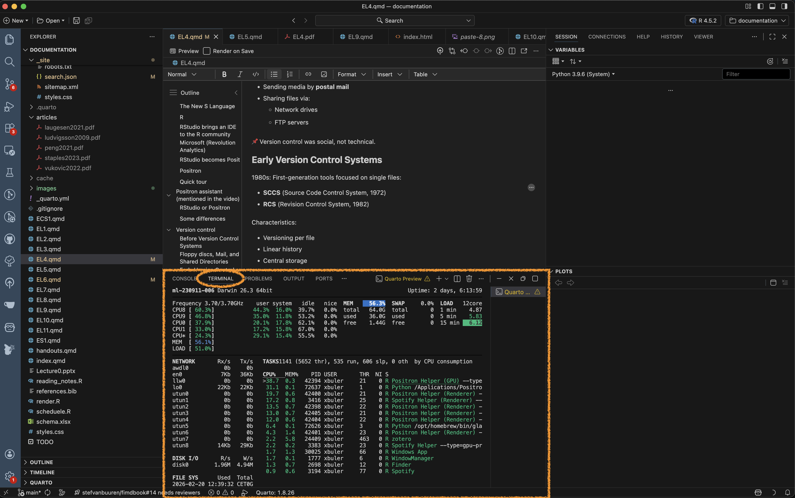

## GUI

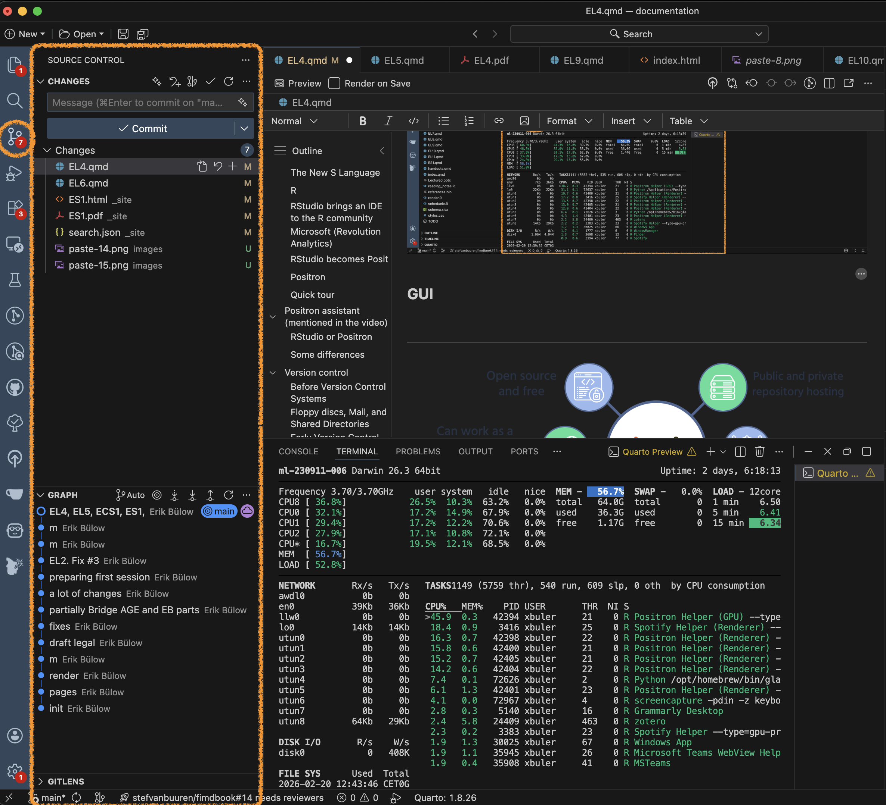

------------------------------------------------------------------------

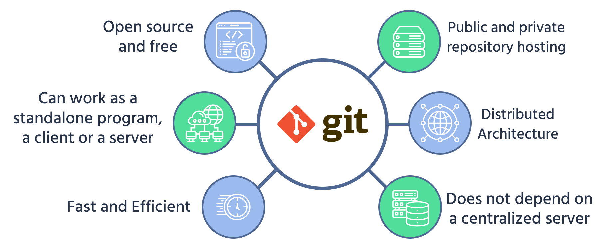

## The basics

[Four short videos to watch](https://git-scm.com/video/what-is-version-control.html)

[Cheat-sheet](https://git-scm.com/cheat-sheet.pdf)

Some interactive learning tools:

-   [Git practice](https://git-practice.com/)
-   [Git Master](https://my-git-playground.vercel.app)
-   [learn git branching](https://learngitbranching.js.org/)
-   [git simulator online](https://webutility.io/git-simulator-online)

## Some basics

-   You initiate a folder as a git project

-   Git will track all changes made in that folder

    -   New files

    -   Modified files (especially text, such as programming scripts/functions etc)

    -   Deleted files

## Branching

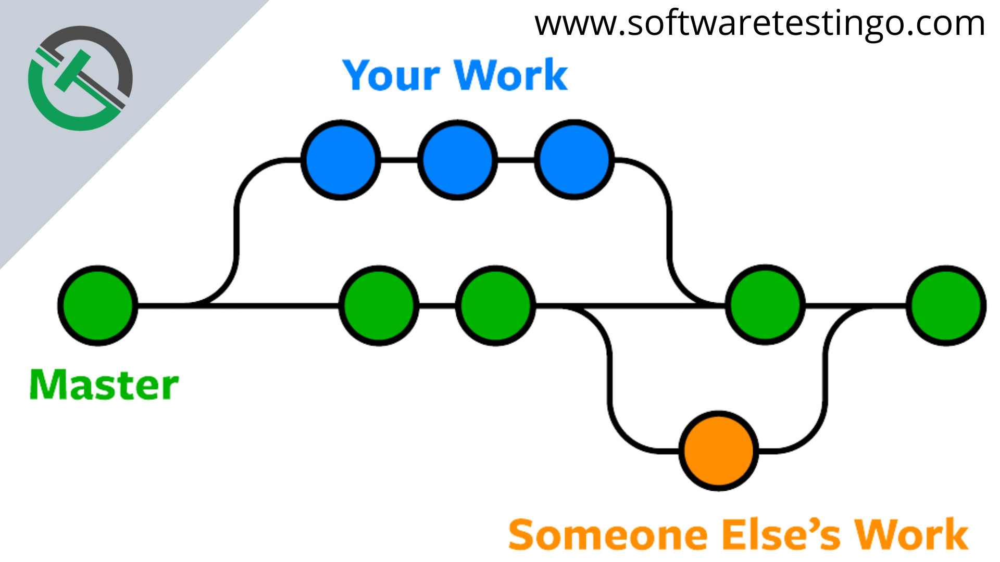

## Distributed Version Control with Git

Key ideas in Git:

-   Every clone is a full repository ("folder")
-   Local commits without network access
-   Cheap and fast branches
-   Cryptographic integrity (hash-based)

📌 Collaboration becomes more flexible and robust.

## Hosting Platforms

Platforms built around Git:

-   [GitHub](github.com) (2008)
-   [Bitbucket](bitbucket.org) (2008)
-   [GitLab](gitlab.com) (2011)
-   [Gitea](https://gitea.com/) - open source alternative to GitHub (get the same functionallity locally or on a server)

They add:

-   Pull requests / merge requests (collaboration tools)
-   Issue tracking (discussions and bug reports etc)
-   Code review
-   CI/CD integration (advanced)

## Issue tracking

-   Issue tracking is not part of Git but is implemented in most (if not all) hosting platforms.

-   Used for bug reports and discussions between developers and users
- Issues can be closed when fixed/adressed but are still found in the history
- Each issue gets a number (in order) and those can be referenced in commit messages etc (ex: `Fix #37`, which will automatically close the issue)


------------------------------------------------------------------------

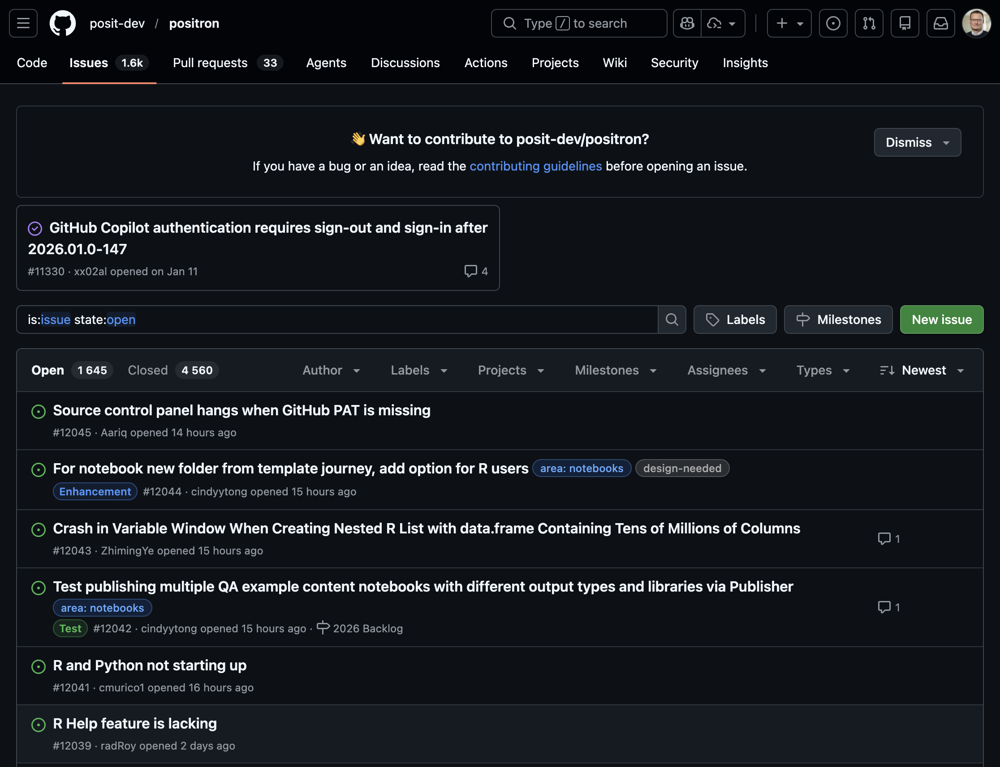

------------------------------------------------------------------------

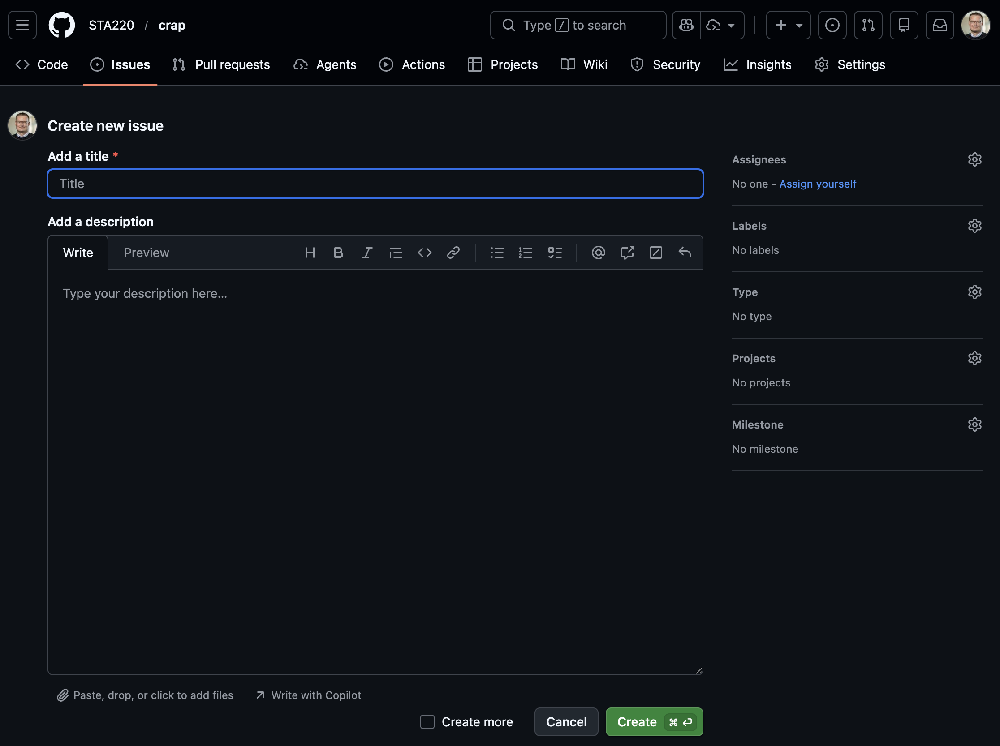

------------------------------------------------------------------------

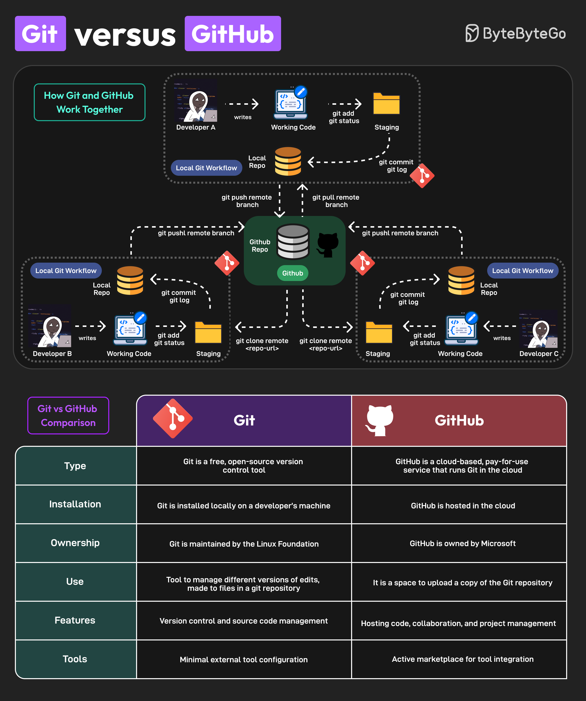

## Version Control Today

Modern usage includes:

-   Code
-   Documentation
-   Data analysis (scripts, notebooks)
-   Configuration and infrastructure

Git is integrated into:

-   IDEs (RStudio, VS Code, Positron)
-   CI/CD pipelines
-   Cloud platforms

## Version Control Beyond Code

Today, version control supports:

-   Reproducible research
-   Collaborative writing
-   Data science workflows
-   Teaching and learning

📌 Version control is now a core professional skill.

## WARNING!

-   Not everything should be shared!
-   Scripts and documentation yes!
-   But **Health data is sensitive!**
    -   Do not share it!
    -   Avoid unintentional sharing!
    -   Private repositories are still shared with hosting provider!
-   Avoid explicit file paths and sensitive info in scripts!
    -   Can give information about data location and internal structure!
-   No hard-coded passwords or API keys!

## Git basics

(After installing the Git software)

-   Collect all files related to a project in a folder
-   Initialize a git repository in that folder
-   Make changes to files
-   Stage changes for commit
-   Commit changes with a message
-   Possibly push commits to remote repository

```         
cd path/to/your/project
git init
git status
# make changes to files
git add filename1 filename2
git commit -m "Descriptive message about changes"
git remote add origin
```

## Video tutorials

The video below is a good start to understand the basic concepts of Git and GitHub (and there are others to be found on YouTube).

<iframe width="560" height="315" src="https://www.youtube.com/embed/mJ-qvsxPHpY?si=vL8ERoEp0OnGzotn" title="YouTube video player" frameborder="0" allow="accelerometer; autoplay; clipboard-write; encrypted-media; gyroscope; picture-in-picture; web-share" referrerpolicy="strict-origin-when-cross-origin" allowfullscreen>

</iframe>

## Inspirational video

Watch this video even though some parts might be overwhelming. It gives a good overview of the current state (2025), even though many things will be too advanced for this course (it is not specifically aimed for statisticians or R users).

<iframe width="560" height="315" src="https://www.youtube.com/embed/vA5TTz6BXhY?si=ctFccFSel_GLwzuh" title="YouTube video player" frameborder="0" allow="accelerometer; autoplay; clipboard-write; encrypted-media; gyroscope; picture-in-picture; web-share" referrerpolicy="strict-origin-when-cross-origin" allowfullscreen>

</iframe>

::: callout-important
# .gitignore

The `.gitignore` file is very important in settings with health data! Pay close attention to [this section](https://www.youtube.com/watch?v=vA5TTz6BXhY&t=1545s) of the video!
:::

## Git in Positron

-   Remember that Positron is build on Code OSS (which shares a lot of features with VS Code).
-   Branching and merging is possible but we will not cover that here.

Short official introduction from Microsoft:

<iframe width="560" height="315" src="https://www.youtube.com/embed/i_23KUAEtUM?si=KNUO6Pr8UatA35kh" title="YouTube video player" frameborder="0" allow="accelerometer; autoplay; clipboard-write; encrypted-media; gyroscope; picture-in-picture; web-share" referrerpolicy="strict-origin-when-cross-origin" allowfullscreen>

</iframe>

More detailed introductions. Watch both! The first one is based on a Windows version of VS code and the second on Mac but the concepts are the same:

<iframe width="560" height="315" src="https://www.youtube.com/embed/z5jZ9lrSpqk?si=tajG6Mkm84wlJBYs" title="YouTube video player" frameborder="0" allow="accelerometer; autoplay; clipboard-write; encrypted-media; gyroscope; picture-in-picture; web-share" referrerpolicy="strict-origin-when-cross-origin" allowfullscreen>

</iframe>

<iframe width="560" height="315" src="https://www.youtube.com/embed/twsYxYaQikI?si=2QEK70Shtfvz5IA7" title="YouTube video player" frameborder="0" allow="accelerometer; autoplay; clipboard-write; encrypted-media; gyroscope; picture-in-picture; web-share" referrerpolicy="strict-origin-when-cross-origin" allowfullscreen>

</iframe>

::: callout-note
# Overwhelmed?

This video includes some parts which might be overwhelming if you are new to Git and GitHub. Don't worry! You don't need to understand everything right away. Just try to follow along with the basic concepts and steps. You will get more comfortable with practice.
:::

# Statistics projects

## Not a single R script

-   Real projects are more complex than a single R script!
-   Multiple scripts
-   Multiple data files
-   Documentation
-   Reports
-   Version control
-   Reproducible workflows

## Project structure

Common file structures

-   Help you organize your thoughts
-   Help others to collaborate
-   simplifies paths used in your code

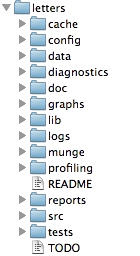

## Example structure

```         
/.../my_project/
  ├── README.md        - project documentation
  ├── TODO             - what should be done next?
  ├── .git             - handled by git (hidden folder)
  ├── .gitignore       - used by git but your responsibility!
  ├── data/            - your data files (not under version control!)
      ├── cancer.csv 
      └── patients.qs 
  ├── R/               - your saved R functions
      ├── function1.R 
      └── function2.R
  ├── reports/
  └── _targets.R       - targets pipeline script
```

## `README.md`

-   Document the purpose of the project
-   What is it about?
-   What is the aim?
-   Who to contact for questions?
-   In what circumstances was it created?

[Markdown format](https://www.markdownguide.org/cheat-sheet/) (simple text with some possible formatting)

## `data` folder

-   Store your data files here as they are when you get them
-   Avoid any modifications to the raw files!
-   It is very easy to forget what you do if it can not be traced by code
-   Do NOT include this folder in version control!
-   Git is not good at handling large files
-   Sensitive data should not be shared!
-   Add `data/*` to your `.gitignore` file
-   In realistic projects, data might come in varying formats
    -   csv, txt, xlsx, sas7bdat, sav, dta, etc
    -   some files might be very big (gigabytes not uncommon)

## `R` folder

-   Store your R functions here
-   Document their purpose inline!
-   Helps you to reuse code
-   Easier to read main scripts
-   Easier to test and debug code
-   Easier to share code between projects

## `reports` folder

-   Store your reports here
-   Quarto documents
-   Documemnt your analysis
-   Include figures and tables
-   Share with external collaborators

## Computer practice

In [ECS1](ECS1.qmd) we will use Positron and git/GitHub in action!

Also see the "Reading and practicing" section above for a more in-depth introduction (homework).

## What you should know

-   Reflect on the use of different software and how the rapid development in this field interplay with other important aspects of our field

-   Be able to describe the principles of basic git commands (init, add, stage, commit, push, pull) and what they are used for (may be theoretical questions in the written exam)

-   Use Git and GitHub in practice (but you can choose to do it either by commands or the GUI), this will be assessed in computer exercises and a later project.

-   Similarily, you need to organize your projects according to best practice (but we will be the focus of [EL5](EL5.qmd)).

------------------------------------------------------------------------