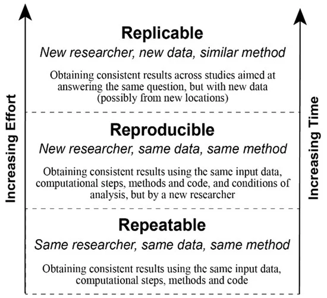
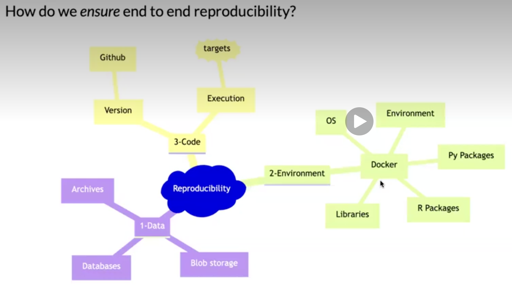
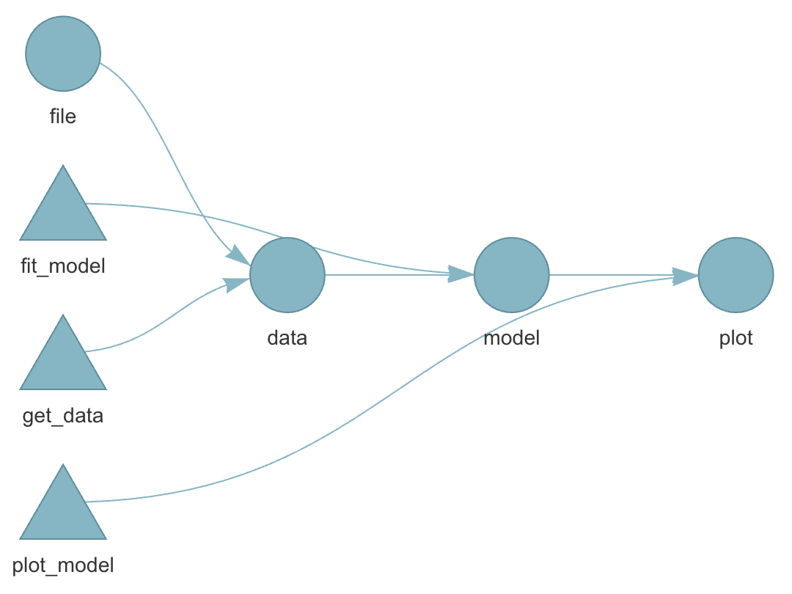
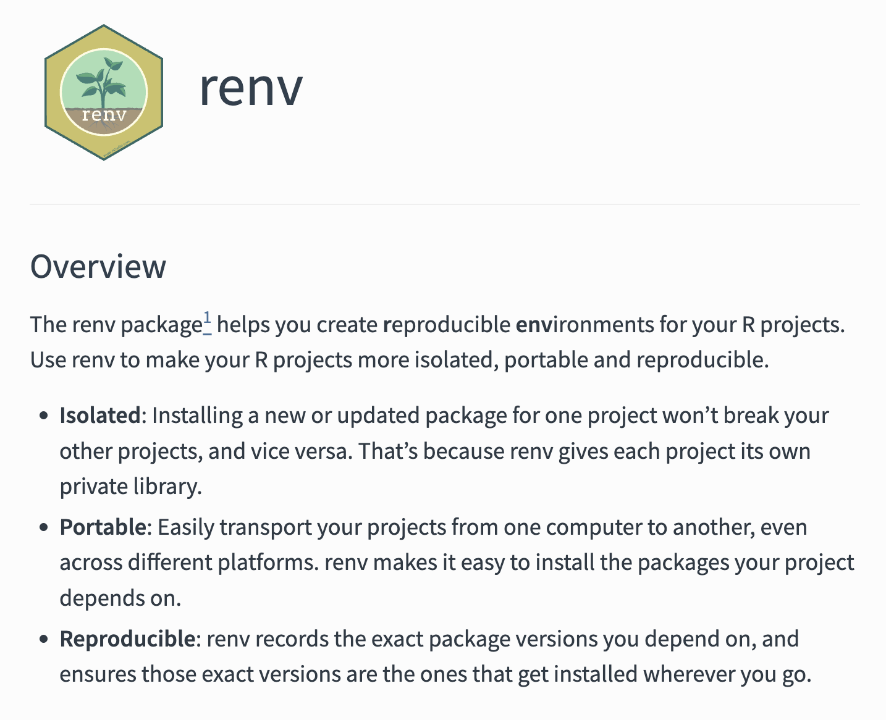
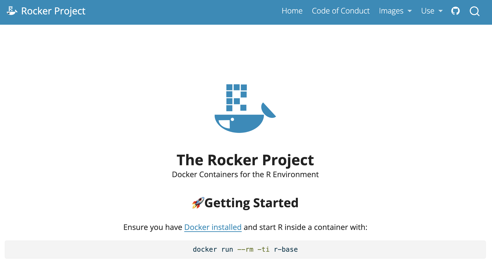
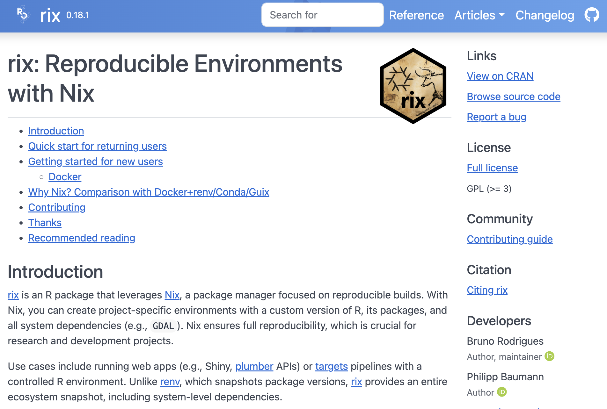
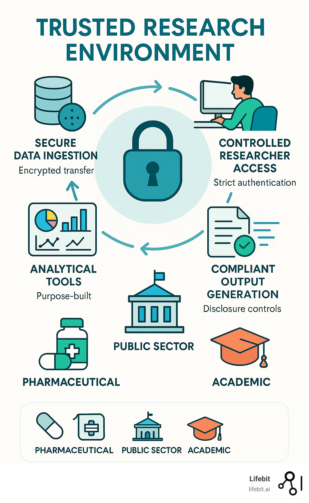

## Reading

-   @baker2016 and @deoliveiraandrade2025 motivates why reproducible analysis is important!
-   @peng2021 introduce and elaborate more on the subject.
-   @nguyen2022a only read section "Basic Introduction to Docker and Containers" in chapter 2 (you do not need to install Docker for this course, just be aware of the concept)
-   @kavianpour2022 introduces Trusted Research Environment as well as some perceived challenges with those (we will not use such environments in the course but this is likely the reality you need to cope with later on in your career, so you should get familiar with the concept).

::: callout-tip
## Consider

-   After reading papers like @baker2016 and @deoliveiraandrade2025 , one might be tempted to conclude that nothing is trustworthy — not even our own analyses. If every result comes with assumptions, uncertainty, and potential bias, what does trust really mean? Statisticians live in a world of probabilities, but most people prefer certainty.

-   Reproducibility might sound like a good thing but how much does the technical details matter if we are not allowed to freely share the underlying health care data anyway?
:::

**For reference:**

-   [Targets overview](https://docs.ropensci.org/targets/articles/overview.html)

-   [Target manual](https://books.ropensci.org/targets/)

-   You read briefly about Docker in the mandatory reading. If this seems interesting, you might read: [An Introduction to Rocker: Docker Containers for R](https://journal.r-project.org/articles/RJ-2017-065/index.html) (not mandatory).

## Practice

A workshop with 7 parts was given at the R Medicine conference 2025. Practice according to part 1-3 (part 4-7 are slightly outside the scope of the course and only recommended if you have additional time and interest).

Clone [this GitHub repo](https://github.com/rsangole/2025-R-Medicine_targets-workshop). Exercies are found in the `code` folder.

Follow the recording from the workshop while you are practicing: [The power of {targets} package for reproducible data science](https://r-consortium.org/posts/the-power-of-targets-package-for-reproducible-data-science/)

::: callout-note
# Notes on the recording

-   The full video is close to three hours long, but this includes breaks as well as the more advanced topics that are not mandatory (only the first 92 minutes, which includes several 10 min breaks is mandatory). Nevertheless, it is recommended to watch the full video (just watching part 4-7 for inspirational purposes without doing the exercises and without any expectation to fully grasp all the details).
-   RStudio is used in the recording. Please try to use Positron; however, feel free to revert to RStudio this time if following the instructions in one application while working in another feels overwhelming.
-   You may recognize some of the material from Part 3, as presented during the lecture
:::

This practice is homework (no dedicated computer session is targeting targets but you should use at least some components of it in a later project, so you should practice the basics now)!

------------------------------------------------------------------------

## Motivational quotes

> An **article** about computational science in a scientific publication is not the scholarship itself, it is **merely advertising of the scholarship**. The **actual scholarship** is the **complete software development environment and the complete set of instructions** which generated the figures. / Buckheit & Donoho

> \[It is important to have\] a clear understanding of how data analysis was conducted when critical life and death decisions must be made. / Peng et al. 2021

# Reproducible analysis

**The definition** of reproducible research generally consists of the following elements.

> A published data analysis is reproducible if the analytic data sets and the computer code used to create the data analysis are made available to others for independent study and analysis

This is rather vague ...

## Why is this a problem?

-   Many, even simple, results depend on a precise record of procedures and processing and the order in which they occur.

-   Many statistical algorithms have many tuning parameters that can dramatically change the results if they are not inputted exactly the same way as was done by the original investigators.

-   If any of these myriad details are not properly recorded in the code, then there is a significant possibility that the results produced by others will differ from the original investigators’ results.

------------------------------------------------------------------------



------------------------------------------------------------------------



## Recap folder structure

```         
/.../my_project/
  ├── README.md        - project documentation
  ├── TODO             - what should be done next?
  ├── .git             - handled by git (hidden folder)
  ├── .gitignore       - used by git but your responsibility!
  ├── data/            - your data files (not under version control!)
      ├── cancer.csv 
      └── patients.qs 
  ├── R/               - your saved R functions
      ├── function1.R 
      └── function2.R
  ├── reports/
  └── _targets.R       - targets pipeline script
```

## Pipeline

-   A pipeline is a computational workflow that does statistics, analytics, or data science.

-   A pipeline contains tasks to prepare datasets, run models, and summarize results for a business deliverable or research paper.

-   Pipeline tools coordinate the pieces of computationally demanding analysis projects.

::: callout-note
# Pipe operator

The simplest example of pipelines might be when you combine R code by the pipe operator (`|>` or `%>%`), which in turn is inspired by the pipe operator in Unix (`|`).
:::

## Long running processes

-   Imaigine you have nice R-scripts to take care of every step in your project
-   You have either one very very ... very ... long file or a bunch of files which you execute in order
-   It takes two weeks to run all scripts (not unrealistic for a big project!)
-   You report the result to your collaborators
-   They ask you to update a tiny detail somewhere in the middle of your workflow
-   You need to rerun everything (while screaming in frustration)!
-   This will repeat again and again until you finally
    a)  Lose your mind and quit your job
    b)  Adapt a more reproducible workflow

## Steps-wise procedure

-   The default setting in R is to save the workspace to disk when you end the session
-   This is [usually not recommended](https://r4ds.hadley.nz/workflow-scripts.html#what-is-the-source-of-truth) and therefore often disabled in for example RStudio
    -   (If you re-start your session at a later point you might have no idea how the restored objects relates to each other.)
-   You may still want to execute things in a more step-wise fashion
    1.  Convert big data files (`.sas7bdat` from SAS etc) to something more R-friendly
    2.  Perform some data management (select relevant columns and rows), cleaning, add calculated variables etc
    3.  Perform some [exploratory data analysis (EDA)](https://en.wikipedia.org/wiki/Exploratory_data_analysis) to get a better understanding of the data
    4.  Perform some statistical analysis
    5.  Report and visualize the results

## Caching

-   If you perform each step in different script files, you might start each file with some input and end it with some output
-   The output from the previous script is used as input in the next script
-   `save()` and `load()` are standard but can be very slow for large objects
-   `saveRDS()` and `loadRDS()` use [serialization](https://www.geeksforgeeks.org/r-language/data-serialization-rds-using-r/) and are nowadays much more efficient
-   `qs2::qs_save()` and `qs2::qs_read()` (or `qs2::qd_save()` and `qs2::qd_read()`) from the [qs2 package](https://github.com/qsbase/qs2) are currently "state-of-the-art" (but things tend to change quickly)

## Benchmarking

#### Single-threaded

| Algorithm       | Compression | Save Time (s) | Read Time (s) |
|-----------------|-------------|---------------|---------------|
| qs2             | 7.96        | 13.4          | 50.4          |
| qdata           | 8.45        | **10.5**      | **34.8**      |
| base::serialize | 1.1         | **8.87**      | 51.4          |
| saveRDS         | **8.68**    | 107           | 63.7          |
| fst             | 2.59        | 5.09          | 46.3          |
| parquet         | 8.29        | 20.3          | 38.4          |
| qs (legacy)     | 7.97        | 9.13          | 48.1          |

#### Multi-threaded (8 threads)

| Algorithm   | Compression | Save Time (s) | Read Time (s) |
|-------------|-------------|---------------|---------------|
| qs2         | 7.96        | 3.79          | 48.1          |
| **qdata**   | **8.45**    | **1.98**      | **33.1**      |
| fst         | 2.59        | 5.05          | 46.6          |
| parquet     | 8.29        | 20.2          | 37.0          |
| qs (legacy) | 7.97        | 3.21          | 52.0          |

-   `qs2`, `qdata` and `qs` with `compress_level = 3`
-   `parquet` via the `arrow` package using zstd `compression_level = 3`
-   `base::serialize` with `ascii = FALSE` and `xdr = FALSE`

**Datasets used**

-   `1000 genomes non-coding VCF` 1000 genomes non-coding variants (2743 MB)
-   `B-cell data` B-cell mouse data, Greiff 2017 (1057 MB)
-   `IP location` IPV4 range data with location information (198 MB)
-   `Netflix movie ratings` Netflix ML prediction dataset (571 MB)

These datasets are openly licensed and represent a combination of numeric and text data across multiple domains. See `inst/analysis/datasets.R` on Github.

## Who cares?

-   Imagine you work with data for the whole Swedish population (\> 10 M people)
-   You have medical prescription data for everyone and lets say on average 20 prescriptions (since 2015) per person =\> 10 \* 20 = 200 M rows of data
-   You are working in a [secure environment](https://en.wikipedia.org/wiki/Secure_environment) were data is stored on a network server (no [SSD drive](https://en.wikipedia.org/wiki/Solid-state_drive))
-   The same environment is shared by 20 other researchers and you are all competing for the same [bandwidth](https://en.wikipedia.org/wiki/Bandwidth_(computing))
-   It will get increasingly frustrating just to load and save the big files
-   You might need to wait for half an hour before you can start working 😩

------------------------------------------------------------------------


## Automated process

-   Instead of relying on individual R scripts, use a reproducible pipeline.
-   This is common practice in software development
    -   For example GNU [Make](https://en.wikipedia.org/wiki/Make_(software)) is a build automation tool that automatically determines which parts of a program need to be rebuilt and executes the necessary commands based on rules defined in a Makefile.
-   **Iteration** during project development (which is equally relevant for a health data project), will be much **faster and reliable**.
-   **Caching** as described above is **automated** and you only need to read/write files to disk/network storage when actually needed.

## Alternative solutions

-   [GNU Make with R](https://www.evan-soil.io/blog/ode-to-gnu-make/)
-   `rmake` creates and maintains a build process for complex analytic tasks. [The package](https://beerda.github.io/rmake/) allows easy generation of a Makefile for the (GNU) ‘make’ tool
-   [drake](https://docs.ropensci.org/drake/) was the first more established R-oriented alternative
-   [targets](https://docs.ropensci.org/targets/) is the currently most developed and used alternative
-   [rixpress](https://docs.ropensci.org/rixpress/) might be a rising star (at least if you are combining R and Python; polyglot)?

We will use `targets` in this course!

# targets

-   The `{targets}` package is a Make-like pipeline tool for statistics and data science in R.

-   The package skips costly runtime for tasks that are already up to date, orchestrates the necessary computation with implicit parallel computing, and abstracts files as R objects.

-   If all the current output matches the current upstream code and data, then the whole pipeline is up to date, and the results are more trustworthy than otherwise.

-   The tasks themselves are called “targets”, and they run the functions and return R objects.

-   The `targets` package orchestrates the targets and stores the output objects to make your pipeline efficient, painless (well ... hopefully relatively so ...), and reproducible.

## Example

**Data:** survey data collected by the US National Center for Health Statistics (NCHS) which has conducted a series of **health and nutrition surveys** since the early 1960's. Since 1999 approximately **5,000 individuals of all ages** are **interviewed** in their homes every year and complete the h**ealth examination** component of the survey.

**Question:** Is there any association between `Gender` and `BMI`?

```{r}
# pak::pkg_install("NHANES")
str(NHANES::NHANES)
```

## R script

A normal R script might look like:

```{r}
# pak::pkg_install("NHANES")
library(tidyverse)

df <- as_tibble(NHANES::NHANES)
tbl <- count(df, Gender)
tst <- t.test(BMI ~ Gender, df)
gg <- ggplot(df, aes(BMI, color = Gender)) + geom_density()
```

-   You must run the script in order (but might not always do that during the initial "trial and error" process ... if so, confusion will later arise)!

-   objects `df`, `tbl` and `tst` only lives in the active session

    -   No problem in this example

    -   but working with big and complex data might introduce long-running processes =\> time consuming!

## Results

```{r}
#| echo: false
gg
tst
```

::: callout-note
## Figure and R output

You should see a figure and some R output on this slide. I just notice it doesn't show on my phone when viewing the slides, so if you don't see it, you might try another browser etc (it seems to render correct in the handouts however).
:::

## Pipeline

-   Define steps in your analysis as targets
-   Define dependencies between targets
-   Automatically track changes and rerun only necessary parts

------------------------------------------------------------------------

## Why?

-   You do not want to rerun everything all the time!
-   You want to keep track of what you have done
-   You want to be able to reproduce your results later
-   You want to share your workflow with others

## target

Reformulate from ordinary object assignment:

```{r}
df <- as_tibble(NHANES::NHANES)
```

to a target

```{r}
library(targets)
tar_target(df, as_tibble(NHANES::NHANES))
```

## Put all targets in a list

```{r}
#| results: "hide"
list(
  tar_target(df, as_tibble(NHANES::NHANES)),
  tar_target(tbl, count(df, Species)),
  tar_target(tst, t.test(BMI ~ Gender, df)),
  tar_target(gg, {
    ggplot(df, aes(BMI, color = Gender)) + geom_density()
  })
)
```

## `_targets.R` file

Put that list into a file `_targets.R` together with some additional code:

```{r}
#| results: "hide"
library(targets)
tar_source() # Source all scripts with functions stored in R folder
tar_option_set(
  # Specify all needed packages here
  # NOTE! They will not be available in the interactive R-session
  # so you might load them above as well to avoid confusion
  packages = c("tidyverse"),
  # Format used for caching (qs which is actually qs2 is best for big data)
  format = "qs",
  # Additional settings ...
  seed = 123
)

list(
  tar_target(df, as_tibble(NHANES::NHANES)),
  tar_target(tbl, count(df, Species)),
  tar_target(tst, t.test(BMI ~ Gender, df)),
  tar_target(gg, {
    ggplot(df, aes(BMI, color = Gender)) + geom_density()
  })
)
```

## Benefits

-   execute the whole project by `tar_make()`
-   intermediate steps are cached and cached objects retrieved by `tar_load()` or `tar_read()`
-   dependency among individual steps can be visualized: `tar_visnetwork()`

## Dependency graph



## Live show

```{bash}
#| eval: false
cd
git clone https://github.com/STA220/targets.git
cd targets
positron .
```

Or perform those steps from within Positron.

------------------------------------------------------------------------

# R-versions

-   Imagine you **finish** your research project and you submit a manuscript to a journal
-   The journal comes back **one year later** (they didn't have time until know) and one reviewer ask you to double check some steps of the analysis
-   You make some modifications and rerun your pipelines.
-   But it doesn't work!
-   **Half a year ago** you updated your R installation and a **week ago** all of your installed packages.
    -   One package was retired from CRAN (could happen even though there was nothing wrong with the package when you used it ... maybe the maintainer just didn't have time or energy to keep maintaining it)
    -   One package has deprecated one of the functions you previously used
    -   On package has redesigned the output format from a specific function you used
-   😱

------------------------------------------------------------------------



## Pros and cons

-   It is always a good idea to be able to reproduce exactly what you did!

-   But if you never update you might miss essential bug fixes!

-   If your results change, how can you know which version was the most accurate?

Best practice (I guess) is to rerun the analysis both with the frozen versions and with the most up-to-date versions of the packages ... because you have all the time in the world and nothing more important to do ... right ... 😂

## Different operating systems

-   R should behave similar on different operating systems.

-   Exceptions nevertheless exist!

    -   `parallel::mclapply()` behaves differently on Windows compared to Unix-like systems because Windows does not support forked processes.

    -   `sort(c("ä", "a", "z"))` might differ due to locale settings

    -   Earlier versions of R relied on system-specific native encoding (notably on Windows), whereas modern versions (R ≥ 4.2) use UTF-8 as the default across platforms.

------------------------------------------------------------------------



## Combining all?

-   you could very well use both targets + renv + git + GitHub etc

-   At some point you might start to wonder whether you are a medical statistician or a software developer ... and the more complex/esoteric tools you use, the more difficult it might be to collaborate with others

-   Try to find some middle ground ... but always be open to new ideas!

------------------------------------------------------------------------



# TRE

-   **Historically**: centralized data on [mainframe computer](https://en.wikipedia.org/wiki/Mainframe_computer)

-   **More recently:** working with data locally (desktop/laptop)

    -   Full volume encryption ([BitLocker](https://en.wikipedia.org/wiki/BitLocker) on Windows, [FileVault](https://en.wikipedia.org/wiki/FileVault) on Mac etc)

    -   Possible to work off-line (trains, flights etc)

    -   Backups! Backups!!! BACKUPS!!!

    -   Usually only password protected and no logging of of activities

    -   Sometimes admin user (sometimes not)

-   **Nowadays**: (Different names, same concept) Secure Research Envoronemnt (SRE), Trusted Research Envoronment (TRE), Secure Data Environment (SDE), Data Clean Room, Data Safe Havens, ...

## In practice

-   Connect through VPN

-   2-factor authentication (BankID common in Sweden)

-   Often by Remote Desktop (to access a Windows virtual desktop)

-   Sometimes a containerized Linux setup for R/RStudio etc accessed through a web browser (from within the virtual Windows machine)

-   Limited internet access from within the environment (maybe possible to install CRAN-packages tied to a certain historical snapshot but not the latest released/developed versions).

-   Data import and exports goes through administrator

-   **Pros**: Secure, centralized backups, possibility to scale/share large computing resources (CPU, RAM, GPU etc), less dependent on individual computer (laptop), might aid collaboration

-   **Cons**: needs internet connection, restrictions on what software (packages) to use, difficult to export results and/or import script files etc, mentally exhausting to use for example a Mac Keyboard when working in Windows, can be expensive (pay per clock-cycle of CPU usage etc instead of simply purchasing a computer once).

------------------------------------------------------------------------



------------------------------------------------------------------------


------------------------------------------------------------------------