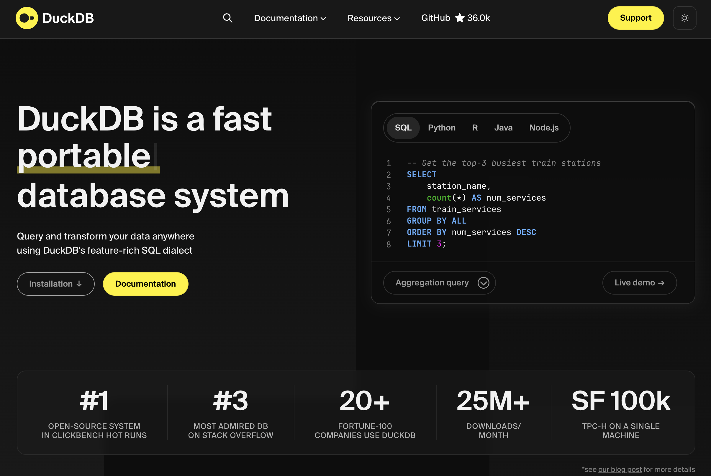
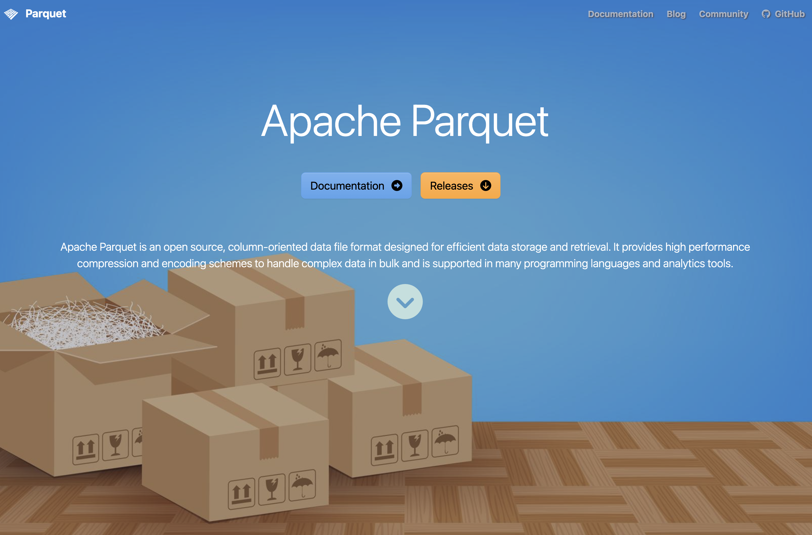

## Reading

-   [@nguyen2022a, ch. 2] on Databases: it is important to understand some basic concepts. You might, however, ignore sections about "(Hyper)graph databases". Try to understand the SQL code even though you might not need to write such code on your own.

-   @wickham [chap 21](https://r4ds.hadley.nz/databases.html) describes how to connect to a database from R.

-   @fenk describe why the current common practice with register data delivery in SAS format should be replaced by parquet files. Until this has happened, we often need to use SAS for data extraction.

-   @dataana introduces the `data.table` syntax, its general form, how to *subset* rows, *select and compute* on columns, and perform aggregations *by group*.

**Recommended references:**

-   @arel-bundock2025 provides a good comparison between base R, dplyr and data.table.

## Optional practice

We won't focus on SQL in this course but it might still be good to know some of the basics. Two useful resources for your own practicing (if you like): 

- [SQLzoo](https://sqlzoo.net/wiki/SQL_Tutorial) 
- [The SQL Tutorial for Data Analysis](https://www.thoughtspot.com/sql-tutorial/introduction-to-sql)

## Imaginaed scenario

-   You have requested register data from Statistics Sweden (SCB) and The National Board of Health and Welfare (NBHW; SoS)
-   Aftar a couple of months (it previously took a year), you receive some huge files with file ending `.sas7bdat`
-   What do you do now?

## .sas7bdat

-   Many govermental agencies are using SAS
-   Their standard format when delivering big data sets
-   SAS is great for handling big data sets (no need to read everything into memory)
-   But you don't know how to use SAS 😩

## First try

-   It is often possible to read medium-sized SAS files to R by `haven::read_sas()`
-   Based on the [ReadStat C library](https://github.com/WizardMac/ReadStat)
-   Based on [reverse-engineering of binary files](https://github.com/FredHutch/sas7bdat-specification/blob/master/sas7bdat.rst)!
-   You need to put some trust that those wizards where good "hackers" (your analyzis and future patients lifes may depend on it) :-)
-   But similar trust always applies when you use open source software, which depend on other peoples software, which depends on ...
-   But, yes, it is legal according to EU legislation :-)

> [Directive 2009/24/EC art 6](https://eur-lex.europa.eu/eli/dir/2009/24/oj/eng) The authorisation of the rightholder shall not be required where reproduction of the code and translation of its form within the meaning of points (a) and (b) of Article 4(1) are indispensable to obtain the information necessary to achieve the interoperability of an independently created computer program with other programs \[...\]

But let's say this did not work for your data! 😩

## Large SAS files

-   Best practice for current SAS version (9.4) is to export only nessecary data to csv
    -   SAS Viya (another solution not likely replacing SAS 9.4) can export parquet files
-   You need a SAS license (expensive) as well as some SAS syntax for this
    -   But you might ask GenAI to generate such code for you
-   The exported csv file can later be read into R

::: callout-note
# SAS in the course?

We are not using SAS in the course (and it is [no longer available for students to download](https://studentportal.gu.se/en/digital-tools/other-digital-tools-and-software) ... it's to expensive even for a large university ...). Hence, this is just as a future advice if you will work in an organisation with a SAS license (it is still available for empoyers within GU for a monthly cost).
:::

------------------------------------------------------------------------


## Databases

-   a database is a collection of "tables" (tabular data frames)

-   Differences between data frames and database tables:

    -   Database tables are stored on disk and can be arbitrarily large.
    -   Data frames are stored in memory
    -   Database tables almost always have indexes; makes it possible to quickly find rows of interest
        -   Data frames and tibbles don’t have indexes, but `data.table`s do, which is one of the reasons that they’re so fast.
    -   No fixed row order in a table

------------------------------------------------------------------------


## Row vs column oriented

-   Most classical databases are optimized for rapidly **collecting** data, **not analyzing existing data**.

-   These databases are called row-oriented because the data is stored row-by-row, rather than column-by-column like R.

-   More recently, there’s been much development of column-oriented databases that make analyzing the existing data much faster.

## DBMS

Databases are run by database management systems (DBMS’s for short), which come in three basic forms

Client-server

:   run on a powerful central server, which you connect to from your computer (the client). For example PostgreSQL, MariaDB, SQL Server, and Oracle. 

Cloud

:   like Snowflake, Amazon’s RedShift, and Google’s BigQuery, are similar to client server DBMS’s, but they run in the **cloud**. This means that they can easily handle extremely large datasets and can automatically provide more compute resources as needed.

In-process

:   like SQLite or duckdb, run entirely on your computer.

## Relevance

Client-server

:  Those are sometimes used in our field but if so, you will hopefully get some initial help from the IT department who will provide acess details etc. Such access is then integrated into R and [Positron](https://positron.posit.co/connections-pane) (as well as [RStudio](https://support.posit.co/hc/en-us/articles/115010915687-Using-RStudio-Connections-in-the-RStudio-IDE)). If thi is relevant, you can most likely use tools such as [dbplyr](https://dbplyr.tidyverse.org) to query the data without to much use of SQL itself.

Cloud

:  Commercial cloud products are less likely to be used for sensitive health data within our field.

In-process

:   They’re great for working with large datasets locally where you (the statistician) is the primary user. SQLite was a good tool in the past (it might still be but ...) nowadays DuckDB is the most prominent implementation!

## SQL

-   Different database systems may use different query languages.
-   The **Structured Query Language (SQL)** is the most widely used for relational databases.
-   Defined by international standards (ANSI/ISO).

## What is SQL used for?

SQL is used to:

-   Retrieve data (`SELECT`)
-   Filter data (`WHERE`)
-   Aggregate data (`GROUP BY`)
-   Combine tables (`JOIN`)
-   Modify data (`INSERT`, `UPDATE`, `DELETE`)

## SQL Dialects

-   SQL is a standard, but implementations differ slightly.
-   These variations are called **dialects**.
    -   **T-SQL** (Microsoft SQL Server)
    -   **PL/SQL** (Oracle)
    -   PostgreSQL SQL dialect
    -   MySQL SQL dialect

Most core functionality is similar across systems.

## A Simple Example

``` sql
SELECT name, age
FROM students
WHERE age >= 18
ORDER BY age;
```

This query:

-   Selects two columns
-   Filters rows
-   Sorts the result

## Relevance?

- I don't think SQL is a necessary skill to master for most statisticians
- You should nevertheless be aware of its existence and understand simple code examples as above
- If an employer requires SQL skills, you can probably learn enough if/when needed
- Nevertheless, the more languages/tools etc you know, the more competitive you become (but don't sacrifice statistical knowledge for technical. 

------------------------------------------------------------------------



## DuckDB

-   Free and open source (backed by foundation)
-   Column based
-   Very easy to set up
-   Very efficient!
-   SQL is an option as API language but not a requirement
-   Integration by DBMS and "hidden" SQL under the hood: [dbplyr](https://dbplyr.tidyverse.org)
-   A more "native" implementation by [duckplyr](https://duckplyr.tidyverse.org)
    -   Better (but perhaps not as widely used yet and therefore a bit less mature/stable)
-   Can be used both with disk data and data in RAM

## Example

```{r}
# pak::pak("tidyverse/duckplyr")
library(duckplyr)
conflicted::conflicts_prefer(dplyr::filter)
# Extra tools to connect to internet data
db_exec("INSTALL httpfs")
db_exec("LOAD httpfs")

# Use some online data which is to big to keep in memory
year <- 2022:2024 # therefore, select just 3 years
base_url <- "https://blobs.duckdb.org/flight-data-partitioned/"
files <- paste0("Year=", year, "/data_0.parquet")
urls <- paste0(base_url, files)


# Connect to the data (without downloading)
flights <- read_parquet_duckdb(urls)
# nrow(flights) # It's not in memory!
count(flights, Year) # processing outside memory
```

------------------------------------------------------------------------

Complex queries can be executed on the remote data. Note how only the relevant columns are fetched and the 2024 data isn’t even touched, as it’s not needed for the result.

```{r}
#| cache: true
out <-
  flights |>
  mutate(InFlightDelay = ArrDelay - DepDelay) |>
  summarize(
    .by = c(Year, Month),
    MeanInFlightDelay = mean(InFlightDelay, na.rm = TRUE),
    MedianInFlightDelay = median(InFlightDelay, na.rm = TRUE),
  ) |>
  filter(Year < 2024)

out |>
  explain()
```

## DuckDB and Data Files

DuckDB can query files directly:

-   Parquet
-   CSV
-   JSON

No data import (to your computers Random Access Memory [RAM]) is required!

## Example

-   Let's say you used SAS to export your data to a csv file
-   DuckDB can query the relevant data from that file directly and collect only the data you actually need!
-   (If you knew you only needed i smaller data set you might have performed similar work already in SAS but you often query the data multiple times for different purposes so it still good to have a readable version of everything)

```{r}
# This is not writing from SAS but to illustrate the point :-)
csv_file <- tempfile(fileext = ".csv")
write.csv(NHANES::NHANES, csv_file)

read_csv_duckdb(csv_file) |>
  filter(Age >= 18) |>
  summarise(BMI_mean = mean(as.numeric(BMI), na.rm = TRUE), .by = Gender)
```

## Parquet

-   From Apache Arrow
-   Open format
-   flat files with possible hierarchical structure by transparent structure of folders and filenames
-   very fast to read and write

------------------------------------------------------------------------



## Example

-   So we might work with CSV + DuckDB but it is even more efficient if we could convert the CSV to a parquet file
-   The solution below reads the CSV data and then exports it to a new parquet file
-   This means that all data must still fit into memory
    -   If it doesn't, do it chunk-wise (piece by piece, 1 M rows at the time or similar)

```{r}
#| cache: true
# install.packages("arrow")
library(arrow)
parquet_file <- tempfile(fileext = ".parquet")
read_csv_arrow(csv_file) |>
  write_parquet(parquet_file)

# Now
read_parquet_duckdb(parquet_file)
```

## tidy data

-   `duckplyr` let's you use the familiar dplyr/tidyverse syntax
-   If certain steps in your pipeline are not compatible with DuckDB, data might be collected into memory and the pipeline contonous nevertheless
-   After filteringen/aggregation etc you can always choose to `collect()` the data and use your ordinary workflow from there

## Data files

`.qs2`  
: A fast, compressed R-specific binary format used for caching by the `{targets}` package.  
  Data must be fully read from disk into memory (RAM), typically via `targets::tar_read()`.

`.sas7bdat`  
: A proprietary binary format used by SAS and commonly encountered in register data deliveries.  
  It can be sometimes be imported into R (`haven::read_sas()`, which also allow selection of specific columns at import).  
  The dataset is read into memory.

`.csv` (Comma-Separated Values)  
: A plain-text format following a loosely defined standard.  
  It is human-readable but inefficient for large datasets.  
  Tools such as DuckDB (via `{duckplyr}`) can read only the required columns and rows and perform filtering and aggregation during import.

`.parquet` (Apache Parquet)  
: A columnar, compressed, and standardized binary format designed for efficient analytics.  
  It supports selective column access and integrates well with modern analytical engines such as DuckDB and Arrow.

## Archiving

- Swedish law say that we must archive the data (within the public sector).
- General practice is to store every "official document" forever ... which is a long time :-)
- Usualy conceptualized as 500 years.
- Retention (dokumenthanteringsplan/gallringsplan) usually limit the time needed to store source material for statistcal reporting/research etc
  - Varies between organisations but usually 10 years (25 for some research, which is also regulated by the EU)
- Can you read a 25 year old data file?
  - Yes, if storeed as an inefficient CSV-file ...
  - Maybe not if using another less human-readable format ...
- The work of a professional archivist might contain responsibilities for data conversion from time to time (CD-ROMS or floppy disks etc might otherwise not be accasible)
- It seems, however, less common that organizational standardd etc imply that statisticians are limited to certain formats (it is more often up to you and your collegues)

## Faster in memory?

-   DuckDB and `{duckplyr}` makes it possible to work with data which does not fit into memory
-   But what if data would fit (which is more common)?
    -   You can use tibbles and dplyr etc as usual ...
        -   ... but it might be slooooooooooooow ... for big enough data
        -   (Although dplyr also gets some [speed improvements](https://tidyverse.org/blog/2026/02/dplyr-performance/) from time to time)
-   `{data.table}` is much more efficient!

## data.table

- An R package (not a data storage format or a database system)
- Comparable to working with `data.frame` in base R or `tibble` in the tidyverse
- Sometimes described as a Domain Specific Language (DSL) within R
- Introduced in 2006 (mature, stable, and widely used — older than the tidyverse)
- Provides faster alternatives to several base R functions:
  `fifelse()`, `fcase()`, `forder()`, `fread()`, `fcoalesce()`,  
  `as.IDate()`, `%chin%`
- Core components implemented in C for performance
- Uses concepts similar to databases:
  - Integer-based keys and indices  
  - Efficient joins and grouping
- Reference semantics  
- Very flexible and compact syntax  
- Strongly appreciated by many statisticians —  
  unknown to some — and slightly intimidating to others 🙂

## Copy-on-modify

- Assume `df` is a large `data.frame`/`tibble` with many rows and columns, one of them called `old`.  
  Let `f()` be some function.
- What happens when you add a new column using  
  `df$new <- f(df$old)` or `df <- mutate(df, new = f(old))`?
- Even though you reuse the name `df`, R typically creates a modified copy of the object.
- In R, objects use *copy-on-modify* semantics:
  - When an object is changed, a new copy is created (if needed).
  - The name `df` is just a reference to an object in memory.
  - After reassignment, `df` refers to the new object.
- The previous object may remain in memory temporarily until garbage collection runs.
- For very large objects, this can result in substantial temporary memory use  

## Reference semantics

- In `data.table`, reference semantics are used instead.
- You can modify the existing object directly:
  `df[, new := f(old)]`
- Or delete columns in place:
  `df[, old := NULL]`
- No full copy is made
- There is still only one object in memory (and it is still called `df`).

## Example

```{r}
#| echo: true
library(data.table)
dt <- NHANES::NHANES
setDT(dt)
setkey(dt, ID) # Use the ID column as index
# How many adults by gender do we have
dt[Age >= 18, .N, Gender]
# Mean BMI by gender
dt[Age >= 18, mean(BMI, na.rm = TRUE), Gender]
# Convert all factors to characters
dt[, names(.SD) := lapply(.SD, as.character), .SDcols = is.factor]
```

## joins

```         
x[i, on, nomatch]
| |  |   |
| |  |   \__ If NULL only returns rows linked in x and i tables
| |  \____ a character vector or list defining match logic
| \_____ primary data.table, list or data.frame
\____ secondary data.table
```

| Join type | data.table | SQL | dplyr |
|---------------|----------------------|---------------|---------------------|
| Right join | `DT1[DT2]` | RIGHT JOIN | `right_join(DT2, DT1)` |
| Left join | `DT2[DT1]` | LEFT JOIN | `left_join(DT1, DT2)` |
| Inner join | `DT1[DT2, nomatch = 0]` | INNER JOIN | `inner_join(DT1, DT2)` |
| Full join | `merge(DT1, DT2, all = TRUE)` | FULL OUTER JOIN | `full_join(DT1, DT2)` |
| Anti join | `DT1[!DT2]` | NOT EXISTS | `anti_join(DT1, DT2)` |
| Semi join | `DT1[DT2, nomatch = 0][, unique(.SD)]` | EXISTS | `semi_join(DT1, DT2)` |
| Rolling join | `DT1[DT2, on = "date", roll = TRUE]` | — | `join_by()` + `rolling` |
| Non-equi join | `DT1[DT2, on = .(x >= lower, x <= upper)]` | — | `join_by(x >= lower, x <= upper)` |
| Update join | `DT1[DT2, value := i.value]` | UPDATE ... JOIN | `DT1 %>% left_join(DT2) %>% mutate(...)` |

## External API

- We previously assumed you get some data delivery from a register holder
- Or mayby you work within the organization where data is collected, and therefore have access to the original data base.
- Some data can also be openly accessed by an Programming Application Interface (API)
- The PX-WEB API is used by a large number of statistical authorities (and others) world-widea to provide access to aggregated data
- The `{pxweb}` R package simplifies the process

## Available resources

```{r}
#| echo: false
pxweb::pxweb_api_catalogue() |>
  purrr::map_chr("description") |>
  tibble::enframe() |>
  knitr::kable()
```

## Example

- The first time you need the data, use `pxweb_interactive()` from your console.
- It will guide you through all the necessary steps.
- It will then provide you the necessary R code to replicate the query

----------

```{r}
library(pxweb)
library(data.table)
library(ggplot2)

url <- "https://api.scb.se/OV0104/v1/doris/sv/ssd/BE/BE0101/BE0101A/BefolkningR1860N"

# PXWEB query
pxweb_query_list <-
  list(
    "Alder" = "*",
    "Kon" = c("1", "2"),
    "ContentsCode" = c("0000053A"),
    "Tid" = as.character(1864:2024)
  )

px_data <-
  pxweb_get(
    url = url,
    query = pxweb_query_list
  )

# A data.table with population numbers
bef <-
  px_data |>
  as.data.frame() |>
  setDT()

# Some data cleaning
setnames(
  bef,
  c("ålder", "kön", "år", "Antal"),
  c("age", "sex", "year", "N")
)
bef[, `:=`(
  age = as.numeric(gsub(" år", "", age)),
  sex = factor(sex, c("män", "kvinnor"), c("males", "females")),
  year = as.integer(year)
)]
bef <- bef[!is.na(age)] # Remove totals

# Aggregate for age groups
bef[,
  age_group := cut(
    age,
    c(-Inf, 17, 66, Inf),
    c("children", "adults", "elderly")
  )
]
bef_ag <- bef[, .(N = sum(N)), .(age_group, sex, year)]

# Visualize
gg <- bef_ag |>
  ggplot(aes(year, N, color = age_group, linetype = sex)) +
  geom_line() +
  theme(legend.position = "bottom") +
  scale_y_continuous(
    labels = scales::label_number(scale = 1e-6, suffix = "M")
  )
```

-------------------
```{r}
#| echo: false
gg
```

## Hierachical data

- We like tabular data!
- If we get wide data we can transform it to long data (and vice versa)
- But we might sometimes encounter more hierarchical data structures
- JSON (JavaScript Object Notation) most popular
- XML is another format (used for example by the IRS/Skatteverket sometimes)

```{json}
{
  "system": "ICD-10",
  "chapter": {
    "code": "Chapter I",
    "title": "Certain infectious and parasitic diseases",
    "range": "A00–B99",
    "blocks": [
      {
        "code": "A00–A09",
        "title": "Intestinal infectious diseases",
        "categories": [
          {
            "code": "A00",
            "title": "Cholera",
            "includes": ["Vibrio cholerae infection"],
            "excludes": ["Carrier state"],
            "subcategories": [
              {
                "code": "A00.0",
                "title": "Cholera due to Vibrio cholerae 01, biovar cholerae"
              },
              {
                "code": "A00.1",
                "title": "Cholera due to Vibrio cholerae 01, biovar eltor"
              }
            ]
          }
        ]
      }
    ]
  }
}
```

## Example

```{r}
#| cache: true
# db_exec("INSTALL json")
db_exec("LOAD json")
url <- "https://raw.githubusercontent.com/LuChang-CS/icd_hierarchical_structure/main/ICD-10-CM/diagnosis_codes.json"
(icd <- duckplyr::read_json_duckdb(url))
```

----------

## Flattening

So you now have a duckplyr data frame. One of its columns is nested and, with additional data frames as children)
If we unnest the children for chapter 1, we see that those children also have children ... and so it continous.
To get a simple translation between individual codes and their description, you might need to define some recursive function to unnest until you have found the last children in line. 

```{r}
#| cache: true
(chap1 <- icd |> slice(1) |> collect())
chap1 |>
  select(children) |>
  tidyr::unnest(children)
```

------------------------------------------------------------------------