## Reading

-   [@wickham, ch. 28-29] introduces Quarto with good examples

**For reference**

[quarto.org](https://quarto.org)


## Levels of documentation

Documentation can exist at several levels in a project.

-   **Code level**
    -   scripts (comments, e.g. `# clean data and merge cohorts`)
    -   functions ([Roxygen2](https://roxygen2.r-lib.org/index.html) documentation)
    -   notes and reminders (e.g. `# TODO:`)
-   **Project level**
    -   `README.md`
    -   (GitHub repos may also have a wiki or a polished website)
-   **Output level**
    -   figures and tables
    -   reports (PDF / HTML)
    -   presentations (slides)

# Code level

## Documenting R scripts

-   Use [Air](https://posit-dev.github.io/air/editor-vscode.html) for better formatting of the R code itself (will format the code according to best practice for readability and collaboration)
-   Section labels by `Shift + Ctrl/Cmd + R` in Positron (and RStudio)
-   Easiest way to aid navigation to R scripts

``` r
# My section heading -----------------------------------------------------
```

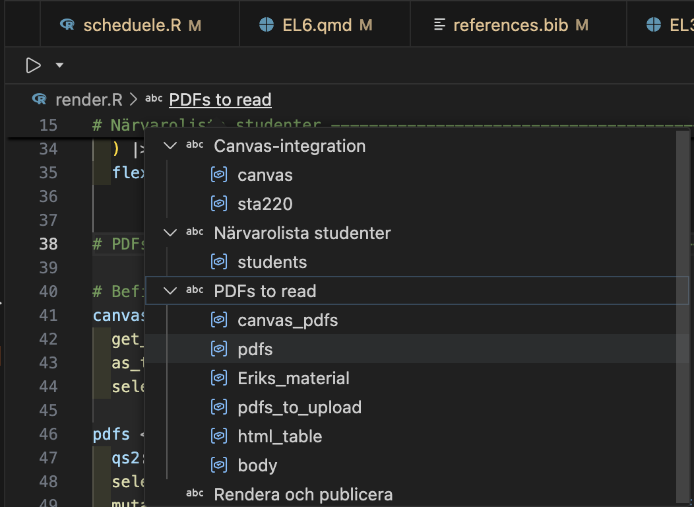

## Individual scripts

-   As soon as you distribute an individual R script from a bigger project (by e-mail or as a printed copy) some context would get lost.
-   The [commentr package](https://bitbucket.org/cancercentrum/commentr/src/master/) is designed to maintain such context
    -   `remotes::install_bitbucket("cancercentrum/commentr")`

```{r}
#| echo: true
commentr::header_comment(
  "My nice script",
  "Bla bla bla ...",
  "Erik Bülow",
  "xxx@yyy.zzz",
  "John Doe"
)
```

------------------------------------------------------------------------

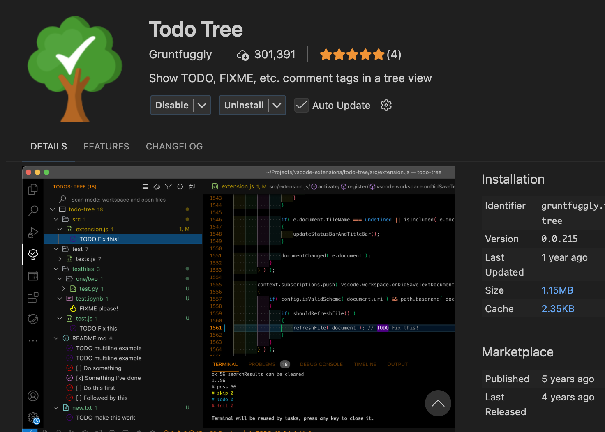

```         
# TODO: Change this to something better:
1 + 2
```

## Documenting R functions

What does this function do?

```{r}
#| echo: true
hello <- function(who = "world") {
  sprintf("Hello %s!", who)
}
```

------------------------------------------------------------------------

```{r}
#| echo: true
#' Say hello
#'
#' Create a simple greeting. If no name is provided, the function
#' returns a greeting to the world.
#'
#' @param who A character vector giving the name(s) of the person or
#'   object to greet. If missing, the greeting defaults to `"world"`.
#'
#' @return A character vector of the same length as `who` containing
#'   greeting messages.
#'
#' @examples
#' hello()
#' hello("you")
#' hello(c("Alice", "Bob"))
hello <- function(who = "world") {
  sprintf("Hello %s!", who)
}
```

-   There is a standardized syntax to document R functions
-   You should be able to click a small light bulb (💡) to insert a sceleton when writing your function
-   The same syntax is used within modern R packages
    -   but it is useful even within your own projects
-   [roxygen2](https://roxygen2.r-lib.org/index.html) is a package used for package documentation but it also has a great [manual for documenteing functions in general](https://roxygen2.r-lib.org/articles/rd.html)

# Project level

## Documenting a project

-   You have a `README.md` file within your git repository
-   It can contain plain text without any formatting
-   It will be displayed up-front in GitHub
-   You can also include formatting!
-   It will be nicely rendered on GitHub or elsewhere

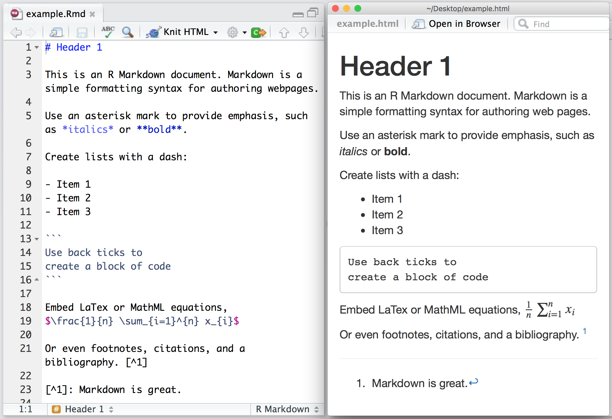

------------------------------------------------------------------------

## Basic formatting

| What you want | Markdown syntax               | Result                      |
|------------------|---------------------------|---------------------------|
| Heading       | `# Heading`                   | Heading                     |
| Italic        | `*text*`                      | *text*                      |
| Bold          | `**text**`                    | **text**                    |
| Inline code   | `` `code` ``                  | `code`                      |
| Link          | `[text](https://example.com)` | [text](https://example.com) |
| Bullet list   | `- item`                      | • item                      |
| Numbered list | `1. item`                     | 1\. item                    |

::: callout-note
# Comment or heading

`#` is used for comments in R files and within R blocks but for headings in `.md` and `.qmd` files!
:::

# Visual mode

Instead of editing the source code, you may also use the "visual editor" in Positron:

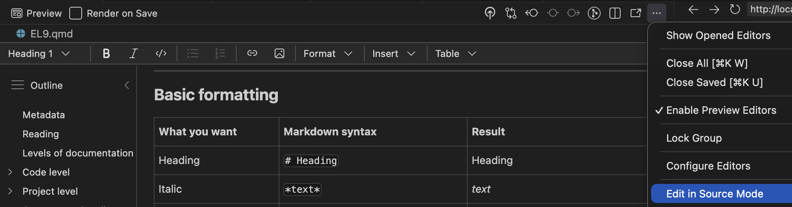

::: callout-warning
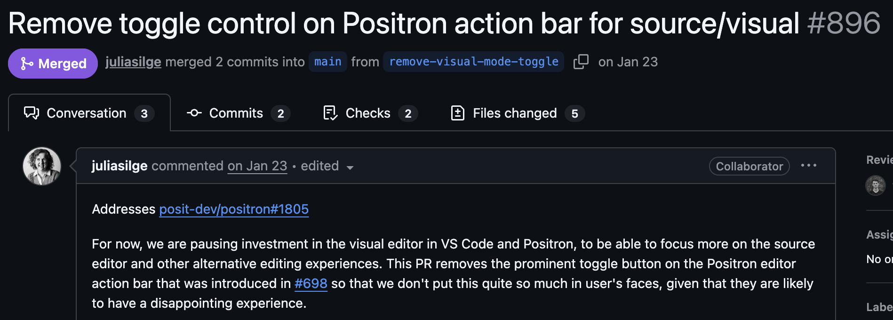
:::

## Use both?

Personally, I do most editing in source mode (better for the R chunks), but I find it much easier to include references/citations and to paste in external figures in using the visual mode.

## Reproducible Workflows

Modern biostatistics projects rarely involve only statistics.

-   data cleaning and preprocessing
-   statistical modelling
-   visualisation
-   interpretation of results
-   reporting and documentation

A good workflow should make it possible to **combine all of these steps in one place**.

# Output level

## What?

**Quarto** is a publishing system for scientific and technical documents.

It allows you to combine:

-   text
-   R code
-   statistical results
-   tables and figures

in a **single workflow**.

This makes it easier to create **reproducible statistical reports**.

## Why?

In many projects people work with:

-   R scripts for analysis 🥳
-   Word documents for reporting 😱
-   PowerPoint slides for presentations 😱

This separation often leads to:

-   copy–paste errors 🥴
-   outdated figures 👎
-   results that cannot easily be reproduced 🤯

**Quarto helps avoid these problems!**

## Reproducible analysis

In a Quarto document you can:

1.  write the explanation of your analysis
2.  include the R code used
3.  generate figures and tables automatically
4.  update everything by re-running the document

-   If the data or model changes, the **entire report can be regenerated automatically**.
-   It is widely used in **data science, epidemiology and biostatistics**.
-   Integrated in Positron and developed by Posit PBC

## Used in three ways

1.  For **communicating to decision-makers**, who want to *focus on the conclusions, not the code behind the analysis*.
2.  For **collaborating with collegues** (including future you!), who are interested in both your *conclusions, and how you reached them (i.e. the code).*
3.  As an **environment** in which to do data science and statistics, as a modern-day lab notebook where you can capture not only what you did, but also what you were thinking.

## A simple report

When you chose `New > New File ... > Quarto document,` the file will contain:

``` yaml
---
title: "Untitled"
format: html
---
```

-   This is a YAML header (Yet Another Markup Language)
-   Different output formats are available:
    -   **html:** can also be published online ([Quartopub](https://quartopub.com) or [GitHub pages](https://quarto.org/docs/publishing/github-pages.html))
    -   **docx:** Word document for collaborating with non-statisticians etc
    -   **typst:** PDF rendering (ever heard of $\LaTeX$? ... This is the modern alternative!)
    -   **revealjs:** slide decks (you are looking at one!)
-   Can render to multiple formats at once!

------------------------------------------------------------------------

This is the yaml header for this presentation:

``` yaml
---
title: "EL9: Documentation"
subtitle: "Quarto"
reading: "[@wickham, ch. 28-29]"
format:
  revealjs:
    theme: blood
    transition: fade
    slide-number: true
    css: styles.css
    smaller: true
    scrollable: true
    incremental: false
  typst:
    include-before-body:
      - text: |
          // Gör alla länkar tydliga i PDF: blå + understrukna
          #show link: set text(fill: rgb("1a5fb4"))
          #show link: underline
  docx: default
bibliography: references.bib
---
```

## YAML structure

YAML uses **indentation to represent structure**.

Think of it like a tree.

``` yaml
format:
  html:
    code-fold: true
```

This corresponds to the structure:

```         
format
└── html
    └── code-fold: true
```

### If indentation is wrong?

``` yaml
format:
html:
  code-fold: true
```

Now Quarto interprets this as:

```         
format
html
└── code-fold: true
```

This is **not the intended structure**, and the document may fail to render.

------------------------------------------------------------------------

💡 **Rule of thumb**

-   use **two spaces per level**
-   never use **tabs**
-   when something fails, **check indentation first**

## Three parts

Quarto documents have three parts:

1.  An (optional) YAML header surrounded by `---`s.
2.  Chunks of R code surrounded by ```` ```{r} ```` and ```` ``` ````.

``` verbatim
```{r}          ← chunk header
#| echo: false  ← options controlling the output
summary(x)      ← R code
```             ← end of chunk
```

Keybindings: `Cmd + option + I` (Mac) or `Ctrl + Alt + I` (Windows)

3.  Text with markdown format

::: callout-tip
# Order

Part 1 (YAML header) always comes first but 2 (code block) and 3 (Markdown text) are usually intermingled throughout the rest of the document.
:::

## Inline code

Sometimes we want to insert **small pieces of R output directly in the text**.

This is called **inline code**.

Inline code will always just show the result of the call (not the code itself in the rendered document):

```{verbatim}
Todays date is `r Sys.Date()` and it is `r format(Sys.time(), format = "%H")` 
```

> Todys date is `r Sys.Date()` and it is `r format(Sys.time(), format = "%I %p")`

To higlight with bold and italic:

```{verbatim}
Todays date is **`r Sys.Date()`** and it is *`r format(Sys.time(), format = "%I %p")`*
```

> Todays date is **`r Sys.Date()`** and it is *`r format(Sys.time(), format = "%I %p")`*


------------------------------------------------------------------------

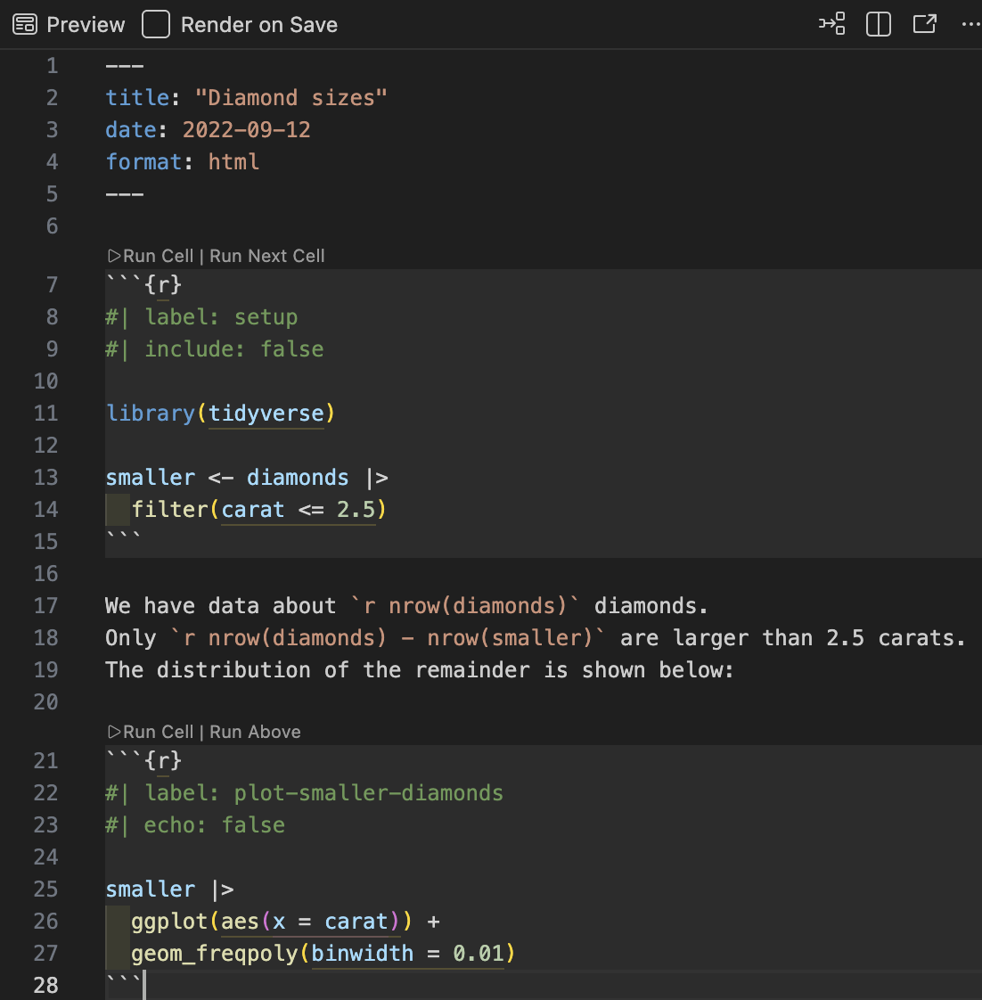

------------------------------------------------------------------------

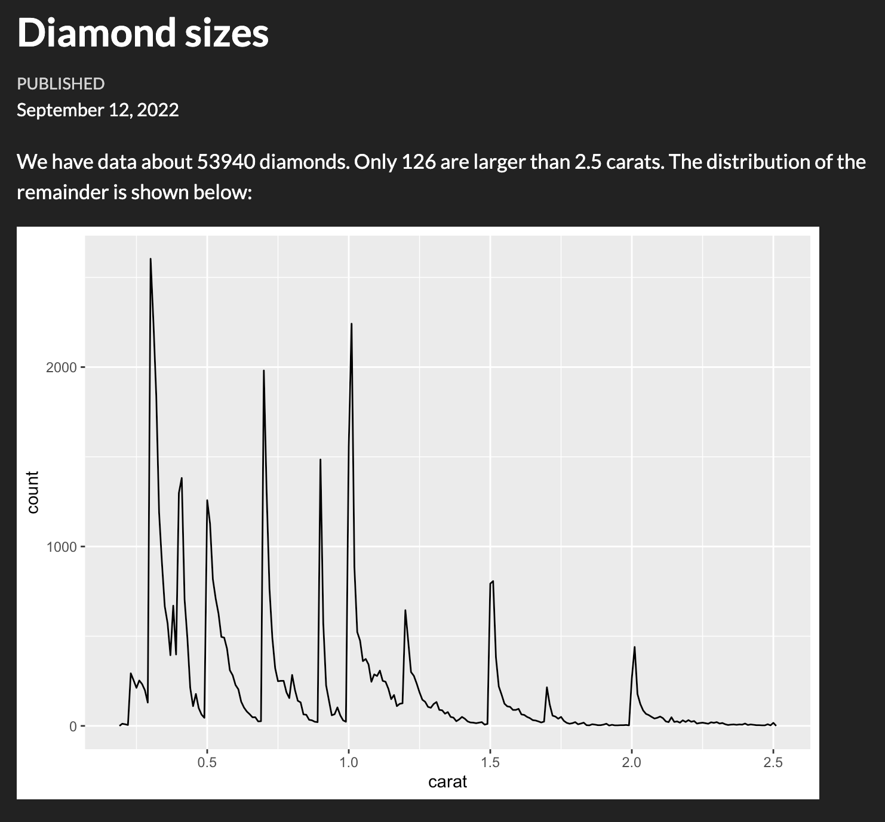


## To publish

Decision makers, stake holders, friends or the public might not care about R. Disable R code (echoing the code itself), warnings and messages:

``` yaml
---
title: "Untitled"
format: html
execute:
  echo: false
  warning: false
  message: false
---
```

## For collaborators

-   Might still care less about verbose R messages and warnings (they trust that you have already considered those)
-   May still need the underlaying R code for deeper understaing
-   Use `code-fold`

``` yaml
---
title: "Untitled"
format:
  html:
    code-fold: true
execute:
  warning: false
  message: false
---
```

------------------------------------------------------------------------

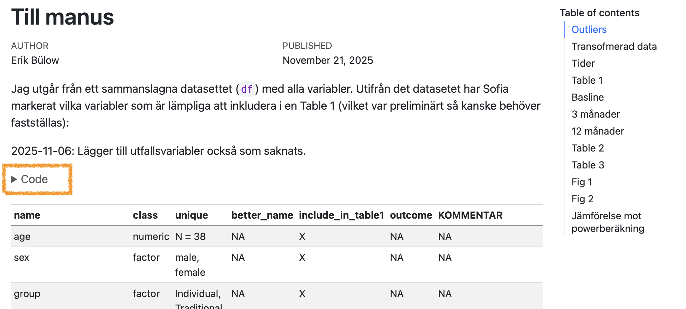

------------------------------------------------------------------------


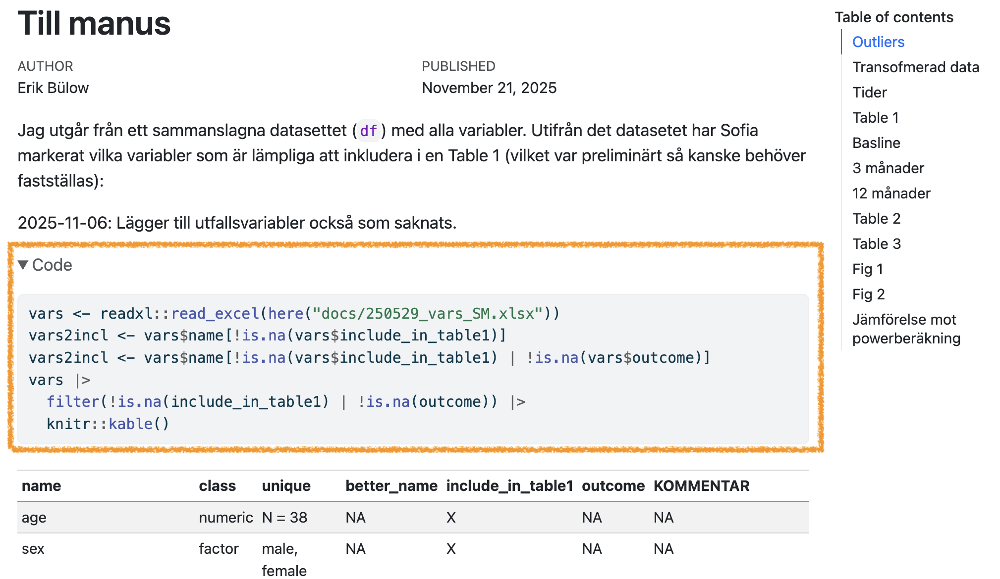

------------------------------------------------------------------------

This can also be set individually for each code chunk:

````{verbatim}
```{r}
#| echo: false
#| warning: false
#| message: true
message("will be muted!")
warning("will be ignored")
plot(something_beautiful, realy = TRUE)
```
````

## Figures

Figures are usualy displayed without problem (and you can adjust their size, add captions etc):

````{verbatim}
```{r}
#| fig-cap: This is origo!
plot(0, 0)
```
````

```{r}
#| fig-cap: This is origo!
plot(0, 0)
```

## Tables

Just printing the R output might not look very nice:

```{r}
#| echo: true
head(iris)
```

------------------------------------------------------------------------

## Better with kable

The easiest way to make tibbles/data.frames/data.tables look nicer is with `df-print: kable` in the yaml header.

``` yaml
---
title: "Untitled"
format: html
df-print: kable
---
```

Or manually for individual outputs:

````{verbatim}
```{r}
#| tbl-cap: Some iris data
knitr::kable(head(iris))
```
````

```{r}
#| tbl-cap: Some iris data
knitr::kable(head(iris))
```

## Best with gt

-   Very flexible
-   Publication ready
-   [Package from Posit](https://gt.rstudio.com)
-   [flextable](https://ardata-fr.github.io/flextable-book/) may be preferred instead if rendering Office documents (Word, PowerPoint)

------------------------------------------------------------------------

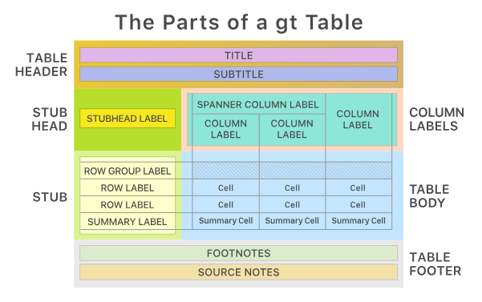

------------------------------------------------------------------------

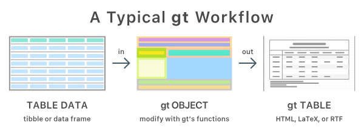

## gtsummary

[gtsummary package](https://www.danieldsjoberg.com/gtsummary/) build on top of `{gt}` to easily summarise datasets, regression models etc

````{verbatim}
```{r}
gtsummary::tbl_summary(iris, Species)
```
````

```{r}
gtsummary::tbl_summary(iris, Species)
```

## Presentations

-   Quarto can export to PowerPoint
-   And to the older Beamer format
-   But I recommend [revealjs](https://revealjs.com)
    -   `format: revealjs`
    -   can also be modified with speaker notes, laser pointer etc
-   [Info and examples](https://quarto.org/docs/presentations/revealjs/)

For example (as used for these slides):

``` yaml
format:
  revealjs:
    theme: blood
    transition: fade
    slide-number: true
    css: styles.css
    smaller: true
    scrollable: true
    incremental: false
```

## Integrate with `{targets}`

[`tarchetypes::tar_quarto()`](https://docs.ropensci.org/tarchetypes/reference/tar_quarto.html)

### in `_targets.R`

``` r
library(targets)
library(tarchetypes) # Let you integrate a quarto report/presentation
list(
  tar_target(data, data.frame(x = seq_len(26), y = letters))
  tar_quarto(report, "report.qmd") # Make presentation
)
```

### In `report.qmd`

````{verbatim}
---
title: My report
format: html
---

# Here is my beautiful data!

```{r}
gt::gt(tar_read(data))
```
````

## Try it

Copy this code to the terminal (not the console!) and try `targets::tar_make()` in the console!

```{bash}
#| eval: false
#| echo: true
cd
mkdir test_targets_quarto
cat > test_targets_quarto/_targets.R <<'EOF'
library(targets)
library(tarchetypes) # Lets you integrate a quarto report/presentation

list(
  tar_target(data, iris),
  tar_target(model, lm(Sepal.Length ~ ., data)),
  tar_quarto(report, "report.qmd") # Make presentation
)
EOF

cat > test_targets_quarto/report.qmd <<'EOF'
---
title: My project
author: My name
date: today
format:
  typst: default
  docx: default
  html: default
  revealjs:
    output-file: slides.html
---

## Here are some flowers!

gtsummary::tbl_summary(targets::tar_read(data))

## And here is a model

gtsummary::tbl_regression(targets::tar_read(model))
EOF

positron test_targets_quarto
# rm -r test_targets_quarto
```

## Manuscripts

-   [Quarto Manuscript](https://quarto.org/docs/manuscripts/)
-   framework for writing and publishing scholarly articles
-   Something for your later thesis work?
-   Handles references
-   Export to Word documents (`.docx`) etc
    -   which is still the most common format for submission to medical/epidemiological journals
    -   Still used for collaborative work with non-statisticians etc

## Use references

When writing scientific reports we need to:

-   acknowledge previous research
-   support claims with evidence
-   allow readers to find the original sources

This is done through **citations** and a **reference list**.

Example:

> Don't blame me, it was according to @wickham.

At the end of the document a **bibliography** is automatically generated.


## How Quarto handles references

Quarto uses a **bibliography file**, usually in `.bib` format.

Example in the document header:

``` yaml
bibliography: references.bib
```

Then citations can be written directly in the text:

```         
Several studies have examined this relationship @smith2020.
```

Quarto will render something like:

> Several studies have examined this relationship (Smith 2020).

The full reference will appear automatically in the bibliography.


## Online portfolio

-   Looking for a job after you fininsh the master program?
-   An online portfolia might increase your visability!
-   Perhaps add your course project to such portfolio?
-   [Demo](https://deepshamenghani.quarto.pub/portfolio-with-quarto-workshop/#/title-slide)

------------------------------------------------------------------------